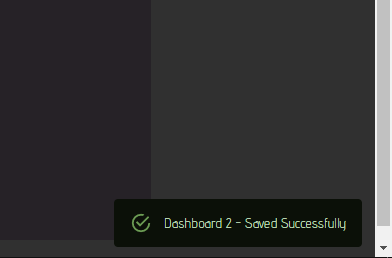

# Craftbeerpi4

#### Versions:

Documentation: 1.4

Valid for 
- Server: [4.0.6](https://pypi.org/project/cbpi4/)
- User Interface: [0.2.2](https://pypi.org/project/cbpi4gui/)

## Craftbeerpi 4 overview

Craftbeerpi4 is an open source software solution developed by Manuel Fritsch to control the brewing and fermentation of beer and maybe more in the future. The server side is based on python 3 and the front end on a react / Material UI interface. The hardware is focused on the RapsberryPi as this board has plenty of GPIO's to read sensors and control actors. However, it is also possible to connect other sensors and actors via http connection. Therefore, plugins are required.

The user interface has the option to define up to 10 different dashboards, e.g. separate brewing or fermentation views or to define a simple view for your cellphone.

Below you can see an example dashboard for a single vessel brew setup.

On a second dashboard you can add for instance your fermenters:

Below you can see an example of a dashboard that is intended for a mobile phone.

You can create your recipes directly in the user interface,

or you can import recipes through several other ways such as beer.xml files, the 'Kleiner Brauhelfer 2' database or directly via the Brewfather app API (Paid Brewfather account required).

The required mash- and boil-steps will be created automatically incl. alarms for hop / misc additions.

Details on how to install the server and user interface, how to install plugins and how to configure the software are described in the next chapters.

## Notifications

CraftbeerPi 4 is raising notifications on several events. If you are working for instance on your dashboard and hit the save button, the server will inform you that the dashboard has been saved successfully. The server can also raise error messages to inform you the something went wrong. The notifications are also helpful in case of the mash steps as they will inform you when a step started and once the timer starts, a message will be raised with the anticipated completion time of the step. Notifications are also raised for hop alarms. They are displayed at the lower right corner of your browser window.

Notifications can be extended by plugins as the notification event can trigger another function. There are currently two plugins available that can extend the notification function. The first is the [buzzer plugin](https://github.com/avollkopf/cbpi4-buzzer) that triggers for instance the buzzer on your extension board, whenever a notification is raised. The other plugin can send a [push notification ](https://github.com/avollkopf/cbpi4-PushOver)of the CraftbeerPi4 notification via the pushover service to your cell phone. This comes in pretty handy in particular for hop alarms. For other notification clients (e.g. Telegram), users need to develop additional plugins.
