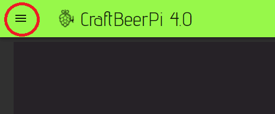
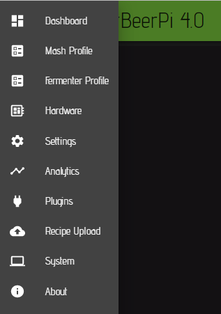

# CraftbeerPi 4 Server

## First start

When you have installed CraftbeerPi4 correctly as described in the [Server Installation](../server-installation.md) and enabled it as [service](../server-installation.md#automatically-start-the-server-as-service), it should start automatically when the Pi is booting. You can access the user interface with your browser by entering the following address in your browser address field:

> IPADDRESSOFYOURPI:8000 -> e.g. 192.168.10.100:8000

CraftbeerPi4 should come up with an empty dashboard window.

At the top and left of the CraftbeerPi4 icon, you can see the main menu button.

By clicking this button, the main menu will open on the left side of the screen.

This menu will bring you to all the different pages you will need to configure your system and start your first mash or fermentation.

| Menu Item                         | Description                                                                                                                                                                                                                                                                      |
| --------------------------------- | -------------------------------------------------------------------------------------------------------------------------------------------------------------------------------------------------------------------------------------------------------------------------------- |
| [Dashboard](dashboard.md)         | Shows the Dashboard where you can place your kettles, sensors, actors and Mash Steps                                                                                                                                                                                             |
| [Mash Profile](mash-profile.md)   | Opens a page where you can write or modify your recipes and store them also in a local recipe book                                                                                                                                                                               |
| [Fermenter Profile](fermenter-profile.md)   | Opens a page where you can write or modify your fermenter recipes and store them also in a local recipe book. A fermenter recipe can be stored for one fermenter, but transferred also to other fermenters. The temp sensor will be updated automatically.    |
| [Hardware](hardware.md)           | Here you need to set up the hardware configuration (e.g. GPIO or logic) of your actors, sensors and kettles                                                                                                                                                                      |
| [Settings](settings.md)           | On this page you need to configure global settings such as the MashTun or default mashsteps that are used for the automatic Mashstep creation or UserID and Password for the Brewfather API to download recipes                                                                  |
| [Analytics](analytics.md)         | This page allows you to show the sensor data for all sensors and you can also delete the sensor logs.                                                                                                                                                                            |
| [Plugins](plugins.md)             | Currently this page shows you the installed plugins with some additional information and a link to the homepage of the code if the author has added this information to the metadata.                                                                                            |
| [Recipe Upload](recipe-upload.md) | On this page you can upload beerxml files or the database from Kleiner Brauhelfer 2. You can select recipes from the uploaded files or you can also select recipes from your Brewfather account directly (paid premium account required) and create the mashsteps automatically. |
| [System](system.md)               | This page shows you some system information and you can shutdown the system or restart it. You can also backup and restore your config via this page. There is also the possibility to upload svg files to the widget folder.                                                    |
| [About](about.md)                 | Some general information about the CraftbeerPi 4 software                                                                                                                                                                                                                        |

## How to start the configuration?

First, you should install the sensor / actor [plugins ](../plugin-installation.md)you will need for your system. Afterwards, you should add [hardware ](hardware.md)and then configure your global [settings.](settings.md)
