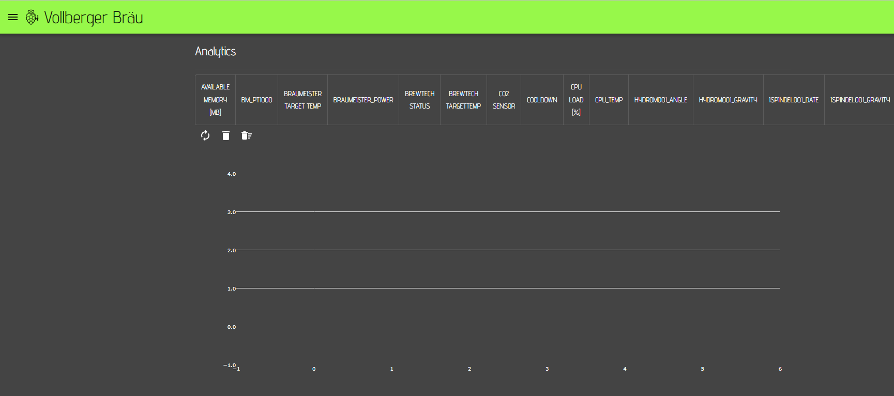

# Analytics

It has been already shown that you can add a chart for an individual sensor to the dashboard. If you are using small screens, these charts may be not prefect for you and if you want to delete the log of a sensor, you would need to add a chart for each individual sensor. The analytics page will help you to show data for multiple sensors in one chart but also allows you to delete the data for multiple sensors with just one click.

On top of the chart you can see all your sensors and can select multiple sensors.&#x20;

To show the data for the selected sensor or refresh the screen, you need to click on the refresh icon .

The chart below shows two selected sensors (Room temperature and Speidel).&#x20;


The log files are rotating automatically when they reach a certain size. This is the reason, why the data for the Speidel log is not shown for the entire timeframe.

Please note: You can only see data in the charts, when the sensor is writing data to a log file ad the server has access rights to the log folder.


If you want to delete one or multiple charts / log files, you need to select the corresponding sensors and click on the delete button on this page. A delete dialog will open where you need to confirm that you want to delete the data.

If you confirm to delete the data. the files will be deleted and can't be restored.&#x20;
