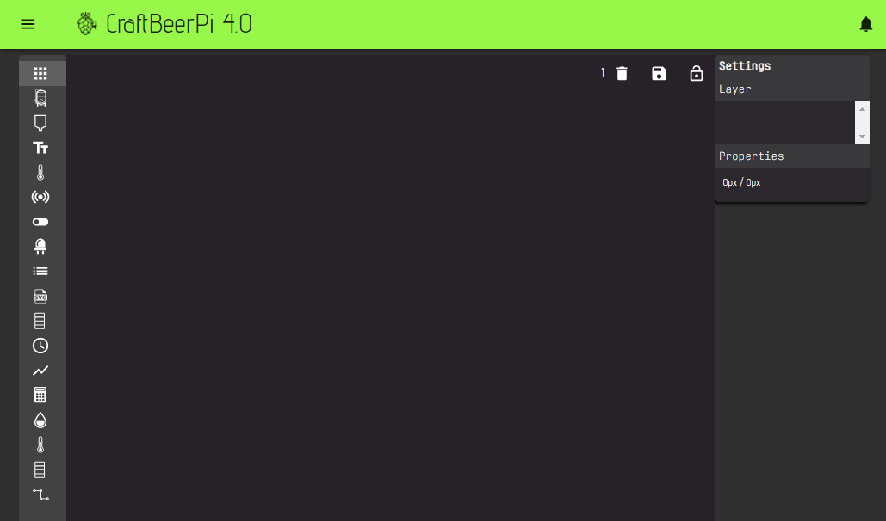
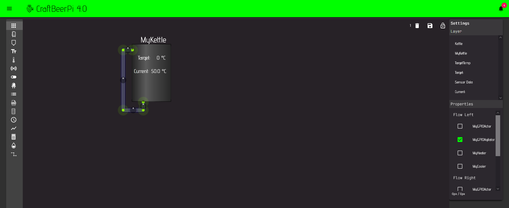
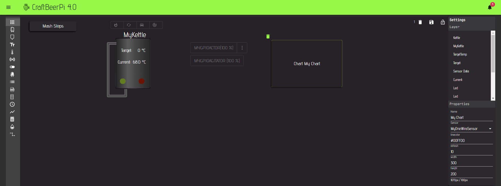
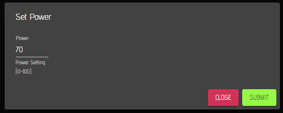
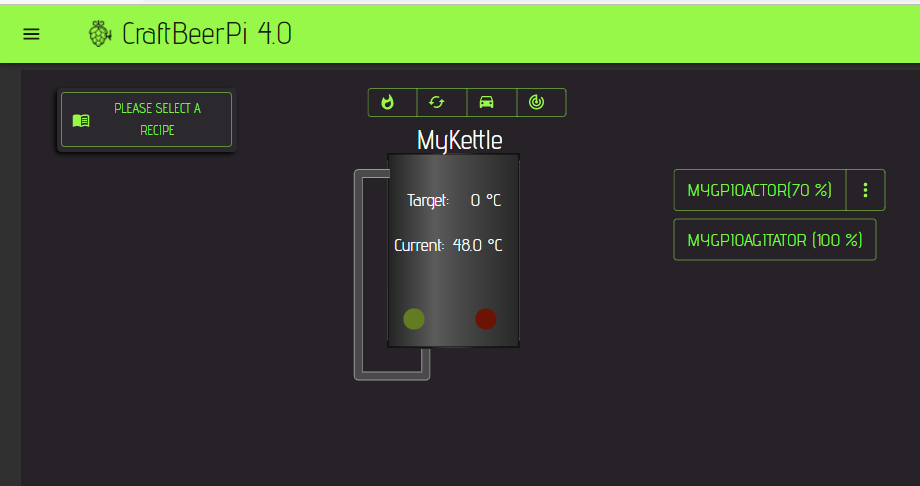
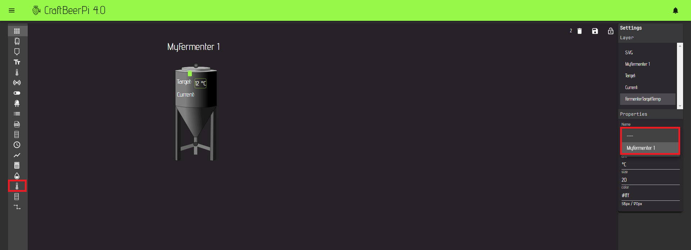
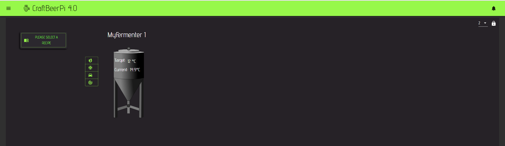

# Dashboard

## Dashboard Overview

As already mentioned on the start page of the configuration section, a freshly installed system starts with an empty dashboard.&#x20;


If you have already added and [configured your hardware](hardware.md), you can now add it to the dashboard.

In a first step, the documentation will give you an overview on the different components of the dashboard. Craftbeerpi 4 has the ability to define up to 10 different dashboards. You need to define the maximum number of dashboards in the [settings](settings.md#global-system-parameters).&#x20;

You can select the dashboard, that you want to work with by changing the number in the drop-down menu. If you want to edit the dashboard, you need to unlock it first  by pressing the unlock symbol.


Afterwards, the dashboard is in edit mode and will show some additional features.



On the left side, you see a menu that shows the available items you can add to the dashboard. At the top right, you see the current dashboard number you are editing. Next to the number you see a save symbol. You need to click on this symbol to save your changes before you lock the dashboard with the lock symbol on the right. On the right side you see a settings part where you can edit the settings for the active item you are working on. All the sections will be explained in the following parts.

## Item Menu


Many Item Names are not displayed on the dashboard. Nevertheless, you should specify them, as they are helpful if you want to change the order of layers on your dashboard.&#x20;


| Item          | Description                                                                                                                                | Poperties                                                                                                                                                                                                                                                                                                                                                        |
| ------------- | ------------------------------------------------------------------------------------------------------------------------------------------ | ---------------------------------------------------------------------------------------------------------------------------------------------------------------------------------------------------------------------------------------------------------------------------------------------------------------------------------------------------------------- |
| Kettle        | Adds a Kettle Symbol                                                                                                                       | <p>Name: specifies a name for the Kettle (not displayed)</p><p>Height/Width: determines the item size</p>                                                                                                                                                                                                                                                        |
| Tank          | Adds a Tank Symbol                                                                                                                         | <p>Name: specifies a name for the Kettle (not displayed)</p><p>Height/Width: determines the item size</p>                                                                                                                                                                                                                                                        |
| Text          | Adds text to the dashboard                                                                                                                 | <p>Name: specifies the displayed text</p><p>Size: defines text size</p><p>Color: defines color of text</p>                                                                                                                                                                                                                                                       |
| TargetTemp    | Adds a target temperature input for a kettle                                                                                               | <p>Name: specifies a name for the TargetTemp (not displayed).</p><p>Kettle: Select Kettle for which that temp shall be displayed.</p><p>Unit: Unit that is displayed behind target temp</p><p>Size: Text Size of displayed target temp</p><p>Color: Displayed color of item</p>                                                                                  |
| Sensor Data   | Adds a data field for a sensor                                                                                                             | <p>Name: specifies a name for the sensor data (not displayed).</p><p>Sensor: Select Sensor data to be shown.</p><p>Unit: Unit that is displayed behind sensor data</p><p>Size: Text Size of displayed data</p><p>Color: Displayed color of item</p><p>Digits: Digits to be shown for data</p><p>Action: Displays action button if sensor comes with actions.</p> |
| Actor         | Adds an Actor                                                                                                                              | <p>Name: specifies a name for the Actor(displayed).</p><p>Actor: Select an Actor.</p><p>Size: Text Size of displayed Actt</p><p>Color: Displayed color of item</p><p>Digits: Digits to be shown for data</p><p>Action: Displays action button if Actor comes with actions (e.g. Power settings).</p>                                                             |
| Led           | Adds a Led for an Actor                                                                                                                    | <p>Name: specifies a name for the Led (not displayed).</p><p>Actor: Defines the actor that triggers the Led state.</p><p>Color: select the led color (green, red, blue)</p>                                                                                                                                                                                      |
| Steps         | Adds a Mashstep field (only one field possible)                                                                                            | <p>Name: specifies a name for the MashSteps item (not displayed).</p><p>Width: defines the item width.</p><p>Stepsize: defines the text size of the steps.</p><p>Namesize: defines the recipe name textsize.</p>                                                                                                                                                 |
| SVG           | You can add your custom svg items for symbols (e.g. Kettle) Details described in this [section](dashboard.md#how-to-add-custom-svg-items). | <p>Name: specifies a name for the SVG item (not displayed).</p><p>Width: defines the item width.</p><p>Widget: Select a widget you copied into the widgets folder</p>                                                                                                                                                                                            |
| KettleControl | Adds a control for your Kettle or Fermenter (FermenterHysteresis Plugin required as Kettlelogic) sd                                        | <p>Name: specifies a name for the Kettle Control item (not displayed).</p><p>Kettle: Select the kettle to be controlled.</p><p>Size: Select one of three sizes for the item.</p><p>Orientation: Select horizontal or vertical</p>                                                                                                                                |
| Clock         | Adds a clock                                                                                                                               | <p>Name: specifies a name for the Clock item (not displayed).</p><p>Size: Textsize of the item.</p><p>Showdate: shows clock with date if set to yes.</p><p>Color: defines the color of the item</p>                                                                                                                                                              |
| Chart         | Adds a chart to display sensor values                                                                                                      | <p>Name: specifies a name for the Chart (displayed).</p><p>Sensor: select sensor data to be displayed.</p><p>Linecolor: define the color of the data.</p><p>Refresh: Refresh rate for the chart in seconds.</p><p>Width/Height: Defines chart size.</p>                                                                                                          |
| Calculator    | Adds a volume calculator                                                                                                                   | To be described                                                                                                                                                                                                                                                                                                                                                  |
| Liquid        | To be described                                                                                                                            | To be described                                                                                                                                                                                                                                                                                                                                                |
| FermenterTargetTemp    | Adds a target temperature input for a Fermenter                                                                                               | <p>Name: specifies a name for the TargetTemp (not displayed).</p><p>Fermenter: Select Fermenter for which that temp shall be displayed.</p><p>Unit: Unit that is displayed behind target temp</p><p>Size: Text Size of displayed target temp</p><p>Color: Displayed color of item</p>                                                                                  |
| FermenterControl | Adds a control for your Fermenter                                   | <p>Name: specifies a name for the Fermenter Control item (not displayed).</p><p>Fermenter: Select the fermenter to be controlled.</p><p>Size: Select one of three sizes for the item.</p><p>Orientation: Select horizontal or vertical</p>                                                                                                                                |
| Pipe          | Adds a pipe that displays a flow when an actor is on                                                                                       | <p>FlowLeft: Left Flow animation if selected actor is active.</p><p>FlowRight: Right Flow animation if selected actor is active.</p>                                                                                                                                                                                                                             |


### How to add custom SVG items

To upload custom SVG files to your server, you can go to the [system page ](system.md)and use the integrated upload fucntion.

You can also copy them manually into the so-called widget folder. The folder is inside your config folder structure. An example of a fermenter created with Inkscape can be found below.



Open a bash window and copy the SVG file manually into the widget folder. Let's assume you have a file called fermenter.svg in /home/pi, and you are in your home folder (/home/pi).

```
sudo cp fermenter.svg config/dashboard/widgets/
```

This will copy the fermenter.svg file into the widgets subdirectory, and you should now be able to select a widget called fermenter in the widget select field when adding a SVG item to your dashboard. You can also add the svg files to the [zip file of your config backup ](system.md#system-settings)and restore the config via the system page.


## Creating a simple single kettle brew dashboard

As already mentioned, CraftbeerPi 4 will start with an empty dashboard. Once you have added your hardware as described in the [hardware section](hardware.md), you can add items to your dashboard.


At the top right of the dashboard, you can select the dashboard number that you want to configure. Once the dashboard has been selected, you need to unlock the dashboard for configuration by pressing the unlock button right of the dashboard selector.



You can define up to 10 different dashboards for CraftbeerPi4. The default is set to a maximum number of 4. If you want to change that maximum number, you need to edit this on the [settings page](settings.md#global-system-parameters).


When you unlock the dashboard, it will change to edit mode and a new menu will pop up on the left side of the dashboard. The dashboard selector will change into a number, as you can't switch between different dashboards while in edit mode. A save icon is shown as you need to save your changes that they will take effect permanently. The unlock button has changed to a lock button. This button needs to be pressed to leave the dashboard edit mode.

On the right side of the dashboard you will see a setting / properties column where you can edit the properties of the active item


To add a kettle symbol, just press the kettle symbol and move it to the position where you want it. As mentioned earlier,  you should define a unique name for your kettle, although you won't see the name in the dashboard. It'll help you later, if you want to change the layer position of your item. Afterwards, define the size of your kettle.



An item in the dashboard that is in edit mode can be always selected by clicking on it. The active item has a green border and a recycle bin icon at the top left.  The properties window shows always the properties for the selected item. You can remove the item by clicking on the recycle bin icon.&#x20;


You can now also add a text field to the dashboard to show a name for your kettle. The text size and color can be specified on the right side in the properties' area.


Now you can add a target temp to the dashboard that shows the current target temp for your kettle. Also here, you should specify a name. You need to select the kettle that you defined in your hardware setup and enter the units you want to see behind the target temp. The size specifies the text size of the target temp and the color can be also changed in the properties field.


Now you should add a label for your target temp. Therefore, you need to add another text field, and you can enter for instance 'Target:'. Again, specify the size and color of the label.


Then, you should add the sensor you are using for your kettle. Just add a sensor item, select the sensor you are using for your kettle temperature measurement. Specify all the properties and add another label for your sensor.


If you also have a recirculation pump, you can add a pipe to your dashboard that is animated when the pump is switched on. Click on the pip symbol to add a pipe first. Afterwards click on the pip to select it as active item.



Please note, that pipes have no recycle bin sign when they are active. You cannot move them over the dashboard like other items. You need to place your mouse over a green end of the pipe and then you can 'grab' this point with the mouse by click and hold the mouse button and move the point over the dashboard to the desired position.


As the next step, move at least one pipe end to a position where you need it.



To add another point to the pip, click on the '+' between two points. The point will be added at the '+'.&#x20;

If you want to remove one point from the pipe, double click on one of the green points.&#x20;



If you want to remove the entire pip, enter the backspace button on your keyboard while the pip is the active element. On my system seems to be an issue that also the not active pipes will be deleted. This needs to be fixed in future


Now add another point to the pipe by clicking on the '+' symbol between the two green points of the existing pipe.


Now you can move the points around and add more points to design your pipe. You also need to select and actor (e.g. your pump) and define the direction of the flow. This can be changed later if the flow is moving into the wrong direction when your pump is on.



Now you can add led items to your dashboard that show if the heater or the pump is active. Therefore, you need to select the corresponding actor and color for each led. As you can see for example below for the red led (heater).


You also need to add a kettle control item to control your kettle in the so-called auto mode, which activates the kettle logic. You also should name the item in the properties field, and you need to select the kettle you want to control. The size of the buttons can be changed to fit to your needs. You can also change the orientation from horizontal to vertical depending on where you want to place the item. In another chapter, it will be shown how to [operate the kettle ](../operating-your-system.md)for brewing.


It is not required, but you can also place actor buttons for each actor on the dashboard. Just add an actor and configure it accordingly. Also, here you should define names for each of the actors, and you need to select the corresponding actor for the item. The size properties will define the text size shown for the actor, and you can select if actions are shown for the actor or not. In case you select actions to be shown for an item (in the example shown for the agitator) an extra menu is shown on the right side of the item. If the actor has power settings, the power will be displayed inside the button. Power settings can be changed from the actions menu that has to be enabled in the actor properties, when you add the actor to the dashboard.


Actions can be shown for Sensors and Actors. In case you select 'Yes' in the properties window for the item, the extra menu is displayed. When you click on the menu, a pop-up window will open with the actions defined for the item.&#x20;

Starting from cbpi 4.0.0.45 the GPIOActor and the GPIOPWMActor have power settings included. To change the power, you will need to activate the actions menu.

Standard sensors have not defined actions. Sensor examples with actions are for instance the [flowmeter](https://github.com/avollkopf/cbpi4-Flowmeter) and [loadcell](https://github.com/avollkopf/cbpi4-hx711-loadcell) plugins where you can set the sensor reading to zero or tare the loadcell.



It is also recommended adding an item for the mash steps to your dashboard. For this item you can define the width and the text size for the steps and the batch name. You will see the effect of these settings only when a recipe has been loaded. Details on how to work with the recipes will be shown in the [Mash Profile ](mash-profile.md)and [Recipe upload ](recipe-upload.md)section.


If sensor data should be displayed on the dashboard, a chart can be also added. Just select a sensor in the chart properties, define the width and height, as well as the refresh rate.


Although you can add charts to the dashboard, it is not recommended. As default, sensor data is stored in csv log files and they will be read every 10 seconds. Due to log file rotation, up to 4Mb in total can be read every 10 seconds per chart (default chart refresh rate). This will drive the cpu load up to 100% and the dashboard will become unrepsonsive. It is better to use the analytics page instead if you want to access the csv based logfiles. 




Finally, press the save button to save all your changes before pressing the lock button to end the edit mode.&#x20;


#### Changing power settings for an actor

If you have added GPIO or GPIOPWM Actors to your dashboard and activated the actions menu, you will see the three dots on the right side of the actor button. Click on the three dots to open the actions menu.


Now you neet to click on the Set Power menu item to open the dialog window for changing the power of your actor.



Enter a value between 0 and 100 (%) and click on the submit button to change the power for your actor. Afterwards, you need to click on the close menu itm to get back to the dashboard and you can see that the power setting has changed for your actor.


Although you can enter values smaller 0 or larger 100, these values will not take effect. Values smaller than 0 will be set to 0 and values larger than 100 will be set to 100.





Power settings will work for the standard GPIO Actor and for the GPIO PWM actor.

If the standard GPIO Actor is set to 100% it will work like a regular GPIO Actor. If the power is changed, the actor will balance the on / off state for the SamplingTime defined in the hardware setting. Tihs parameter can be set to 2 or 5 seconds.

**Example:** Sampling time is set to 5 seconds. Actor power is set to 60%. The actor will be switched on every 5 seconds for 3 seconds and off for 2 seconds.

For the GPIOPWM Actor, the user can define a frequency and the RPi.GPIO package will handle the power settings incl. the frequency. However, you should not set the frequency to high in particular if you are working with a standard SSR ([link](https://electronics.stackexchange.com/questions/436599/pwm-1hz-on-solid-state-relay)).



The RPi.GPIO package that is used for the PWM actor can set basically all GPIOs to PWM. But you need to know that this is still a software based PWM which is not suitable to run a servo. To run a servo you will need to add other hardware and [install the cbpi4-pca9685 plugin](../plugin-installation.md#actors).


Details on how to operate your system will be described in the [here](../operating-your-system.md).

## Creating a simple fermenter dashboard

To have a better overview, you can add your fermenter setup to a different dashboard. Select an empty dashboard at the top right of your CraftbeerPi 4 dashboard screen (e.g. 2)


This will open the second dashboard which is empty as you added all your brewing setup to the first dashboard. Unlock the dashboard with the unlock button to edit it.


You can now add again a kettle symbol as shown in the [brew dashboard section](dashboard.md#creating-a-simple-single-kettle-brew-dashboard).  Since this has been already shown, this time I show you how to add an SVG file as fermenter item. First you need to create and upload an SVG file as described [here](dashboard.md#how-to-add-custom-svg-items). Once this is done, reload the page and click on the SVG item on the menu at the right side.


Then select the widget you have uploaded in the properties on the right side. As soon as you select your widget, it will be shown on the dashboard.


Now you can add, as already shown for the brewing setup a name for your Fermenter. This time you need to add a fermenter target temp item and select the fermenter you did set up in the hardware section.



You also need to add a sensor to your fermenter to display the current temperature.


Afterwards add a fermenter control item to the dashboard and select the fermenter. You can select the size and the orientation for the control item. 


Now you can add also led items to display the activity of the heating or cooling actor. You need to select the corresponding actors for the led items (e.g. red: heater, blue: cooler). 


Save your dashboard and lock it.



&#x20;Now you can switch between both dashboards to focus on brewing or fermentation.

How to operate the fermenter will be shown in the section [Operating your system](../operating-your-system.md).
