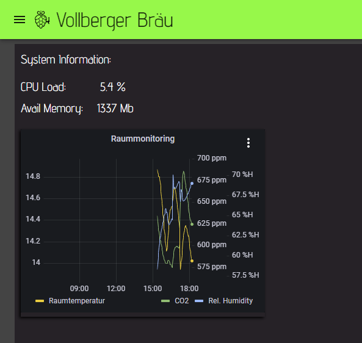

# Sensor data logging (CSV or InfluxDB)

The data retrieved by sensors can be logged in different ways. The default is csv logging. CSV files will be stored for each sensor and the log is rotating. This means, that up to 4 csv files with 1 Mb per file can be created per sensor. Some sensors write one datapoint per second. If you have variuos sensors, plenty of write cycle will be done per second which is not good for the health of an SD card. In addition to that dashboard charts will read from those files which may drive up the CPU usage to 100% and may cause an unresponsive Interface in particular, when you are using a screen that is directly connetec to your pi.

Therefore, it is not recommended to use charts in your brewing or femrentation dashboard. I recommend to use the analytics page instead.

To reduce the write cycles to the sd card, you could symlink the log folder also to an external hdd or even a network folder.

If you are not using the log files and charts at all, it is recommended to switch of csv logging, which can be done on the [settings page](settings.md#global-system-parameters) via the parameter CSVLOGFILES. Set this parameter to 'No'.

CraftbeerPi4 has also the possibility to forward the sensor data to an InfluxDB database. This method is way more sophisticated and recommended as it allows the user to use and display the data for instance with grafana. 

To activate this functionality, you need to adapt the [settings](settings.md#global-system-parameters) for InfluxDB (Address, Port, database name,..) and set the parameter INFLUXDB to 'Yes'. Currently, InfluxDB verions up to 1.8.X are supported. Version 2.0 or larger is not yet supported since the authorization is different.

Below is an example for the usage of Influxdb in combination with Grafana. The dashboard shows sensor data for the Kettle and two fermenters. In addition, data from the cbpi4-system plugin that monitors the CPU load, free memory and more is displayed. I am also using a SCD30 sensor to monitor the 'environmental condition' of the room (CO2, temp and rel. humidity) and display this on the same dashboard.

## Grafana Dashboard Chart
As shown in the [dashboard](dashboard.md#item-menu) section, you can also add a grafana chart to the dashboard.

