# Fermenter Profile

On the CraftbeerPi 4 fermenter profile page, you can create recipes manually and send them to the fermenter step widget of a defined fermenter. You can also store them in a recipe book and use them at a later point of time for the same or different fermenters. You can also clone recipes or modify existing recipes. If there is no active recipe defined, an empty window will open from where you can access the recipe book.

Now click on the recipe book button to open the recipe book. This will be empty when you open it for the first time.

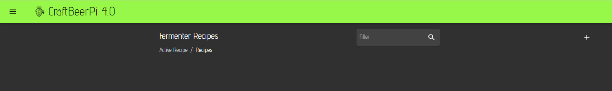

To create a new recipe, click on the '+' at the top right. An interactive menu will open where you can enter the Name of your recipe and click on the create button. 

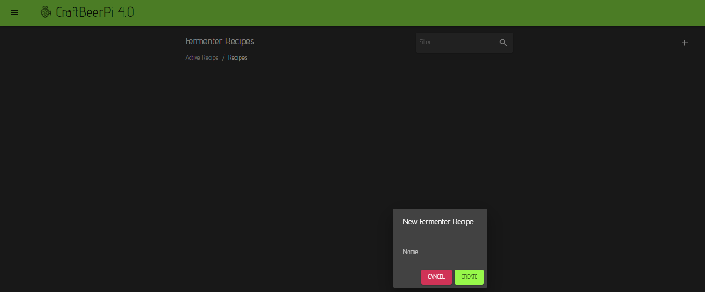

Afterwards, the recipe editor will open and you can add a description for the recipe

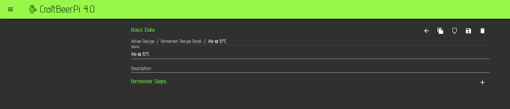

Now you need to add steps to the recipe. Therefore, you need to click on the '+' symbol on the right side of the fermenter steps label.

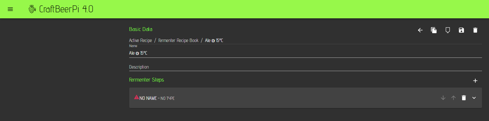

To edit the added step, you need to click on the 'down arrow' at the right side of the step. This will open an interactive menu for the step.

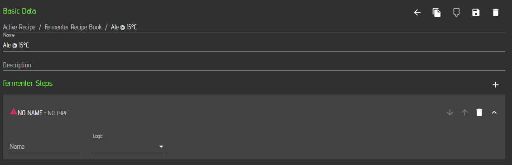

Now you need to select a mash step type which is currently labelled as 'Logic'. Therefore, you need to click on the Logic drop down menu and you will see the available step types.

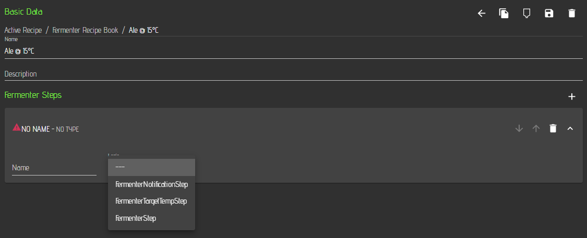

CraftbeerPi 4 comes with a pre-defined set of fermenter steps that can be added to a fermenter recipe. Additional steps can be added via plugins. Some examples will be described in the [Development](../development.md#creating-new-plugins) part.

The table below summarizes the function and parameters for the standard fermenter steps that come with CraftbeerPi 4.


All Steps have the name field and you should enter a name for each step. e.g. RampTo Target, MainFermentation1, MainFermentation2, ... as this information can be used in other plugins (e.g. LCDisplay)


|                  | Description   | Parameters  |
| ---------------- | ------------- | ----------- |
| FermenterTargetTempStep | Heats up or cools down to the target temp. Sends notification, when temp is reached and moves to next step. Can be used as first step to bring wort to temp for yeast pitching. | 
<strong>Temp:</strong> Target Temp for Step

<strong>Sensor:</strong> Sensor to be used for this step

<strong>Notification:</strong> Notification text that can be specified by user

<strong>AutoMode:</strong> If yes: Kettle Logic will be switched on/off when step starts/stops
 |
| FermenterRampTempStep | Heats up or cools down to the target temp with defined ramp rate. Sends notification, when temp is reached and moves to next step. Can be used as ramp step between two fermentation steps with different temperature. | 
<strong>Temp:</strong> Target Temp for Step

<strong>RampRate:</strong> Ramps is done with this rate in °/day

<strong>Sensor:</strong> Sensor to be used for this step

<strong>Notification:</strong> Notification text that can be specified by user

<strong>AutoMode:</strong> If yes: Kettle Logic will be switched on/off when step starts/stops
 |
| FermenterStep | Heats up or cools down to the target temp and runs until Timer is done. | 
<strong>TimeD:</strong> Time in days for Timer
<strong>TimeH:</strong> Time in hours for Timer
<strong>TimeM:</strong> Time in hours for Timer

<strong>Temp:</strong> Target Temp for FermenterStep

<strong>Sensor:</strong> Sensor to be used for this step

<strong>AutoMode:</strong> If yes: Kettle Logic will be switched on/off when step starts/stops
 |
| FermenterNotificationStep | Sends a Notification and can wait on user input. Can be used as step between two other steps with a required user input or at the end to inform the user that the fermentation is completed. | 
<strong>Notification:</strong> Notification text that can be specified by user

<strong>AutoNext:</strong> If set to 'No', step is waiting for user input to move to next step. Otherwise, next step is automatically started.
 |

## Write your first simple fermenter recipe

As described above, the basic data has been entered and the first step has been added to your recipe. Now you need to select a step type. I recommend to start with a FermenterTargetTemp step as this step will bring your wort to the desired temp at which you want to pitch the yeast. It sends a notification when the temperature is reached (You need to specify the text) and will automatically move to the next step.

You need to set the targeted temperature and you can select the sensor you want to use for this step. You should also specify a notification that is send when the target temperature is reached. I also recommend to set AutoMode to Yes.


AutoMode set to 'Yes' will switch on the fermenter logic when a step starts and switch it off at the end of the step. This is the recommended setting for your steps.


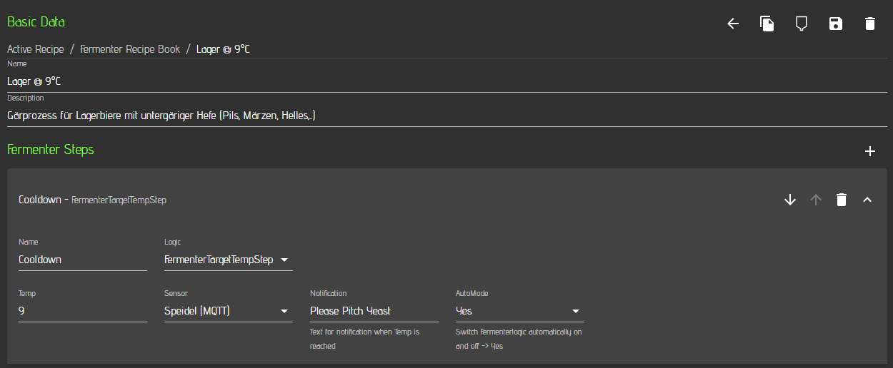

Now you need to add a step and define the temperature for the first fermentation step which can be the same as the first step step. Just click again on the '+' symbol to add an empty step and select FermenterStep as Logic. In this step you will need to define a timer in days, hours and minutes and select your temperature sensor. Also here I recommend to use the auto mode setting. The timer will start counting, once the target temperature is reached.


The three parameters for days, hours and minutes will add up. You can leave also some fields empty and it will be counted as 0.


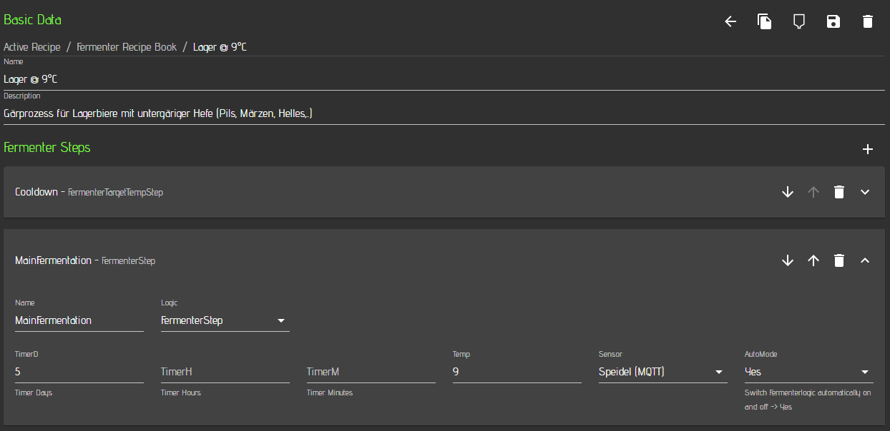

In this example we add another step at a higher temperature. The procedure to add another step is the same as before. Define name, temperature, time and select your sensor. Set Auto mode to 'yes'

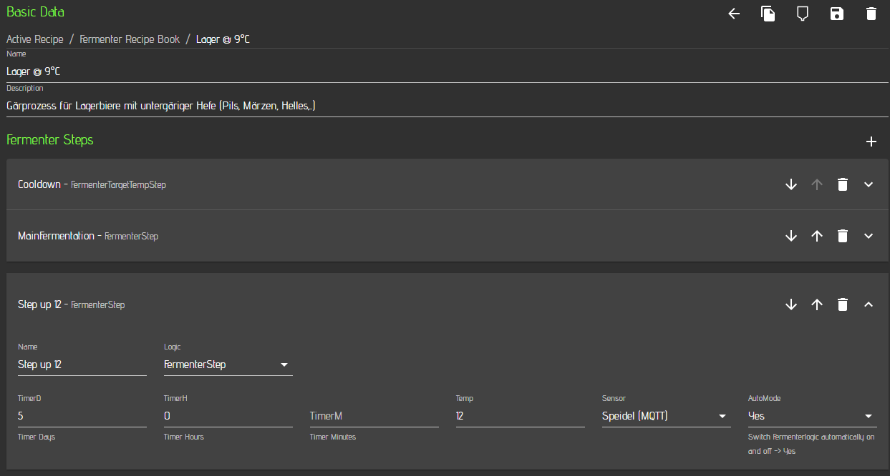

Afterwards, we add a step at 16°C to reduce the diacetyl. The other options will be the same as in the first two fermentation steps.

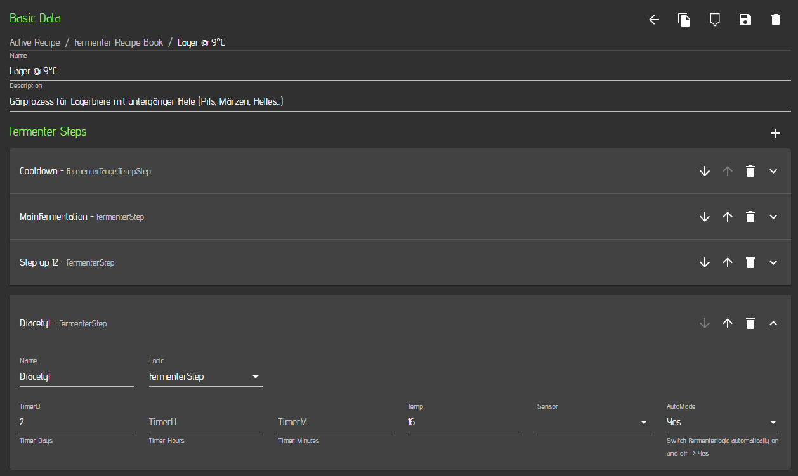

Below you can see now the full recipe with all steps. You can move a step up or down with the up/down arrows on the right side. You can delete a step by clicking on the recycle bin button and you can edit a step by clicking on the down arrow as described above.

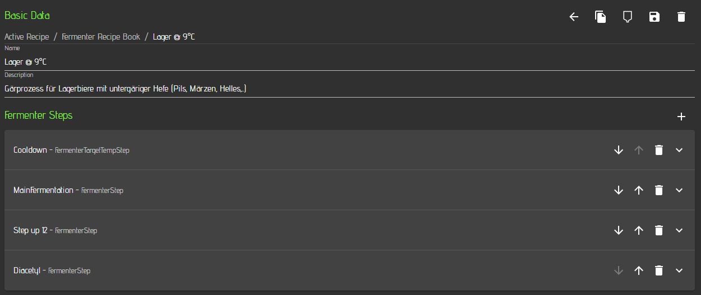

Now you should save your recipe to the recipe book by clicking on the save button at the top right. 

If you click on the back button 'left arrow' at the top, you will see your recipe book with your recipe. In this example you can see already multiple recipes in the recipe book 

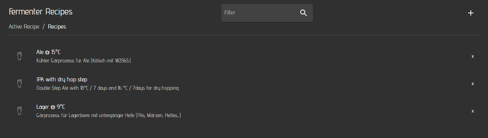

If you click on the recipe, you come back to the edit screen. At the top of the recipe edit screen is also a fermenter icon. You can send the recipe now to a fermenter by clicking on the fermenter icon. 


I recommend to store some basic recipes with global names Like 'Lager @ 9°C' as recipe name in the fermenter recipe book. Right before sending the recipe to the fermenter, just change the name to your current beer name but don't save the recipe to the book. Just click on the send button. The recipe book will have still the more generic recipe name, but the Fermenter and the corresponding step widget in the dashboard will show the beer name of your current fermentation.


A window will open where you need to select the fermenter, to which you want to send the recipe. 

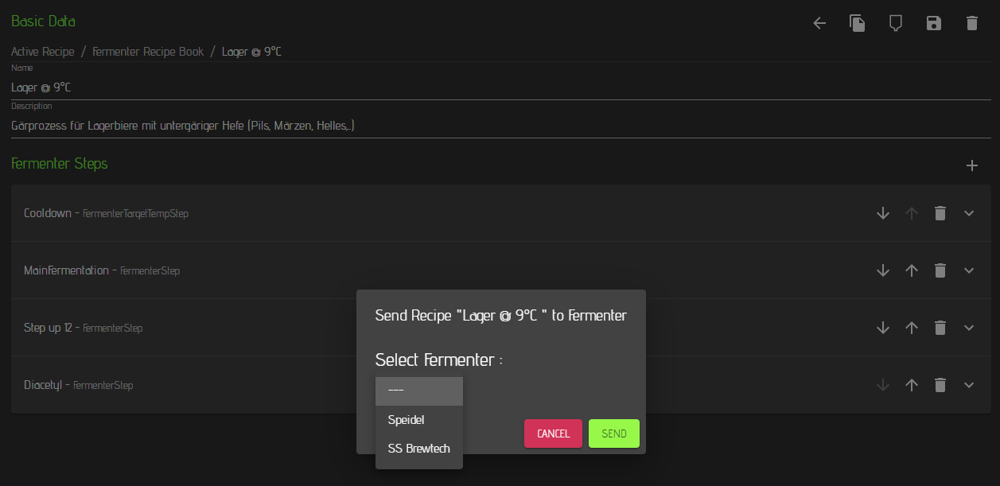

Select your fermenter and click on the send button.


If you have created a recipe for fermenter A and stored it in the recipe book and want to sent it at a later point of time to fermenter B, you don't need to take care of the temp sensors you may have specified. The send function will update the temp sensors with the correct IDs of the fermenter you send the recipe to.


A different window will open and you can basically start brewing by clicking on the start button. Also in this window, you can edit your recipe parameters or delete steps. You can also move steps up or down. 

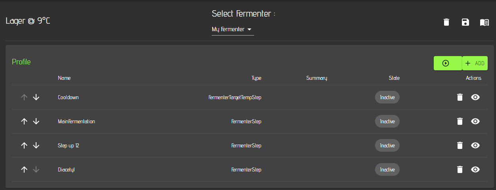

If you want to save your changed recipe as new recipe, click on the ave button. If you want to get back to the recipe book, you need to click on the recipe book icon on the top right. You can also select one of your fermenters from the drop down menu to see the active recipe for other fermenters.

If you go now to the Dashboard on your main menu and select the [Fermentation dashboard ](dashboard.md#creating-a-simple-fermenter-dashboard)you defined earlier, you will see that the active recipe is now also shown in your fermenter steps widget.

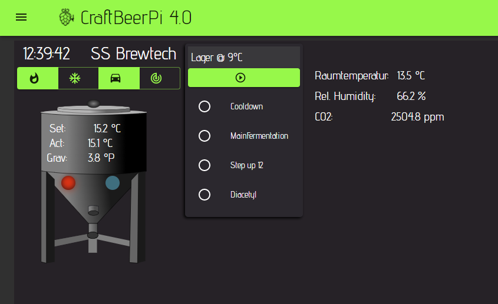

How to run now a recipe will be shown in the section [Operating your system](../operating-your-system.md#use-the-system-for-fermentation).
