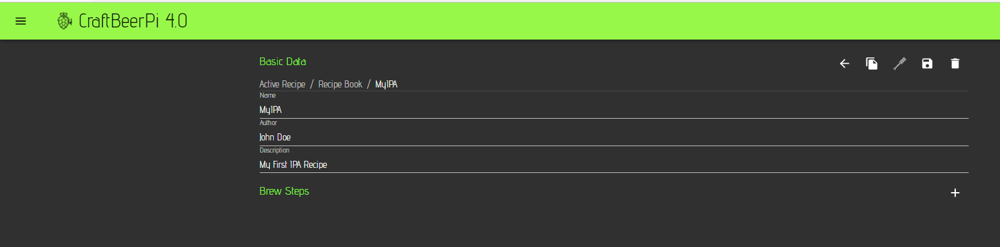

# Fermenter Profile

On the CraftbeerPi 4 mash profile page, you can create recipes manually and send them to the mash step item for brewing. You can also store them in a recipe book and use them at a later point of time. You can also clone recipes or modify existing recipes. There is also the possibility to import recipes via beerxml files, from the database of 'Kleiner Brauhelfer 2' or directly via the Brewfather API (Paid premium account required). This part will be described in the [Recipe Upload](recipe-upload.md) section. If there is no active recipe defined, an empty window will open from where you can access the recipe book.

Now click on the recipe book button to open the recipe book. This will be empty when you open it for the first time.

To create a new recipe, click on the '+' at the top right. An interactive menu will open where you can enter the Name of your recipe and a description. The brewer field will be filled with the brewer you entered on the [settings page](settings.md#global-system-parameters).&#x20;

Now you need to add steps to the recipe. Therefore, you need to click on the '+' symbol on the right side of the Brew Steps label.

To edit the added step, you need to click on the 'down arrow' at the right side of the step. This will open an interactive menu for the step.

Now you need to select a mash step type which is currently labelled as 'Logic'. Therefore, you need to click on the Logic drop down menu and you will see the available step types.

CraftbeerPi 4 comes with a pre-defined set of mash steps that can be added to a mash profile. Additional steps can be added via plugins. Some examples will be described in the [Development ](../development.md#creating-new-plugins)part.

The table below summarizes the function and parameters for the standard mash steps that come with CraftbeerPi 4.


All Steps have the name filed and you should enter a name for each step. e.g. MashIn, MashStep1, Boilstep, ... as this information can be used in other plugins (e.g. LCDisplay)


|                  | Description                                                                                                                                                                      | Parameters                                                                                                                                                                                                                                                                                                                                                                                                                                                                                                                                                                                    |
| ---------------- | -------------------------------------------------------------------------------------------------------------------------------------------------------------------------------- | --------------------------------------------------------------------------------------------------------------------------------------------------------------------------------------------------------------------------------------------------------------------------------------------------------------------------------------------------------------------------------------------------------------------------------------------------------------------------------------------------------------------------------------------------------------------------------------------- |
| MashInStep       | Heats up to the target temp and stops when temp is reached. This can be used to add e.g. Malt before moving to next step. User has to manually move to next step.                | 
<strong>Temp:</strong> Target Temp for MashInStep

<strong>Sensor:</strong> Sensor to be used for this step

<strong>Kettle:</strong> Kettle to be used for this step

<strong>AutoMode:</strong> If yes: Kettle Logic will be switched on/off when step starts/stops
                                                                                                                                                                                                                                                                                                   |
| MashStep         | Heats up to the target temp and runs until Timer is done.                                                                                                                        | 
<strong>Time:</strong> Time in Minutes for Timer

<strong>Temp:</strong> Target Temp for MashStep

<strong>Sensor:</strong> Sensor to be used for this step

<strong>Kettle:</strong> Kettle to be used for this step

<strong>AutoMode:</strong> If yes: Kettle Logic will be switched on/off when step starts/stops
                                                                                                                                                                                                                                              |
| BoilStep         | Heats up to the target temp and runs until Timer is done. Is sending notifications to add hops.                                                                                  | 
<strong>Time:</strong> Time in Minutes for Timer

<strong>Temp:</strong> Target Temp for BoilStep

<strong>Sensor:</strong> Sensor to be used for this step

<strong>Kettle:</strong> Kettle to be used for this step

<strong>AutoMode:</strong> If yes: Kettle Logic will be switched on/off when step starts/stops

<strong>First Wort:</strong> Sends a notification for First Wort Hops on Start if set to 'Yes'

<strong>Hop [1-6]:</strong> Sends up to 6 notifications for Hop alarms on specified times. Time is remaining Boil time in Minutes
 |
| CooldownStep     | Waits that Wort is cooled down to target temp and is sending a notification. Active Step if Actor is selected. Can switch actor on on start and off when target temp is reached. | 
<strong>Temp:</strong> Target Temp for Notification

<strong>Sensor:</strong> Sensor to be used for this step

<strong>Kettle:</strong> Kettle to be used for this step

<strong>Actor:</strong> Actor that is switched on during cooldown if selected (can be used to trigger a magnetic valve)
                                                                                                                                                                                                                                                                        |
| Waitstep         | Does nothing for a specified time. Can be used as Whirlpool step.                                                                                                                | **Time:** Time in Minutes for Timer                                                                                                                                                                                                                                                                                                                                                                                                                                                                                                                                                           |
| ToggleStep       | Switches an actor on or off                                                                                                                                                      | 
<strong>Toggle Type:</strong> defines if the specified actor is switched on or of in this step

<strong>Actor:</strong> Actor that is toggled
                                                                                                                                                                                                                                                                                                                                                                                                                                     |
| ActorStep        | Switches an Actor on for a specified time                                                                                                                                        | 
<strong>Time:</strong> Time in Minutes for Timer

<strong>Actor:</strong> Actor that is switched on for the specified time
                                                                                                                                                                                                                                                                                                                                                                                                                                                        |
| NotificationStep | Sends a Notification and can wait on user input. Can be used as step between Mash and boil for lautering with a required user input                                              | 
<strong>Notification:</strong> Notification text that can be specified by user

<strong>AutoNext:</strong> If set to 'No', step is waiting for user input to move to next step. Otherwise, next step is automatically started.
                                                                                                                                                                                                                                                                                                                                                    |

## Write your first simple recipe

As described above, the basic data has been entered and the first step has been added to your recipe. Now you need to select a step type. I recommend to start with a MashInStep as this steps will heat up your water to the target temperature and sends a notification when the temperature is reached and will wait for a user input before moving to the next step. This allows you to add the malt at the mash-in temperature.

You need to set the targeted mashin temperature and select the sensor and Kettle you want to use for this step. You should also specify a notification that is send when the target temperature is reached. I also recommend to set AutoMode to Yes.&#x20;


AutoMode set to 'Yes' will switch on the kettle logic when a step starts and switch it off at the end of the step. This is the recommended setting for your mash and boil steps


Now you need to add a mash step and define the temperature for the first mash step which can be the same as the mashin step. Just click again on the '+' symbol to add an empty step and select MashStep as Logic. In this step you will need to define a timer in minutes and select your temperature sensor and kettle. Also here I recommend to use the automode setting. The timer will start counting, once the target temperature is reached.

In this example we add another mash step at a higher temperature. The procedure to add another step is the same as before. Define name, temperature, time and select your sensor and kettle. Set Automode to 'yes'

Afterwards, we add a mashout step which is also a regular mashstep at 78°C for 5 minutes. The other options will be the same as in the first two mash steps.

Now it is recommended to add a Notification step for the lautering process before you can move to the boilstep. This step is based on a Notification step. Just select the notification step, enter some text for the notification and set AutoNext to 'No'. This will raise a pop-up message that needs to be confirmed before the system is moving to the next step.

As next step, you need to add a boilstep. In this step you need to define a couple of more parameters compared to the mash steps. However, the first few parameters are the same. You need to define the name, time, temperature. Then you need to select your sensor and kettle which can be for instance different from the mash kettle if your boil takes place in a different kettle. The lid alert flag can be set to yes. In this case the system will send a notification shortly before boiling temperature to remove the lid. AutoMode should e set again to 'Yes'. If your recipe has first wort hops included, you can set the First Wirt flag to yes. This will send a notification to add hops once you start this step. You can also define up to 6 hop/misc alarms. The time is the remaining boil time for the hops.

After the boilstep, it is recommended to add a waitstep that can be used as Whirpool. Just enter 15 minutes or your desired time for this step.

Finally, you can add a cooldown step for the active cool down of your wort. You need to specify a target temperature, select your sensor and kettle. You can also specify an actor that is triggered by this step (e.g. a magnetic valve that toggles the cooling water). If an actor is specified, the step will turn the actor on at start and turn it off, when the target cooldown temperature is reached. The step will also send a notification, when the target temperature is reached. It also tries to predict the time, when the target temperature is reached. However, this is currently not very accurate.

Below you can see now the full recipe with all steps. You can move a step up or down with the up/down arrows on the right side. You can delete a step by clicking on the recycle bin button and you can edit a step by clicking on the down arrow as described above.

Now you should save your recipe to the recipe book by clicking on the save button at the top right. If you click on the back button 'left arrow' at the top, you will see your recipe book with your first recipe. If you click on the recipe, you come back to the edit screen.&#x20;

At the top of the recipe edit screen is also a mash paddle. If you want to set the recipe you loaded as active recipe, you need to click the mash paddle and the recipe is loaded and you can use it for brewing. A different window will open and you can basically start brewing by clicking on the start button. Also in this window, you can edit your recipe parameters or delete steps. You can also move steps up or down.

If you select now the Dashboard on your main menu and select the [Brewing dashboard ](dashboard.md#creating-a-simple-single-kettle-brew-dashboard)you defined earlier, you will see that the active recipe is now also shown in your mash steps item.

As mentioned above, there is also a way to automatically create recipes. This will be shown in the [Recipe Upload section.](recipe-upload.md) How to run now a recipe will be shown in the section [Operating your system](../operating-your-system.md).
