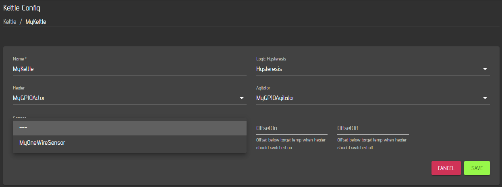
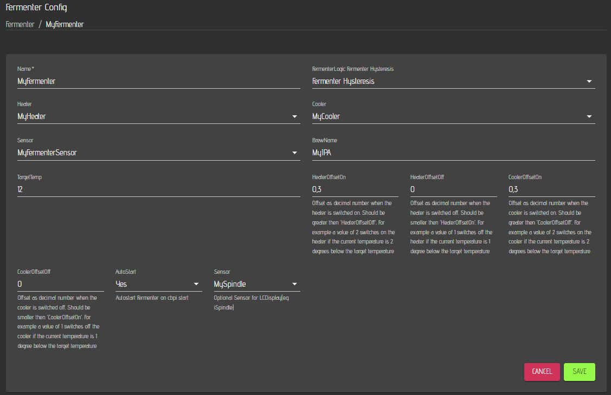

# Hardware

On the hardware page, you can set up your sensors, actors, kettles and fermenters. As sensor, a onewire sensor comes with cbpi4. If you need other [sensors](../plugin-installation.md#sensors), you can install them with a plugin. The default Actor is the GPIO actor that is also part of cbpi4. Other actor types can be installed via a [plugin](../plugin-installation.md#actors). The default kettle logic is a simple hysteresis. If you want to use a more sophisticated kettle logic such as a PID based logic, you will also add them via a [plugin](../plugin-installation.md#kettle-controller).

To add a Kettle, Sensor or an Actor, you need to click on the '+' symbol on the right side of the corresponding table.

## Setting up the hardware for brewing

The next chapter describes how to set up a kettle for brewing with the features that come with cbpi4. If you need different sensors or a different logic or a grouped actor, you need to install them via plugins.&#x20;

### Setting up a sensor

Start with a sensor. The onewire sensors need to be connected before you start cbpi4 as it reads the sensor ids only during startup. Plug and Play is currently not possible. Click on the '+' in the senor table and you will see the following window:

Select the Sensor Type (OneWire), enter a Name for your sensor, set 1 second as Interval and select the ID of your sensor. The interval defines the time how often a value is read and updated / stored to the log

The offset parameter is optional. If no value is entered, the default value of 0 is used (no offset). You can use the offset, to align the sensor readings if required.

Click on save and the sensor will be saved and you can see it in the sensor table of the hardware page.


Starting with Craftbeerpi4 4.1.6 and the UI 0.3.10, sensors have added a DataType property. This allows STrings and DateTime values for Sensors. One example is the Alarmtimer that you can add as sensor in the hardware section which acts as Alarmtimer.

Just add a Sensor to your hardware and select Alarmtimer.

Add this sensor also to the dashboard.

In the Sensor properties make sure, that you enabled the action menu.

In the action menu, you can set the timer in minutes, start and stop the timer. You canalso reset the timer.

If you set the timer, you need to enter the time in minutes. You can also use digits.

When you start the timer, is is running until 0 and is raising a notfication that can be forwarded via other plugins such as pushover push messages.

You can add multiple timers to your hardware and dashboard and have them running in parallel.


### Setting up an Actor

The next step is the setup of an actor. For a Kettle you will typically need two actors. One for the heating element and one for the pump or agitator. Click on the '+' in the actor table and you will see the following window:

Define a name for your actor, select GPIO Actor and define if the actor should run in inverted mode or not. The default is not inverted. That depends on your hardware configuration and the type of relay board you are using.&#x20;

The parameter SamplingTime is only interesting if you want to use power settings for a regular GPIO actor. The default value is 5 seconds, but you can set it also to 2 seconds. If you are using power settings for such an actor, the system will balance the time between on and off within the defined sampling time.


Power Example: Sampling time is set to 5 seconds and the power for the actor is set to 60%. The system will switch the actor on every 5 seconds for 3 sconds and off for 2 seconds.

If you want to use power settings directly from the dashboard, you need to add the actor to your dashboard and set the action poperty to yes.



Not inverted means that the actor will be on, when the GPIO is set to high. Inverted means that the actor will be on when the GPIO is set to low. Choose also the GPIO number your actor is connected to.&#x20;



The GPIO numbers represent the [BCM numbers ](../server-installation.md#display-your-gpio-numbers-with-wiringpi)and not the PIN numbers



GPIO PWM Actors have been added with cbpi >= 4.0.0.45. With this version, power settings are available for actors. Therefore, 'actions' have to be set to yes if you add the axctor to the dashboard.


Once your properties are set, hit the save button and you are back on the hardware page that shows now your sensor and actors:


You can always go back to the sensor or actor properties and modify them by clicking on the 'eye' on the right side of the corresponding item. If you want to delete the item, just click on the 'bin' on the right side of the item.


### Setting up a Kettle

Now you can setup your kettle as you need the sensor and the actors for that. Click on the '+' in the kettle table to add a new kettle:

Select a logic for your kettle. The hysteresis is the default simple logic. As mentioned, you can install other kettle logics as [plugin](../plugin-installation.md#kettle-controller) and you will seem them then in the selection list.


If you want to run a PID based Kettle logic like [PIDBoil](https://github.com/PiBrewing/cbpi4-PIDBoil) it is also recommended to install the [PID Autotune](https://github.com/PiBrewing/cbpi4-PID\_AutoTune) plugin as well. The Autotune plugin can be used to derive the PID parameters. Please note, that the Autotune Plugin is only to determine the PID parameters but not meant for brewing. Set the kettle logic to Autotune, define a kettle target temperature and start the automode. Wait and if the tuning is successful the Plugin will show you the claculated values. This can take up to several hours depending on your system. Details can be also found in the plugin description.


Please also define a name for your kettle and select an actor for your heating element.

Now select an actor for your pump / agitator.

The next step is to select the sensor for your kettle.

Finally, you will need to define the hysteresis parameters OffsetOn and OffsetOff.


OffestOn: Offset below target temperature when the heater switches on. E.g. 0.3 means the heater switches on, if the current temperature is 0.3° or more below the target temperature.&#x20;

OffsetOff: Offset below the target temperature when the heater switches off. E.g. 0.1 means the heater is switching off, if the current temperature is 0.1° below the target temp.

OffsetOn has to be larger than OffsetOff


Now you need to save the kettle and can see it also on the hardware page.

In the next step you should go to the [settings ](settings.md)page to define some global settings incl. your default mashtun and boil kettle but also the temperature units. Afterwards you can start to add your hardware to the [dashboard](dashboard.md).

### Setting up a Fermenter

If you want to use your system also for fermentation, you can set up fermenters in the same way as kettles. Currently, CraftbeerPi4 has one Fermenter Logic plugin included which is based on a hysteresis logic. 

Add a fermenter on the hardware page, enter a name for your fermenter and choose Fermenter Hysteresis as logic.

Once you have selected Fermenter Hysteresis as Logic, you will see more properties that you need to define. The steps to set up a fermenter are basically the same as for a regular kettle. You need to [define a sensor ](hardware.md#setting-up-a-sensor)for the temperature measurement of your fermenter. In addition you will need to [define an actor ](hardware.md#setting-up-an-actor)for heating and another actor for cooling as described above.&#x20;

Afterwards, you need to define the offset values for the hysteresis for both, cooler and heater.&#x20;


HeaterOffsetOn: Offset below target temperature when the heater switches on. E.g. 0.3 means the heater switches on, if the current temperature is 0.3° or more below the target temperature.&#x20;

HeaterOffsetOff: Offset below the target temperature when the heater switches off. E.g. 0.1 means the heater is switching off, if the current temperature is 0.1° below the target temp.

HeaterOffsetOn has to be larger than HeaterOffsetOff

CoolerOffsetOn: Offset above target temperature when the cooler switches on. E.g. 0.3 means the cooler switches on, if the current temperature is 0.3° or more above the target temperature.&#x20;

CoolerOffsetOff: Offset above the target temperature when the cooler switches off. E.g. 0.1 means the cooler is switching off, if the current temperature is 0.1° above the target temp.

CoolerOffsetOn has to be larger than CoolerOffsetOff

BrewName: Name of your beer in femrentation. Will be for instance shown in the LCDisplay Plugin

TargetTemp: Target temprature for your femrnetation process. This will be used for the automode. Howerver, you can set this also via the fermentercontrol item



The parameter Autostart defines if the fermentation logic should start automatically on a reboot or restart of CraftbeerPi4. You can enter a Name for your current fermentation. This will be used by the modified [LCDisplay Plugin](hardware.md#setting-up-the-hardware-for-brewing) and shown on the display for each fermenter during fermentation activity. The same is true for the second sensor. You can for instance use here a iSpindle and display the current gravity on your LCD Screen.

You can also define your fermentation target temperature in the fermenter properties, but this can be also set via the fermenter controll on the dashboard.


Don't forget to set Automode to 'No' whenever you have no active fermentation as it will switch on your logic after every restart of CraftbeerPi4


Now click save and then you can add your Fermenter to the dashboard.
