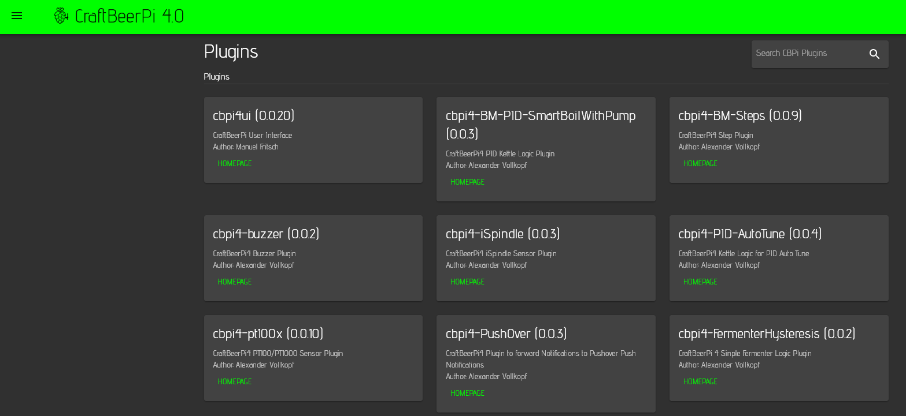

# Plugins

The Plugin page does currently show the installed plugins including their version. If the plugin provider has added metadata to his plugin, some of this information including a link to the plugin page will be shown.


To see content on this page you need to run 4.0.0.40 or later of the server and 0.0.19 or later of the user interface.

At this point of time you can't install, activate or deactivate plugins on this page. It only shows the plugins you have installed and activated via command line. There are plans to change this page at a later point of time and add additional functionalities such as plugin installation and de-installation


