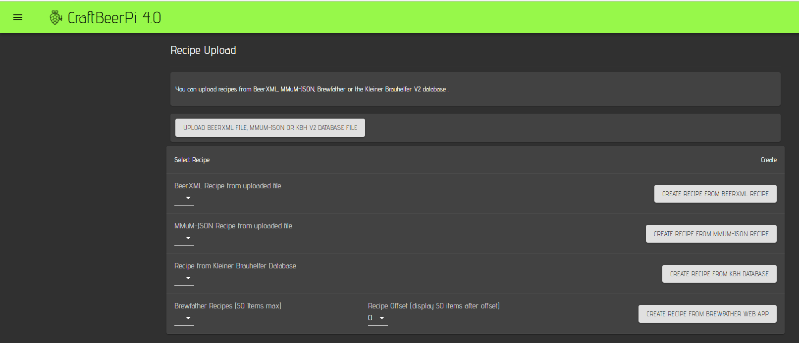
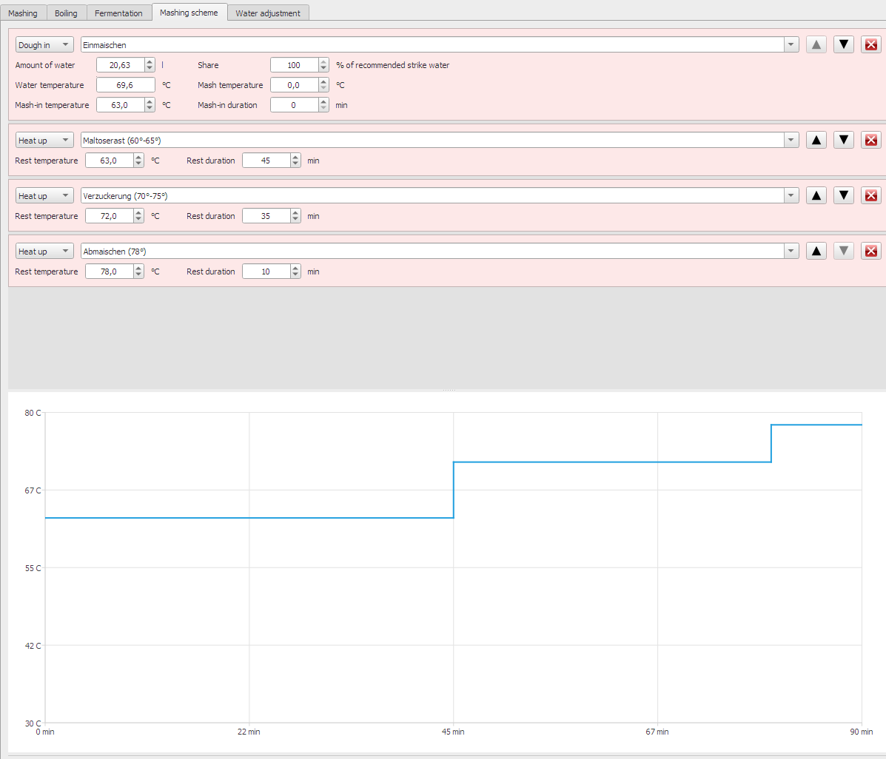
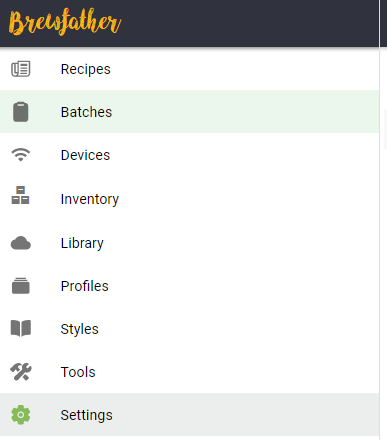
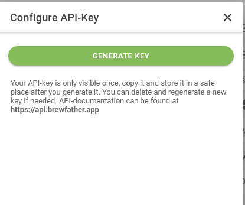
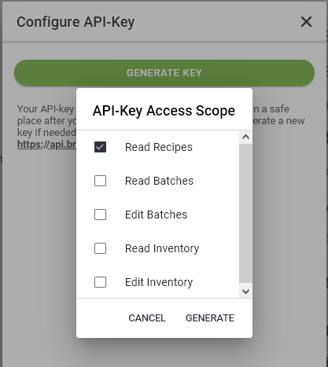

# Recipe Upload

## Overview

CraftbeerPi 4 has the possibility to create recipes automatically. There are different possibilities to create a recipe.

1.  beerxml Files:

    If you are using an application that can export files in the beerxml standard (e.G. [Beersmith](http://beersmith.com)), you can upload the beerxml based file to CraftbeerPi4 and create a recipe from the file.

2.  JSON recipe files from [MaischeMalzundMehr](https://www.maischemalzundmehr.de/):

    You can upload JSON based recipe files from the [MuMM](https://www.maischemalzundmehr.de/) page like the beerxml files and create a CraftbeerPi4 recipe

3.  [Kleiner Brauhelfer 2 ](https://github.com/kleiner-brauhelfer/kleiner-brauhelfer-2)(KBH2) database file:

    You can also upload the sqlite database file to CraftbeerPi 4 and select any recipe from the database to create a local CraftbeerPi 4 recipe automatically and start brewing

4.  Brewfather API (Paid BF Premium account required):

    If you have a paid Brewfather Premium account you need to go to settings and create an API Key that allows you to read recipes. The brewfather app will provide you a user id and an api key. You need to enter both strings into the corresponding parameters in the [CraftbeerPi settings.](settings.md#recipe-creation-settings) Don't forget to hit the save button on the settings page.

The recipe upload page has one upload button where you can upload the xml file or the sqlite database.


You can only upload one xml file at a time. If you upload another xml file, the first xml file will be replaced.

If you create a recipe from the xml file, you can save the recipe in the local recipe book and upload another xml file to create a new recipe. Also this recipe can be saved in the local recipe book.



You can also upload the sqlite database only once, but you can access all recipes from the database. When you change your recipes or add recipes in the KBH2 software, you can upload the sqlite database again to replace the existing database.


When you click on the upload button, a file upload dialog will open where you can select xml or sqlite files.

Once the beerxml file or the database have been uploaded, you can create recipes from the uploaded files. In the select Recipe section you have the possibility to select either a recipe from the xml file, a recipe from the KBH2 database or a recipe from the Brewfather API.

## Define your default recipe creation settings

To create the recipes automatically from these sources, it is required to configure your CraftbeerPi 4 [recipe creation settings](settings.md#recipe-creation-settings) correctly.

First, you need to define the kettle, that should be used as mashtun. If you want to use a different kettle for the boil step and the following steps, you will also need to define the kettle in the settings. If no kettle is defined for the boil kettle, the same mash kettle will be used.

Auf you always want to have a MashIn Step as first step that automatically heats up your water to the target mash-in temperature, you should set AddMashInStep to yes. This will add the MashIn step in case you have not defined one in the source recipes.

The AutoMode function has been already described in the [Mash Profile section](mash-profile.md). If you want to use that function also in the recipes that are created automatically from the external sources, you need to set this parameter to yes.

In addition you will also need to define the default steps the system shall use for the automated recipe creation. The default values should work for the most of you. However, is one has created and activated a step plugin with alternative steps, it is possible to pre-define other steps as default steps.

MashIn, Mash and Boil steps should be clear and details can be found in the table of the [Mash Profile Section](mash-profile.md). The default MashOut step is defined as Notification step. The system will inform the user with a notification, that the mash process has been completed and that some action is required before the boiling starts. The user can start the lautering process and once he clicks on the next button, the boil process will start.

You can also define the default boil temperature and the cooldown target temperature in the default settings. In addition it is possible to define an alternative sensor that is used in the cooldown step. This is for example helpful if your default sensor is at the bottom of your kettle and all the trub sits on top of it during cooldown (e.g. the Speidel Braumeister).


The default temperature settings for boil and cooldown are in °C. If you operate your system in F you need to change those settings once before you create any recipe from an external source.


## Example for XML recipe creation (Beersmith)

Beersmith is used as an example on how to create a recipe with a mash profile which is exported as beerxml file and can be used for the xml recipe creation.

In this example, the initial step has the same temperature as the first mash step and the time is 0 minutes. There is also no heat up time specified. The other mash steps are defined with the temperatures and time you need for your mash.

When exporting such a recipe as beerxml and importing it into craftbeerpi, the recipe creation mechanism will define the step that has 0 minutes duration as mashin step. The system will be heated up to 62°C and sends a notification to the user to add malt and press the 'next step' button.


If you don't want to add the additional step with the mashin temperature and 0 minutes as first step in your recipes, you can set the AddMashInStep parameter in the [settings ](settings.md#recipe-creation-settings)to 'yes'. CraftbeerPi will add a MashIn step as first step that has the target temperature of your first mashstep.


Once you uploaded your recipe to CraftbeerPi 4, you will see the recipe in the drop down menu of the beerxml recipes.

To create a recipe from the xml file, just select the recipe in the drop down menu and click on the create recipe button for beerxml recipes on the right side.

## Example for KBH2 recipe creation

In the KBH2 software you are able to define different recipes and store them in a sqlite database. You can also export individual recipes in the beerxml format and import them as xml file. But you can also upload the entire KBH2 database and have access to all KBH2 recipes in parallel.&#x20;

In KBH2, the mash profile is defined  in the mashing scheme tab. This software has the ability to define a dedicated mashin step. It's called dough-in. If you define such a step, CraftbeeerPi 4 will use this step as mash-in step and heats up to the defined temeprature of the 'dough-in' step befroe it reminds to user to take action and press 'next step' to mive on.

As soon as you successfully uploaded a KBH2 sqlite database file to CraftbeerPi 4 you should be able to see all the recipes from the KBH2 database in the corresponding dropdown menu.

To create a recipe from the KBH2 database, just select the recipe in the drop down menu and click on the create recipe button for KBH2 recipes on the right side.

## Example for Brewfater API recipe creation

CraftbeerPi 4 has the possibility to import recipes directly from the brewfather app if you have a paid premium account.

### Brewfather API key generation

Before you can use this feature, you will need to create a UserID and an api Key that allows you to read recipes in your Brewfather App settings.&#x20;


Generation of the API Key needs to be done only once. As soon as you have created they key and entered your user id and api key into the CraftbeerPi settings you can use this feature until you change the API key settings in the brewfather app for some reason


Click on the settings menu item on the left side.

On the right side all the settings will be shown. You need to look for the API menu item.

Clock on the generate button to create an API key. This will open another window.

Click on the 'Generate Key' button.

Now you need to select 'Read Recipes' for the CraftbeerPi4 recipe upload functionality. You can select other funtions in addition which will have no effect for CraftbeerPi 4. Click on the 'Generate' button and the keys will be created.

Now you can copy the keys directly to the clipboard to transfer them your CraftbeerPi 4 settings.


The brewfather App will show the generated API key only directly after creation. If you go back to this window at a later point of time, you will see only the user id. If you need the key at a leter point of time, you should note it somewhere else. Otherwise, you need to create a new key and update the API key in the CraftbeerPi 4 settings


### Brewfather recipe settings for optimized upload

As already described in the XML recipe creation part in the Beersmith example, you can also add a first mash step with 0 minutes as mash in step. This temperature will be used in CraftbeerPi 4 for the mash-in step to heat up your water before you add the malt. The second option is to add no step but have set the [AddMashInStep settings parameter](settings.md#recipe-creation-settings) to Yes. In this case, a MashIn step will be added and the temperature of the first step will be used for the MashIn step. In the third option, you also need to set the AddMashInStep parameter to yes and set the Strike Temperature Parameter for your Equipment in the Brewfather App. Brewfather will calculate the optimum temperature for your system and adds it to the recipe. This temperature will be used as MashIn temperature if provided by brewfather.

The mash-in step stops, when the target temperature is reached and will raise a notification. You need to confirm by clicking 'next step' to move to the next step.

The example below shows a mash-in step @ 65°C, while the first mash step is done at 63°C.&#x20;


If you don't want to add the additional step with the mashin temperature and 0 minutes as first step in your recipes, you can set the AddMashInStep parameter in the [settings ](settings.md#recipe-creation-settings)to 'yes'. CraftbeerPi will add a MashIn step as first step that has the target temperature of your first mashstep. If Brewfather is providing the Strike Temperature, this temperature will be used instead.


On the right side you can see the hop additions. If you want to give a first wort hop addition (Vorderwürzehopfung), just specify it. The recipe creation mechanism will add a notification to the boilstep for first wort hops and raise this notification, when you start the boilstep. The other hop alarms (up to 6 alarms) will be added to the boilstep. CraftbeerPi 4 will send a notification for each hop alarm.

When everything is configured correctly and you have created and stored your recipes in the Brewfather app, you will see them in the Brefather drop down menu on your CraftbeerPi 4 Recipe Upload page.

The Brewfather API limits the recipe download to batches of 50 recipes. If you have more the 50 recipes in your account, you need to change the offset dropdown menu.

If you have for instance 75 recipes defined in your brewfather account, you can select recipe 1-50 with the offset 0 and recipe 51 to 75 with the offset 50. With the offset, you can select up to 250 different recipes from your Brewfather account.
