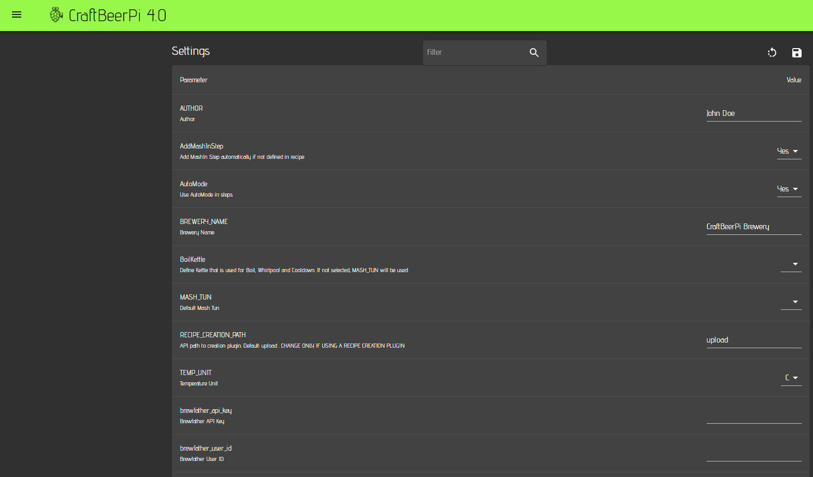

# Settings

As described in the Hardware section, each sensor, actor or kettle has individual properties. However, there are also global parameters / settings that need to be defined for CraftbeerPi 4. This can be done on the settings page.&#x20;

After the server installation you will see already quite a few parameters with some default values, but also parameters with empty values. At least some of them need to be entered or adapted. When you enter or change settings on this page, you need to click the save symbol on the top right corner.&#x20;


Please note that it may seem to be that the values have not been saved correctly, if you move back to e.g. the dashboard and then again to the settings page. This is currently bug in the frontend. Just press F5 to reload the page and you will see the saved parameters.



Whenever you install a plugin, you also need to pay attention to the settings page, as some plugins will add parameters to the settings page


## Parameters

The following tables will show the settings grouped into different topics.

### Global system parameters

| Name                     | Description                                                  |
| ------------------------ | ------------------------------------------------------------ |
| Author                   | Name of the brewer - Will be shown in the local recipes      |
| Brewery Name             | Brewery Name. For instance shown on the LCD Display standby. |
| Temperature Unit         | Global setting for temperature unit F or C                   |
| Current Dashboard Number | Used by the system. No change on user side required          |
| Max number of Dashboards | Maximum number of dashboards that can be used (1 - 10)       |
| CSVLOGFILES              | Yes / No: Write sensor data to csv log files. If no, dashboard charts and analytics page will not show sensor data |
| INFLUXDB                 | Yes / No: Forward sensor data to influxdb (up to V1.8.x)     |
| INFLUXDBADDR             | IP address of your influxdb server                           |
| INFLUXDBNAME             | Name of the influxdb database the sensor data should be sent |
| INFLUXDBPORT             | Port of the influxdb server (typically 8086)                 |
| INFLUXDBPWD              | Influxdb password in case your server is configured to require a password |
| INFLUXDBUSER             | Influxdb password in case your server is configured to require a user |

### Recipe creation settings

These parameters are relevant if you want to create recipes automatically from external sources like beerxml files, the database from Kleiner Brauhelfer 2 or from the brewfather API.


Details on mash steps are documented in the [Mash Profile section](mash-profile.md).


| Name                      | Description                                                                                                                                                                                                                                                                                                                     |
| ------------------------- | ------------------------------------------------------------------------------------------------------------------------------------------------------------------------------------------------------------------------------------------------------------------------------------------------------------------------------- |
| AddMashInStep             | If you have not defined a mashin step in your recipe (a first step with 0 minutes), the system can add a mashin step if set to yes                                                                                                                                                                                              |
| AutoMode                  | If set to yes, the kettle logic will be switched on and off automatically for each step and the mash process runs automatically                                                                                                                                                                                                 |
| Boil Kettle               | If you use a different kettle for mash and boil, you can define the kettle you are using for boiling and this will be taken into account when a recipe is created from an external source. If not set, the MASH\_TUN will be used as default                                                                                    |
| MASH\_TUN                 | Defines your default mashtun. This parameter needs to be set. Otherwise, the automatic recipe creation won't work                                                                                                                                                                                                               |
| Recipe\__Creation\__Path  | This parameter needs to remain unchanged unless you want to use a plugin for the automated recipe creation. Details are explained in the [Recipe Import Plugin](https://github.com/avollkopf/cbpi4-RecipeImport) that users can adapt to their needs.                                                                           |
| brewfather\__api\__key    | Enter the brewfather api key, if you want to create recipes directly from your brewfather account (Paid Premium account required)                                                                                                                                                                                               |
| brewfather\_user_\_id_    | Enter the brewfather user id, if you want to create recipes directly from your brewfather account                                                                                                                                                                                                                               |
| steps\_boil               | Defines the default boil step and can be adapted if a step plugin is used. Default: BoilStep                                                                                                                                                                                                                                    |
| steps\__boil\__temp       | Defines the boil temperature used for automated recipe creation. Default: 99. Needs to be adapted in case you run your system in F                                                                                                                                                                                              |
| steps\_cooldown           | Defines the step used for cooldown at the end of your entire process. It raises a notification once the target temperature is reached. Default: CooldownStep and can be adapted, if a step plugin is used                                                                                                                       |
| steps\__cooldown_\_sensor | You can define a different sensor for this step which can be helpful for some systems (e.g. Speidel Braumeister). If empty, the default sensor of your Boil Kettle is used.                                                                                                                                                     |
| steps\__cooldown_\_temp   | Target temp of your cooldown step when the Notification is raised that the temp is reached. Default: 20. This also needs to be adapted if you operate your system with F                                                                                                                                                        |
| steps\_mash               | Defines the step that is used as mash step. Default: MashStep and can be changed if a step plugin is used                                                                                                                                                                                                                       |
| steps\_mashin             | Defines the step that is used as mashin step. The difference to the MashStep is that this step heats up to the target mashin temp and stops the system afterwards. It will raise a notification to add the malt and you need to confirm to start the next step. Default: MashInStep and can be changed if a step plugin is used |
| steps\_mashout            | Defines the step that is used as mashout step. This is not  a real mashstep but meant as notification step to remind the brewer that the mashing is completed and that he needs to start the lautering before the boil can start. Default: NotificationStep which requires a confirmation to move to the next step / boil.      |

## Sensor data logging (CSV or InfluxDB)

The data retrieved by sensors can be logged in different ways. The default is csv logging. CSV files will be stored for each sensor and the log is rotating. This means, that up to 4 csv files with 1 Mb per file can be created per sensor. Some sensors write one datapoint per second. If you have variuos sensors, plenty of write cycle will be done per second which is not good for the health of an SD card. In addition to that dashboard charts will read from those files which may drive up the CPU usage to 100% and may cause an unresponsive Interface in particular, when you are using a screen that is directly connetec to your pi.

Therefore, it is not recommended to use charts in your brewing or femrentation dashboard. I recommend to use the analytics page instead.

To reduce the write cycles to the sd card, you could symlink the log folder also to an external hdd or even a network folder.

If you are not using the log files and charts at all, it is recommended to switch of csv logging, which can be done on the settings page via the parameter CSVLOGFILES. Set this parameter to 'No'.

CraftbeerPi4 has also the possibility to forward the sensor data to an InfluxDB database. This method is way more sophisticated and recommended as it allowls the user to use and display the data for isntance with grafana. 

Below is an example for the usage of Influxdb in combination with Grafana. The dashboard shows sensor data for the Kettle and two fermenters. In addition, data from the cbpi4-system plugin that monitors the CPU load, free memory and more is displayed. I am also using a SCD30 sensor to monitor the 'environmental condition' of the room (CO2, temp and rel. humidity) and display this on the same dashboard.

