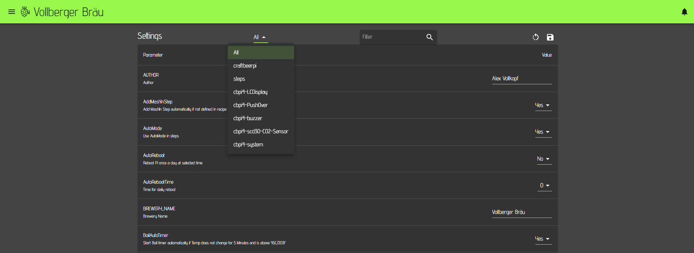

# Settings

As described in the Hardware section, each sensor, actor or kettle has individual properties. However, there are also global parameters / settings that need to be defined for CraftbeerPi 4. This can be done on the settings page.

After the server installation you will see already quite a few parameters with some default values, but also parameters with empty values. At least some of them need to be entered or adapted. When you enter or change settings on this page, you need to click the save symbol on the top right corner.


Whenever you install a plugin, you also need to pay attention to the settings page, as some plugins will add parameters to the settings page.


Starting with Craftbeerpi 4.1.10 and UI 0.3.12, the settings page has also a dropdown box at the top of the page, where the user can choose 'All' to see al settings or can select a plugin, that has added global settings. 


To see the plugin settings under the correct selection, you need to update the plugins to the latest version ad the plugin creator has to adapt the parameter creation in his plugin accordingly.


## Parameters

The following tables will show the settings grouped into different topics.

### Global system parameters

| Name                     | Description                                                  |
| ------------------------ | ------------------------------------------------------------ |
| Author                   | Name of the brewer - Will be shown in the local recipes      |
| Brewery Name             | Brewery Name. For instance shown on the LCD Display standby. |
| Temperature Unit         | Global setting for temperature unit F or C                   |
| Pressure Unit            | Global setting for pressure unit kPa or PSI                   |
| Current Dashboard Number | Used by the system. No change on user side required          |
| Max number of Dashboards | Maximum number of dashboards that can be used (1 - 10)       |
| MQTTUpdate               | Forced MQTT Update frequency in s for Kettle and Fermenter (no changes in payload required). Restart required after change |
| CSVLOGFILES              | Yes / No: Write sensor data to csv log files. If no, dashboard charts and analytics page will not show sensor data |
| INFLUXDB                 | Yes / No: Forward sensor data to influxdb (up to V1.8.x)     |
| INFLUXDBADDR             | Full address of your influxdb server (e.g. http://localhost:8086)
| INFLUXDBCLOUD            | Yes / No: Write data to influxdbcloud or v2                  |
| INFLUXDBMEASUREMENT      | Name of the measurement in your INFLUXDB database (default: measurement) |
| INFLUXDBNAME             | Name of the influxdb database (1.8) or bucket (cloud or 2.x) the sensor data should be sent |                
| INFLUXDBPWD              | Influxdb password in case your server is configured to require a password or token for the cloud and v2|
| INFLUXDBUSER             | Influxdb user in case your server is configured to require a user or organisation in case of cloud or v2 |
| PLAY_BUZZER              | Play buzzer sound in Web interface on Notifications          |
| slow_pipe_animation      | Slow down dashboard pipe animation taking up close to 100% of the CPU's capacity |
| NOTIFY_ON_ERROR          | Send Notification on Logging Error                            |
| SENSOR_LOG_BACKUP_COUNT  | Max. number of backup logs                                   |
| SENSOR_LOG_MAX_BYTES     | Max. number of bytes in sensor logs                           |

### Recipe creation settings

These parameters are relevant if you want to create recipes automatically from external sources like beerxml files, the database from Kleiner Brauhelfer 2 or from the brewfather API.


Details on mash steps are documented in the [Mash Profile section](mash-profile.md).


| Name                      | Description                                                                                                                                                                                                                                                                                                                     |
| ------------------------- | ------------------------------------------------------------------------------------------------------------------------------------------------------------------------------------------------------------------------------------------------------------------------------------------------------------------------------- |
| AddMashInStep             | If you have not defined a mashin step in your recipe (a first step with 0 minutes), the system can add a mashin step if set to yes                                                                                                                                                                                              |
| AutoMode                  | If set to yes, the kettle logic will be switched on and off automatically for each step and the mash process runs automatically                                                                                                                                                                                                 |
| Boil Kettle               | If you use a different kettle for mash and boil, you can define the kettle you are using for boiling and this will be taken into account when a recipe is created from an external source. If not set, the MASH\_TUN will be used as default                                                                                    |
| MASH\_TUN                 | Defines your default mashtun. This parameter needs to be set. Otherwise, the automatic recipe creation won't work                                                                                                                                                                                                               |
| Recipe\__Creation\__Path  | This parameter needs to remain unchanged unless you want to use a plugin for the automated recipe creation. Details are explained in the [Recipe Import Plugin](https://github.com/PiBrewing/cbpi4-RecipeImport) that users can adapt to their needs.                                                                           |
| brewfather\__api\__key    | Enter the brewfather api key, if you want to create recipes directly from your brewfather account (Paid Premium account required)                                                                                                                                                                                               |
| brewfather\_user_\_id_    | Enter the brewfather user id, if you want to create recipes directly from your brewfather account                                                                                                                                                                                                                               |
| steps\_boil               | Defines the default boil step and can be adapted if a step plugin is used. Default: BoilStep                                                                                                                                                                                                                                    |
| steps\__boil\__temp       | Defines the boil temperature used for automated recipe creation. Default: 99. Needs to be adapted in case you run your system in F                                                                                                                                                                                              |
| steps\_cooldown           | Defines the step used for cooldown at the end of your entire process. It raises a notification once the target temperature is reached. Default: CooldownStep and can be adapted, if a step plugin is used                                                                                                                       |
| steps\__cooldown_\_sensor | You can define a different sensor for this step which can be helpful for some systems (e.g. Speidel Braumeister). If empty, the default sensor of your Boil Kettle is used.                                                                                                                                                     |
| steps\__cooldown_\_temp   | Target temp of your cooldown step when the Notification is raised that the temp is reached. Default: 20. This also needs to be adapted if you operate your system with F                                                                                                                                                        |
| steps\_mash               | Defines the step that is used as mash step. Default: MashStep and can be changed if a step plugin is used                                                                                                                                                                                                                       |
| steps\_mashin             | Defines the step that is used as mashin step. The difference to the MashStep is that this step heats up to the target mashin temp and stops the system afterwards. It will raise a notification to add the malt and you need to confirm to start the next step. Default: MashInStep and can be changed if a step plugin is used |
| steps\_mashout            | Defines the step that is used as mashout step. This is not  a real mashstep but meant as notification step to remind the brewer that the mashing is completed and that he needs to start the lautering before the boil can start. Default: NotificationStep which requires a confirmation to move to the next step / boil.      |

