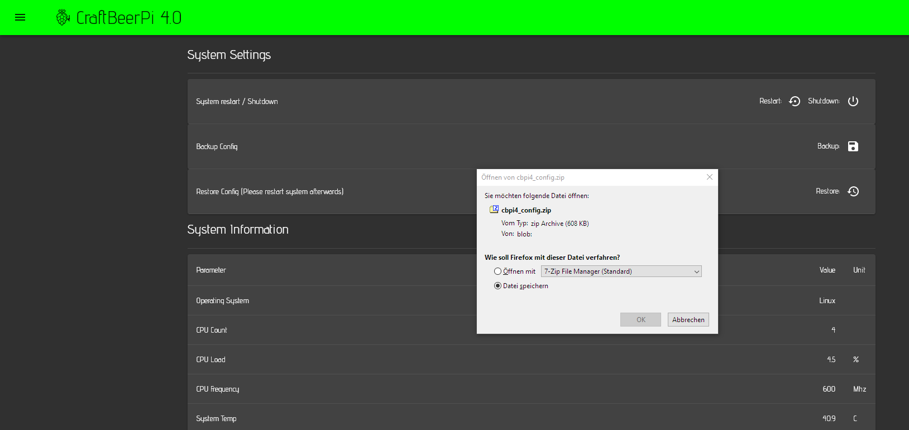
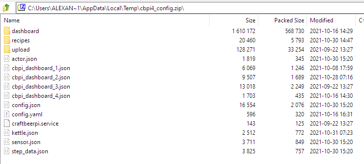
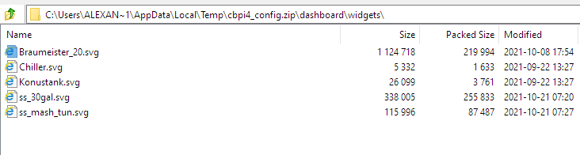

# System

The system page is divided into three areas.  The first area contains some useful system functions such as shutdown, restart or backup and restore of your config. The second part contains dashboard functions, where you can upload SVG files for your dashboard. The third area contains some system information such as OS, CPU information, system temperature and available memory.&#x20;


Not all systems will show all the information. This will depend on the OS and your hardware. If data is not available with the functions provided by python, an N/A will be shown.&#x20;


### System Settings

You can restart or shut the server down (currently only working under linux). 

You can also download a backup of your CraftbeerPi 4 server configuration or restore a config. The backup function will create a zip file of the config that you can download.

The file contains the config folder of your running CraftbeerPi 4 server. The structure inside the zip file is the same as on your system.

You can go into the dashboard folder and find a widgets folder.

The widgets folder contains the [SVG files you have copied to your system.](dashboard.md#how-to-add-custom-svg-items) If you have not copied any SVG files yet, you can also add them to the widgets folder of your backup and restore the backup. This will also add the SVG files to the selectable widgets in the dashboard.

If you want to restore your config, just click on the restore button and select the config file you want to restore.


You need to restart the Server, before the restored settings will take effect.


You can download the cbpi logfile to look for issues. This will also help troubleshooting and if you ask for help. You need to select a timeframe and hit the downloadd button. This will download a zip file with some information on the server configuration and the log file for the specified timeframe. If you experience for instance issues with plugins, you should restart your server and download afterwards the logfile of the last hour this will help to identify issues with plugins that do not load correctly. See also [Troubleshooting](../troubleshooting.md)