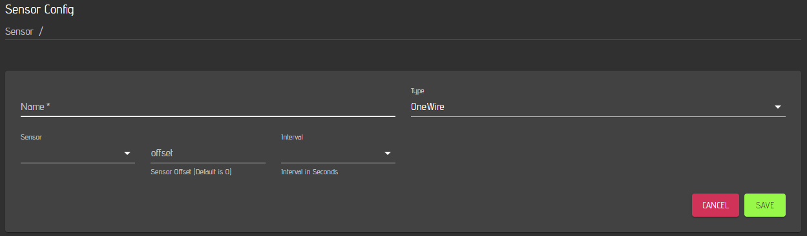

# Creating new Plugins

CraftbeerPi4 has the capability to create a plugin template for the development of your own plugin. You just need to run the following command:

```
cbpi create {PLUGINNAME}
```

This will create a folder with a template for your plugin and configures ith with your PLUGINNAME

If you run for instance

```
cbpi create cbpi4-testplugin
```

A Plugin with the name cbpi4-testplugin will be created and you will see the following output:

```

Plugin cbpi4-testplugin created! See https://craftbeerpi.gitbook.io/craftbeerpi4/development how to run your plugin

Happy Development! Cheers

```

## Plugin folder structure

CraftbeeerPi4 is creating a folder with the name cbpi4-testplugin which has the follwoing structure:

```
pi@raspberrypi:~ $ cd cbpi4-testplugin/
pi@raspberrypi:~/cbpi4-testplugin $ ll
insgesamt 52
drwxr-xr-x 3 pi pi  4096 17. Jan 11:47 cbpi4-testplugin
-rw-r--r-- 1 pi pi 35149 17. Jan 11:47 LICENSE
-rw-r--r-- 1 pi pi    80 17. Jan 11:47 MANIFEST.in
-rw-r--r-- 1 pi pi    30 17. Jan 11:47 README.md
-rw-r--r-- 1 pi pi   446 17. Jan 11:47 setup.py
```

The main folder conatins the LICENSE file and a MANIFEST file where you do not need to change anything. The README.md file will be seen if you upload your plugin to a github repo. This file should be edited with the required information on how to install, configure and use your plugin.

The sub-folder `cbpi4-testplugin` ist the folder, where the plugin code is located.


### Plugin setup.py file

The setup.py file contains some information for the plugin installation such as version number and other required packages. You need to edit this file accoridingly. Additional information on how to use setuptools can be found [here](https://docs.python.org/3.9/distutils/setupscript.html).

The setup.py file looks like this:

```
from setuptools import setup

setup(name='cbpi4-testplugin',
      version='0.0.1',
      description='CraftBeerPi Plugin',
      author='',
      author_email='',
      url='',
      include_package_data=True,
      package_data={
        # If any package contains *.txt or *.rst files, include them:
      '': ['*.txt', '*.rst', '*.yaml'],
      'cbpi4-testplugin': ['*','*.txt', '*.rst', '*.yaml']},
      packages=['cbpi4-testplugin'],
     )
```

You should change the version number whenever you modify/update your plugin. You should also enter some information in the description (e.g. Sensor Plugin). As author you can enter your name and in the email your email if you want. The URL should be filled with the homepage of your plugin which is typically the url of your github repo. 

You can also specify required python packages that will be installed during the installation of your plugin. In addition, it is recommended to andd a few lines that will help to display the README.md file also on the pypi.org page if you decide to create also a pacage for pypi.org that can be installed later just via:

```
sudo pip3 install cbpi4-testplugin
```

Below is an example of a setup.py for a [plugin](https://pypi.org/project/cbpi4-scd30-CO2-Sensor/), which is also available on the pypi.org page and can be installed directly from there.


```
from setuptools import setup

# read the contents of your README file
from os import path
this_directory = path.abspath(path.dirname(__file__))
with open(path.join(this_directory, 'README.md'), encoding='utf-8') as f:
    long_description = f.read()

setup(name='cbpi4-scd30_CO2_Sensor',
      version='0.0.3',
      description='CraftBeerPi4 Plugin for SCD30 based CO2 Sensor',
      author='Alexander Vollkopf',
      author_email='avollkopf@web.de',
      url='https://github.com/avollkopf/cbpi4-scd30-co2-sensor',
      license='GPLv3',
      include_package_data=True,
      package_data={
        # If any package contains *.txt or *.rst files, include them:
      '': ['*.txt', '*.rst', '*.yaml'],
      'cbpi4-scd30_CO2_Sensor': ['*','*.txt', '*.rst', '*.yaml']},
      packages=['cbpi4-scd30_CO2_Sensor'],
        install_requires=[
        'cbpi>=4.0.0.33',
        'smbus2',
        'scd30_i2c',
  ],
  long_description=long_description,
  long_description_content_type='text/markdown'

     )
```

One section has been added to read the content of the readme file and provied it at the end of the setup.py as 'long_description'. There is also a parameter 'install_requires' which can be filled with additional packages that are required for the plugin. This plugin requires for instance in addition to cbpi the packages 'smbus2' and 'scd30_i2c'.

### Creation of plugin package and upload to pypi.org

Once you have written your plugin and uploaded it to your github repo, you can also create a package on the pypi.org page. Therefore, you need to create an acoount on pypi.org and install the [twine package](https://twine.readthedocs.io/en/stable/).

In the main folder of your plugin you need to run the following command to create a distribution package:

```
sudo python setup.py sdist
```

Once the apckage is created, you can upload it with twine:

```
sudo twine upload dist/*
```

## Plugin code folder

If you change into the sub folder of your main plugin directory, you can edit the plugin code. The code folder structre looks like this:

```
pi@raspberrypi:~/cbpi4-testplugin $ cd cbpi4-testplugin/
pi@raspberrypi:~/cbpi4-testplugin/cbpi4-testplugin $ ll
insgesamt 12
-rw-r--r-- 1 pi pi   33 17. Jan 11:47 config.yaml
-rw-r--r-- 1 pi pi 1881 17. Jan 11:47 __init__.py
drwxr-xr-x 2 pi pi 4096 17. Jan 11:47 static
```

The config.yaml is created automatically and should not be changed. The static folder is typically not required and can be removed in most of the cases. The `__init__.py` file contains the code of your plugin.

## Plugin Types

CraftbeerPi4 provides flexibility as Plgins can be written for different purposes. The following plugin types are currently supported:

| Type                    | Description                                                               | Example |
| ------------------------ | ------------------------------------------------------------------------ |-------- |
| Sensor                   | Allows addition of differnet sensor types besies onwore temp sensor      | <p>[cbpi4-pt100x](https://github.com/avollkopf/cbpi4-pt100x)</p><p>[cbpi4-iSpindle](https://github.com/avollkopf/cbpi4-iSpindle)</p> |
| Actor                    | Allows addition of different actor types / hardware                      | <p>[cbpi4-GroupedActor](https://github.com/avollkopf/cbpi4-GroupedActor)</p><p>[cbpi-PCF8574-GPIO](https://github.com/avollkopf/cbpi4-PCF8574-GPIO)</p> |
| Kettle Logic             | Allows to create a kettle logic that fits for your system requirements   | [cbpi4-PIDBoil](https://github.com/avollkopf/cbpi4-PIDBoil) |
| Fermenter Logic          | Allows to create a fermenter logic that fits for your system requirements | <p>No example yet</p><p>Builtin FermenterHysteresis</p> |
| Mash Steps               | Allows to add mash steps that users may require / adapt to their needs   | [cbpi4-BM_Steps](https://github.com/avollkopf/cbpi4-BM_Steps) |
| Notifications            | Allows users to define callback functions that forward cbpi notifications to other message services or a buzzer | <p>[cbpi4-Pushover](https://github.com/avollkopf/cbpi4-PushOver)</p><p>[cbpi4-buzzer](https://github.com/avollkopf/cbpi4-buzzer)</p> |
| Automated Recipe Creation | Allows users to adapt the automated recipe creation process (xml, kbh or brewfather) to their requirements. | [cbpi4-RecipeImport](https://github.com/avollkopf/cbpi4-RecipeImport)|
| Other Functions           | Allows users to add other functionalities such as an LCD Display        | [cbpi4-LCDisplay](https://github.com/avollkopf/cbpi4-LCDisplay) |

## Plugin Classes

CraftbeerPi4 has defined different classes, that you need to create a Sensor, Actor, Logic,.....

The following table will describe show you the clasess.

| Class                 | Properties |  Usage                                                                                                 |
| --------------------- | ---------- |------------------------------------------------------------------------------------------------------ |
| CBPiSensor            | Yes | Required for all type of sensors. For some functions the class CBPiExtension might be required in addition | 
| CBPiActor             | Yes | Required for all type of actors. For some functions the class CBPiExtension might be required in addition |
| CBPiKettleLogic       | Yes | Required to create a new Kettle Logic type                                                             |
| CBPiFermenterLogic    | Yes | Required to create a new Fermenter Logic type                                                             |
| CBPiStep              | Yes | Required to create new MashSteps                                                                       |
| CBPiExtension         | No | Required for various purposes such as addition of cbpi setting prameters, definition of http endpoints or startup of additional hardware |

## Plugin Properties

If you want to add for instance a new onewire sensor, you need to select the sensor id, define a name, an Interval and an offset, if required. This is done via so called properties.



The Sensor Name and Sensor Type will be always required, even if you don't add properties to your plugin. However, the other porperties need to be added via  @parameters right in front of your class. Properties can be added to all plugins except for the CBPiExtension.

```
@parameters([Property.Select(label="Sensor", options=getSensors()), 
             Property.Number(label="offset",configurable = True, default_value = 0, description="Sensor Offset (Default is 0)"),
             Property.Select(label="Interval", options=[1,5,10,30,60], description="Interval in Seconds")])
class OneWire(CBPiSensor):
```

If you want to add multiple properties, you need to separate them with a `,`. If you don't want to add properties for your sensor leave the @ parameters empty:

```
@parameters([])
class YourNewSensor(CBPiSensor):
```

The following properties are available:

| Property            | Description                                                         |
| ------------------- | ------------------------------------------------------------------- |
| Property.Select     | The user can select some pre-defined options                        |
| Property.Number     | The user can enter a number (e.g. offset value for a sensor)        |
| Property.Text       | The user can enter a string / text                                  |
| Property.Sensor     | The user can select a sensor that should be used for the plugin     |
| Property.Actor      | The user can select an actor that should be used in the plugin (e.g. in a step) |
| Property.Kettle     | The user can select a kettle that should be used in the plugin (e.g. in a step) |
| Property.Fermenter  | The user can select a femrenter that should be used in the plugin   |

 
Some properties will be used as default for the different plugin classes. 
- A Kettle will for instance always require a kettle logic, a sensor, a heater (actor) and an agotator (actor).
- A Fermenter will always require a logic, a heater, a cooler, a sensor, a brewname and a target temp.
- Only the properties you want to use in addition have to be specified in the @parameters.


## Examples for Property types

 
Allthough you can specify a default_value inside the property, it is currently not used. You need specify the default value in the `self.props.get` function (see below).


### Property.Select
`Property.Select("Type", options=["Temperature", "Gravity/Angle", "Battery", "RSSI"], description="Select which type of data to register for this sensor. For Angle, Polynomial has to be left empty")`

### Property.Number
`Property.Number(label="offset",configurable = True, default_value = 0, description="Sensor Offset (Default is 0)")`

### Property.Text
`Property.Text(label="iSpindle", configurable=True, description="Enter the name of your iSpindel")`

### Property.Sensor
`Property.Sensor("FermenterTemp",description="Select Fermenter Temp Sensor that you want to provide to TCP Server")`

### Property.Actor
`Property.Actor(label="Actor", description="Actor can trigger a valve for the cooldown to target temperature")`

### Property.Kettle
`Property.Kettle(label="Kettle")`

### Property.Fermenter
`Property.Fermenter(label="Fermenter")`

You can define the label content to your requirements. Labels are used to access the property in the plugin.


If you have for instance specified a parameter with the label ´offset´ in your parameters:

`Property.Number(label="offset",configurable = True, default_value = 0, description="Sensor Offset (Default is 0)")`

You can retrieve this parameter for the particular instance of your plugin via:

`self.offset = float(self.props.get("offset",0))`

The variable `self.offset` will be set to the offset parameter, if defined. Otherwise it will be 0 as default.

More details will be shown in a few examples at a later point of time.

## Plugin registration

Every Plugin that you create needs t be registered during cbpi startup. This requires a few lines of code at the end of each plugin. If you create for instance one plugin that requires for instance a CBPiExtension class to check if setting parameters are available or have been added to the cbpi config or needs to start sensor hardware, you need to register this extension as well, as the sensor plugin itself.

One example is the [cbpi4-scd30-co2-sensor](https://github.com/avollkopf/cbpi4-scd30-co2-sensor). Before the sensor can be started / used, the hardware needs to be initialized which is done with the CBPiExtension class:

```
class SCD30_Config(CBPiExtension):

    def __init__(self,cbpi):
        self.cbpi = cbpi
        self._task = asyncio.create_task(self.init_sensor())

    async def init_sensor(self):
        global SCD30_Active
        SCD30_Active=False
...
...
...
        if ready is not None:    
            ...
            ...
            ...
            loop = asyncio.get_event_loop()
            try:
                asyncio.ensure_future(self.ReadSensor())
                loop.run_forever()
            finally:
                loop.close()
...
...
...
    async def ReadSensor(self):
        logging.info("Starting scd30 ReadSensor Loop")
        global cache
        while True:
            if self.scd30.get_data_ready():
                measurement = self.scd30.read_measurement()
                if measurement is not None:
                    co2, temp, rh = measurement
                    timestamp = time.time()
                    cache = {'Time': timestamp,'Temperature': temp, 'CO2': co2, 'RH': rh}
                await asyncio.sleep(self.Interval)
            else:
                await asyncio.sleep(0.2)
```

While SCD30_Config is initializing, it creates a task `self.init_sensor()` which is initializing the hardware and starts a routine `ReadSensor` that is reading the sensor with the frequency defined in the plugin settings. This routine is writnig data into a cache including a timestamp.

The sensor module itself is just reading the cache and if data with a new timestamp is available, it will update the sensor value and pushs it to the user interface and mqtt and loggs the data.

```
@parameters([Property.Select("Type", options=["CO2", "Temperature", "Relative Humidity"], description="Select type of data to register for this sensor.")])
class SCD30Sensor(CBPiSensor):
    
    def __init__(self, cbpi, id, props):
        super(SCD30Sensor, self).__init__(cbpi, id, props)
...
...
...
    async def run(self):
        while self.running is True:
            try:
                if (float(cache['Time']) > float(self.time_old)):
                    self.time_old = float(cache['Time'])
                    if self.Type == "CO2":
                        self.value = round(float(cache['CO2']),2)
...
...
...
```

 
When initializing the module with `super` you need to pay attentio that you also adapt the name for your module. In this case it is `SCD30Sensor` -> `super(SCD30Sensor, self).__init__(cbpi, id, props)`


As mentioned, you need to register both Plugin classes to run the sensor plugin as the sensor will require the CBPiExtension to retreive data and this needs to be started during cbpi startup. The registration is done at the end of the plugin with the setup function:

```
def setup(cbpi):
    cbpi.plugin.register("SCD30 Sensor", SCD30Sensor)
    cbpi.plugin.register("SDC30 Config", SCD30_Config)
    pass
```

Here, both plugin classes will be registered during cbpi startup. 

 
The registration requires two strings. The first is the name or label you will see in the software when you select the Sensor. In this case it is for instance 'SCD30 Sensor'. It should be a unique name for your plugin. The second one has to match the class you have defined for your module. In this example is is `SCD30Sensor`.


You can also put multiple 'modules' into one plugin. Below is a [step plugin](https://github.com/avollkopf/cbpi4-BM_Steps) shown as example. In this case, various steps have been put together. 

```
...
...
@parameters([Property.Number(label="Temp", configurable=True),
             Property.Sensor(label="Sensor"),
             Property.Kettle(label="Kettle"),
             Property.Select(label="AutoMode",options=["Yes","No"], description="Switch Kettlelogic automatically on and off -> Yes")])
class BM_MashInStep(CBPiStep):
...
...
...
@parameters([Property.Number(label="Timer", description="Time (Default: Minutes)", configurable=True),
    Property.Select(label="TimeUnit",options=["Min","Sec"], description="Specify timer units (Empty: Min)"),
            Property.Actor(label="Actor")])
class BM_ActorStep(CBPiStep):
...
...
...
```

Each of the steps need to be registered individually:

```
def setup(cbpi):
    '''
    This method is called by the server during startup 
    Here you need to register your plugins at the server
    :param cbpi: the cbpi core 
    :return: 
    '''    
    cbpi.plugin.register("BM_BoilStep", BM_BoilStep)
    cbpi.plugin.register("BM_Cooldown", BM_Cooldown)
    cbpi.plugin.register("BM_MashInStep", BM_MashInStep)
    cbpi.plugin.register("BM_MashStep", BM_MashStep)
    cbpi.plugin.register("BM_ActorStep", BM_ActorStep)
    cbpi.plugin.register("BM_SimpleStep", BM_SimpleStep)
```

This comes in handy as you just need to create one plugin with mupltiple modules. It is just important that you register every module.

## Adding cbpi settings from plugins

Some plugins will require global cbpi settings. You can add them during the startup of your plugin. The plugin can check if the setting is available. If not, the plugin can add the global setting to cbpi. You will need to add the class CBPiExtension to your plugin and handle that task within this class.

The example below shows an example, where the plugin starts with the CBPiExtension class to add an intervall to the global cbpi settings. In this case, a task will be created the initializes the senor. During the initialization, the task will run the funtion scd30_intervall. This function could be also directly included into the initialization task / function.

```
class SCD30_Config(CBPiExtension):

    def __init__(self,cbpi):
        self.cbpi = cbpi
        self._task = asyncio.create_task(self.init_sensor())

    async def init_sensor(self):
        ...
        await self.scd30_interval()
...
```
The function is checking, if the paramter `scd30_interval` is already existing in the global cbpi settings. If not, the function `self.cbpi.config.get("scd30_intervall", None)` will return `None`.

In this case, the function will add this parameter with the function `self.cbpi.config.add(....)`. 
- The first parameter in this function will define the parameter name `"scd30_interval"`. 
- The second parameter will define the intiial value  
- The third parameter will define the type of the parameter (They are like the [plugin property types](#examples-for-property-types))
- The next parameter specifies the explanation for this parameter that is shown on the settings page.
- In case of `ConfigType.SELECT` you will also specify the options as another parameter. 

```
...
    async def scd30_interval(self):
        global scd30_interval
        scd30_interval = self.cbpi.config.get("scd30_interval", None)
        if scd30_interval is None:
            logger.info("INIT scd30_intervall")
            try:
                await self.cbpi.config.add("scd30_interval", 5, ConfigType.SELECT, "SCD30 Readout Interval", [{"label": "2s","value": 2},
                                                                                                            {"label": "5s", "value": 5},
                                                                                                            {"label": "10s", "value": 10},
                                                                                                            {"label": "15s", "value": 15},
                                                                                                            {"label": "30s", "value": 30},
                                                                                                            {"label": "60s", "value": 60}])
                scd30_interval = self.cbpi.config.get("scd30_interval", None)
            except:
                logger.warning('Unable to update database')
...
```
You can see plenty of examples on how to add global cbpi settings in the `ConfigUpdate` extension that comes with cbpi. This can be found [here](https://github.com/avollkopf/craftbeerpi4/blob/master/cbpi/extension/ConfigUpdate/__init__.py).


