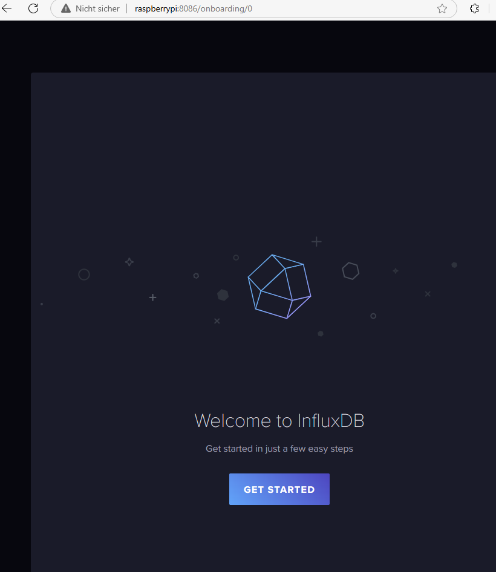
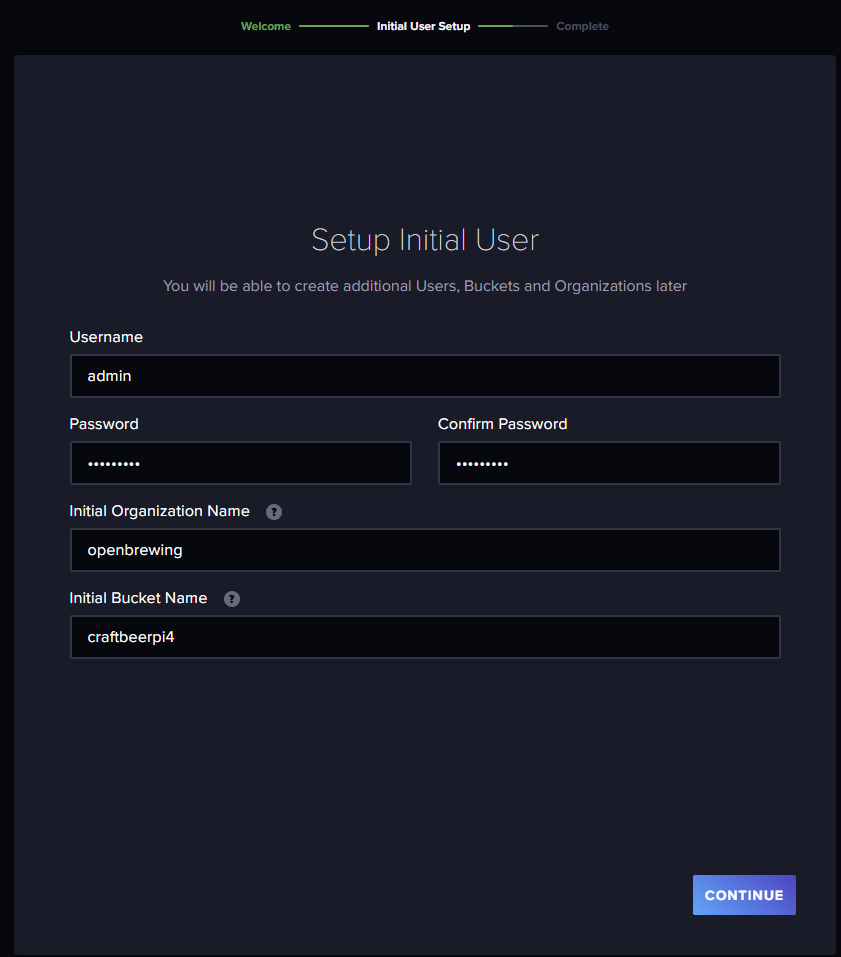
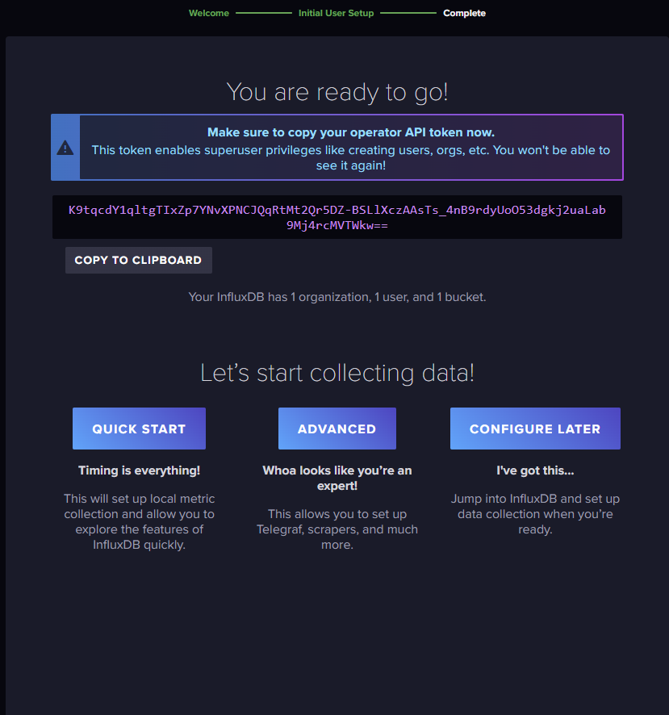
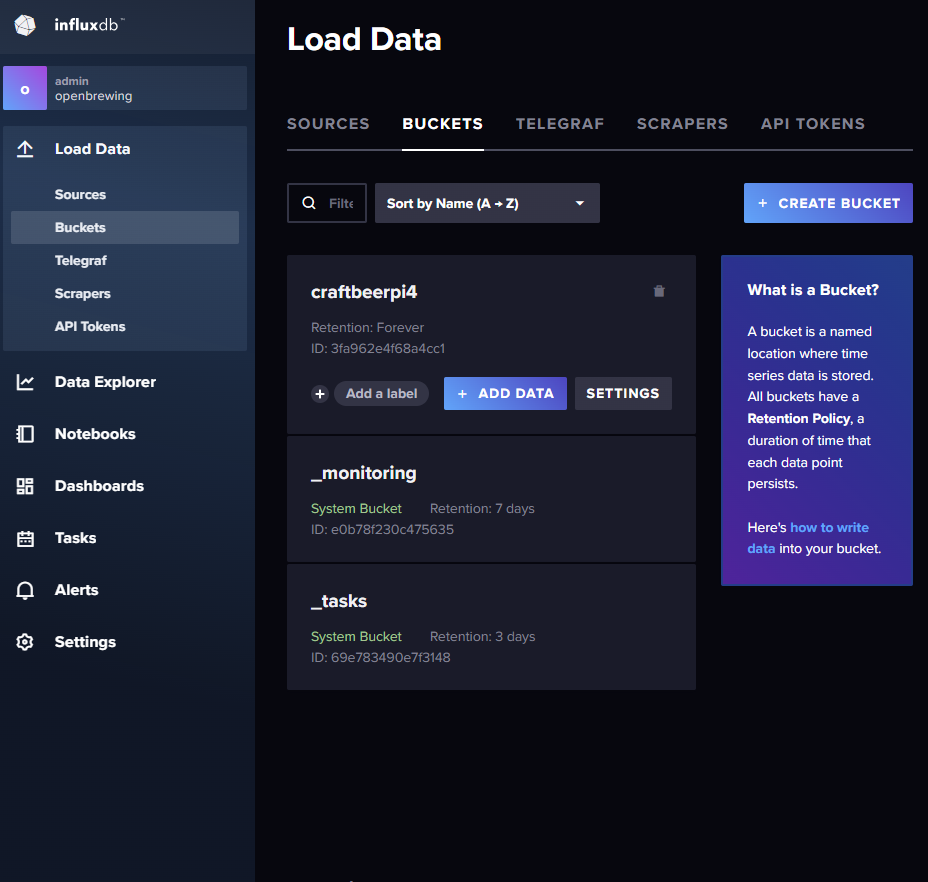
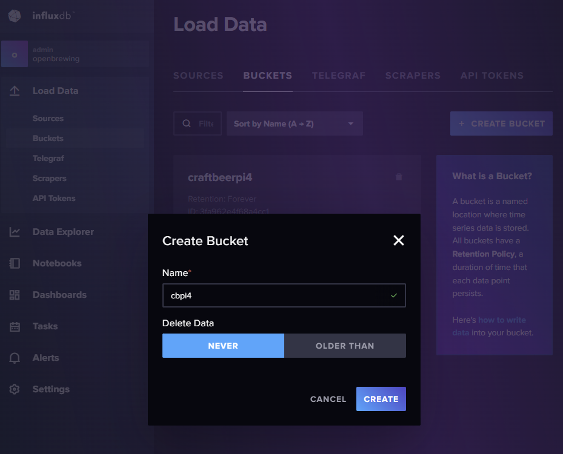
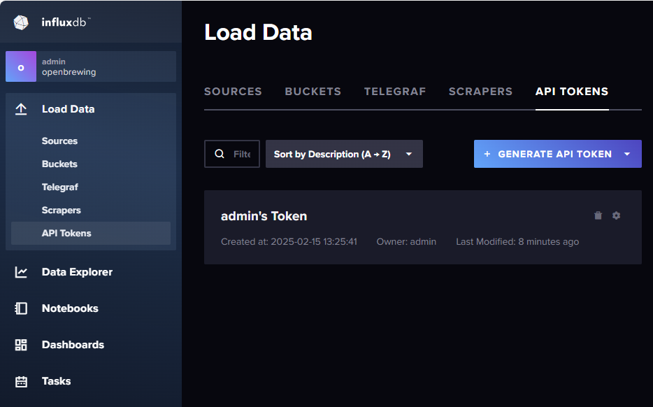
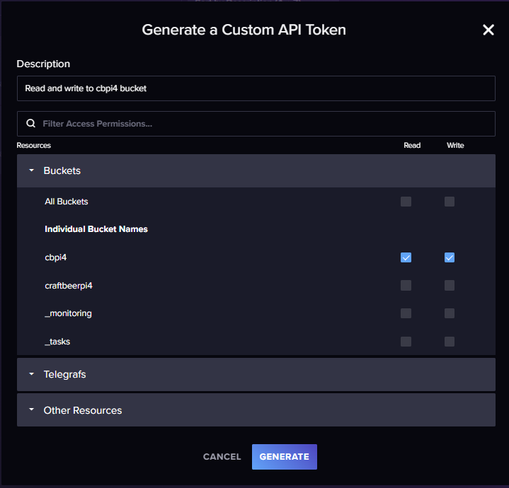
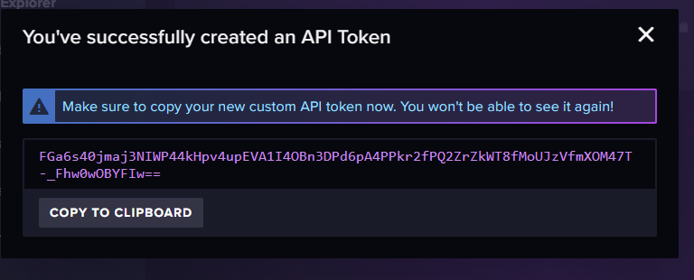
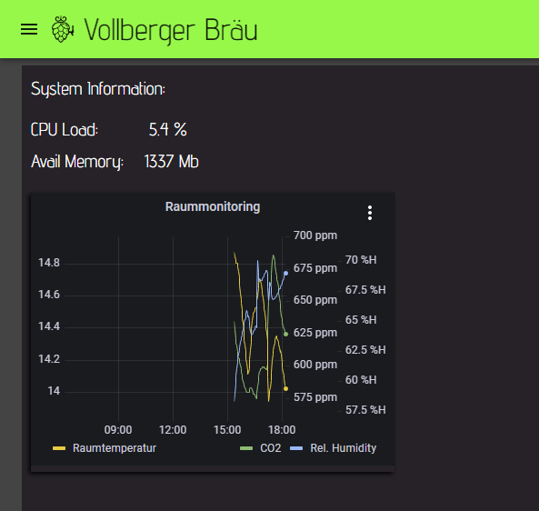
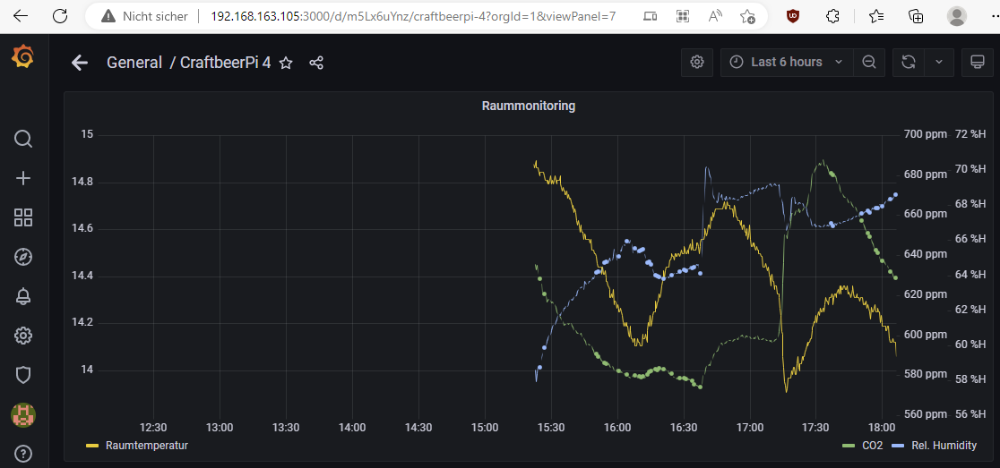

# Example for InfluxDB V2 / Grafana installation and configuration on th pi

The example installation for influxdb2 is based on the instructions you can find on the [influxdb webpage](https://docs.influxdata.com/influxdb/v2/install/#install-influxdb-as-a-service-with-systemd)

Follow the instructions for Ubuntu / Debian. First you need to add the source information for the installation packages to your system. Run the following commands from your home directory where you have write access.

```
curl --silent --location -O https://repos.influxdata.com/influxdata-archive.key
```

```
echo "943666881a1b8d9b849b74caebf02d3465d6beb716510d86a39f6c8e8dac7515  influxdata-archive.key" \
| sha256sum --check - && cat influxdata-archive.key \
| gpg --dearmor \
| sudo tee /etc/apt/trusted.gpg.d/influxdata-archive.gpg > /dev/null \
&& echo 'deb [signed-by=/etc/apt/trusted.gpg.d/influxdata-archive.gpg] https://repos.influxdata.com/debian stable main' \
| sudo tee /etc/apt/sources.list.d/influxdata.list
```

Now update the package information and install influxdb2

```
sudo apt update && sudo apt install influxdb2
```

Start influxdb and see if it is up and running:

```
sudo systemctl start influxd
sudo systemctl status influxd
```

Open your browser and access influxdb from your browser (replace IPADDRESS_OF_PI with the ip address of your pi):

```
http://IPADDRESS_OF_PI:8086
```

You should see this initial screen:



Click on the get started button amd enter a name for the admin and a password. Enter an organization name and a name for an initial bucket



The system will show you an API Token for the admin user. Copy this token and keep it somewhere as you might need it at a laeter point of time. Then click on quick start.



In the menu on the left, got to `Load data / Buckets`.



Click on `Create Bucket` and Enter a name for the bucket (e.g. cbpi4). Click `create`



In the menu on the left, got to `Load data / API Tokens`. 



Click on `Generate API token` and select `Custom Token`. Enter a description and allow read and write for the bucket, you created for cbpi4. Click on `Generate`.



The server will generate an API token for your bucket for read and write data. Copy this token as you will require it for Grafana but also for the craftbeerpi settings



API Token from example above: `FGa6s40jmaj3NIWP44kHpv4upEVA1I4OBn3DPd6pA4PPkr2fPQ2ZrZkWT8fMoUJzVfmXOM47T-_Fhw0wOBYFIw==


Grafana:

Install grafana server section from here:
https://grafana.com/tutorials/install-grafana-on-raspberry-pi/


Flux query builder
https://grafana.com/docs/grafana/latest/datasources/influxdb/query-editor/#flux-query-editor


To access the diagrams from the cbpi server, you need to adapt a few settings in your grafana configuration.

1. You need to allow [embedding](https://grafana.com/docs/grafana/latest/administration/configuration/#allow_embedding) of your charts.
2. You need to allow [external_access](https://grafana.com/docs/grafana/latest/administration/configuration/#external_enabled).  
3. You need to enable [anonymous authentication](https://grafana.com/docs/grafana/latest/setup-grafana/configure-security/configure-authentication/anonymous-auth/)

You need to adapt the grafana.ini accordingly. Choose an editor of your choice (e.g. vim)

`sudo vi /etc/grafana/grafana.ini`

Then edit things in the following sections

```
[security]
allow_embedding=true
```

```
[snapshots]
enabled = true
external_enabled = true
public_mode = true
```

Add this to feature toggle section

```
[feature_toggles]
enable = displayAnonymousStats
```

Edit the next setion:

```
[auth.anonymous]
enabled = true

# Organization name that should be used for unauthenticated users
org_name = Main Org.

# Role for unauthenticated users, other valid values are `Editor` and `Admin`
org_role = Viewer

# Hide the Grafana version text from the footer and help tooltip for unauthenticated users (default: false)
hide_version = true

# Setting this limits the number of anonymous devices in your instance. Any new anonymous devices added after the limit has been reached will be denied access.
device_limit =
```

As shown in the [dashboard](../craftbeerpi-4-server/dashboard.md#item-menu) section, you can also add a grafana chart to the dashboard.



Required Parameters are described briefly in the dashboard section. Below is an example, how to set the 'url' and 'panelID' for your chart.



The url for this chart on Grafana is: ```http://192.168.163.105:3000/d/m5Lx6uYnz/craftbeerpi-4?orgId=1&viewPanel=7```

You need to use the first part of the url prior to the `?` and replace the `d`with `d-solo` and enter this into the url parameter:

```url: http://192.168.163.105:3000/d-solo/m5Lx6uYnz/craftbeerpi-4```

In the `panelID` Parameter you need to enter just the number of the panel from the original url: `7`

```panelID: 7```

In the `timeframe` Parameter you need to enter the timeframe you want to see in the chart until 'now'. It has to be entered in the grafana syntax:

```now-5m``` shows the last 5 minutes.

```now-12h``` shows the last 12 hours.

```now-7d``` shows the last 7 days.

```2023-02-17 2:00``` shows data from this date until now.



Depending on your setup on your pi, you may need to adapt also the chromium settings if the charts are displayed on another device, but not on your pi screen.

In this case, you need to allow all third party cookies in chromium. You need to enter: ```chrome://settings/content```

and change the cookie setting accordingly.



Dashboard link
http://raspberrypi:3000/d/ded555kwjttz4b/craftbeerpi4?orgId=1&from=now-5m&to=now&timezone=browser&viewPanel=panel-1


Address: http://raspberrypi:3000/
ID: ded555kwjttz4b
Dashboard: craftbeerpi4
Panel: panel-1 -> Panel id: 1

url for grafana widget: http://raspberrypi:3000/d-solo/ded555kwjttz4b/craftbeerpi4
Paneld ID for grafana widget: 1