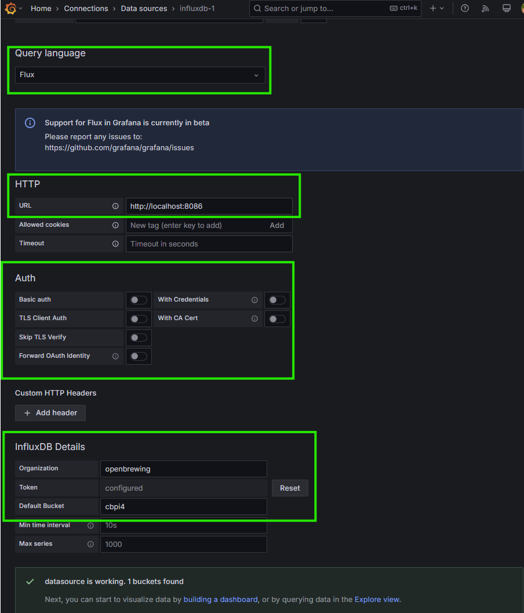
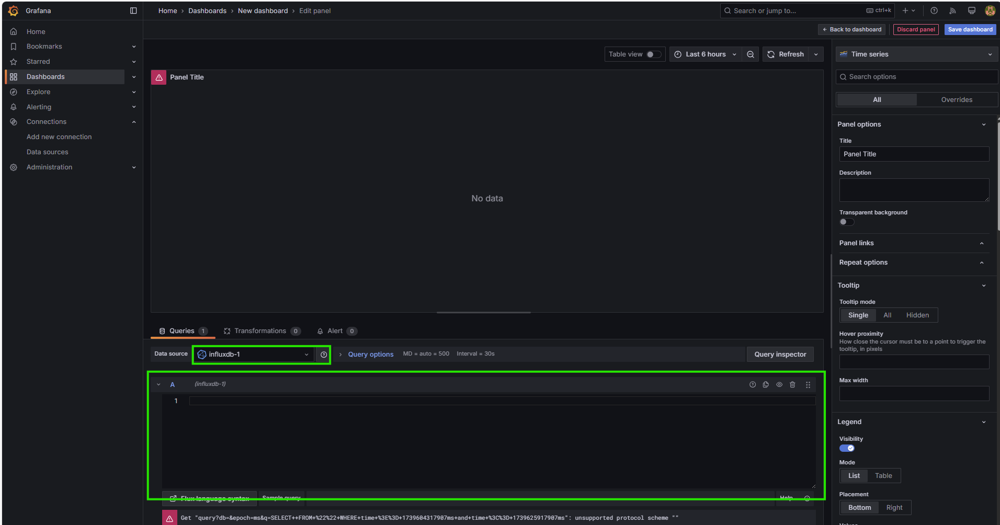
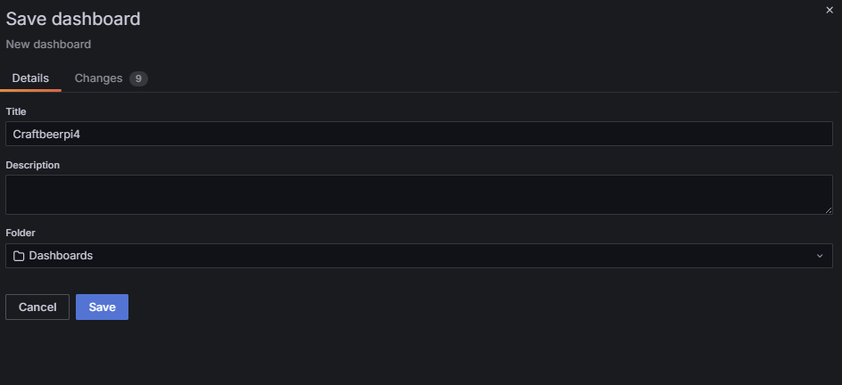
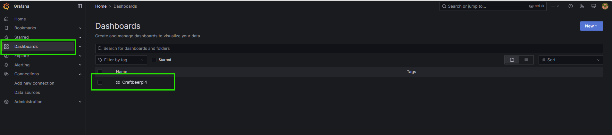

# Example for InfluxDB V2 / Grafana installation and configuration on th pi

## Installation of the InfluxDB v2 on the Pi

The example installation for influxdb2 is based on the instructions you can find on the [influxdb webpage](https://docs.influxdata.com/influxdb/v2/install/#install-influxdb-as-a-service-with-systemd)

Follow the instructions for Ubuntu / Debian. First you need to add the source information for the installation packages to your system. Run the following commands from your home directory where you have write access.

```
curl --silent --location -O https://repos.influxdata.com/influxdata-archive.key
```

```
echo "943666881a1b8d9b849b74caebf02d3465d6beb716510d86a39f6c8e8dac7515  influxdata-archive.key" \
| sha256sum --check - && cat influxdata-archive.key \
| gpg --dearmor \
| sudo tee /etc/apt/trusted.gpg.d/influxdata-archive.gpg > /dev/null \
&& echo 'deb [signed-by=/etc/apt/trusted.gpg.d/influxdata-archive.gpg] https://repos.influxdata.com/debian stable main' \
| sudo tee /etc/apt/sources.list.d/influxdata.list
```

Now update the package information and install influxdb2

```
sudo apt update && sudo apt install influxdb2
```

Start influxdb and see if it is up and running:

```
sudo systemctl start influxd
sudo systemctl status influxd
```

Open your browser and access influxdb from your browser (replace IPADDRESS_OF_PI with the ip address of your pi):

```
http://IPADDRESS_OF_PI:8086
```

You should see this initial screen:


## Configuration of InfluxDB and CraftbeerPi4

Click on the get started button amd enter a name for the admin and a password. Enter an organization name and a name for an initial bucket


The system will show you an API Token for the admin user. Copy this token and keep it somewhere as you might need it at a later point of time. Then click on quick start.


In the menu on the left, got to `Load data / Buckets`.


Click on `Create Bucket` and Enter a name for the bucket (e.g. cbpi4). Click `create`


In the menu on the left, got to `Load data / API Tokens`. 


Click on `Generate API token` and select `Custom Token`. Enter a description and allow read and write for the bucket, you created for CraftbeerPi4. Click on `Generate`.


The server will generate an API token for your bucket for read and write data. Copy and store this token somewhere as you will require it for Grafana but also for the CraftbeerPi 4 settings


Open the Craftbeerpi Server settings page and configure all influxdb settings. 

- Set influxdb and influxdbcloud to `yes` (influxdb and influxdbcloud are using the same connection settings)
- Enter `measurement` into the influxdbmeasurement field
- Enter the name of the bucket you have created into the influxdbname field (e.g. cbpi4)
- Enter the bucket API token you have generated for read and write into the influxdbpassword field.
- Enter the name of the organization you have created in the beginning for the influxdbuser (e.g. openbrewing)
- To be on the safe side, restart cbpi


Create a sensor for testing if you have not already created sensors in your system.


Then to the influxdb interface and open the data explorer. Select under `From`your bucket (e.g. cbpi4). Under filter select source and select your Sensor (e.g. Test). Press the `Submit` button and you should see the Sensor data. You can also select multiple sensors to display the data in one diagram.


## Installation of Grafana on the Pi:

Please follow the installation instructions for Grafana an scroll down to `Install Grafana` on this [page](https://grafana.com/tutorials/install-grafana-on-raspberry-pi/).

Open a terminal and add the APT key used to authenticate packages. Ideally you are in your home directory as you must have write access. 

```
sudo mkdir -p /etc/apt/keyrings/
wget -q -O - https://apt.grafana.com/gpg.key | gpg --dearmor | sudo tee /etc/apt/keyrings/grafana.gpg > /dev/null
```

Add the Grafana APT repository to the sources
```
echo "deb [signed-by=/etc/apt/keyrings/grafana.gpg] https://apt.grafana.com stable main" | sudo tee /etc/apt/sources.list.d/grafana.list
```

Install grafana:
```
sudo apt update
sudo apt install -y grafana
```

Enable and start the grafana server
```
sudo systemctl enable grafana-server
sudo systemctl start grafana-server
```

Open your browser and access influxdb from your browser (replace IPADDRESS_OF_PI with the ip address of your pi):

```
http://IPADDRESS_OF_PI:3000
```

Log in to Grafana with the default username `admin`, and the default password `admin`.

Change the password for the admin user when asked.

Navigate to Connections and add a new InfluxDB based data connection:


Then add a new data source:


- Select Flux as Query language
- Enter `http://localhost:8086` in the URL field.
- Disable Basic Authentication and everything else in Authentication
- Enter your organization in the organization Field
- Enter the bucket you created for your CraftbeerPi4 data in the default bucket field
- Enter the API token for the bucket in the token field
- Test Connection and you should see a message at the bottom, the Grafana is able to connect to the data source



Navigate to Dashboards amd add a new dashboard


Then add a new visualization to the dashboard


Now select your data source for the visualization that you have created earlier.


To display the data for your Sensor in the visualization, you need to add a data query in the corresponding field. Data queries must be written in [flux](https://grafana.com/docs/grafana/latest/datasources/influxdb/query-editor/#flux-query-editor). The correct data source must be selected.




If you are not used to the flux queries, you can go to the influxdb data explorer and select your sensor as you did above and open the script editor.


Now the corresponding flux query will be shown on the influxdb interface. Copy this query. and paste it into the query form for the grafana visualization.




Once you have entered the query you can click on the refresh button to see, if the query is working. You can add a name to your visualization for the sensor and save the dashboard.


Enter a name for your dashboard and click save.



Now you should see the dashboard overview and can access your dashboard with a click on `CraftbeerPi4`



The dashboard can be modified (e.g. adding another visualization) by clicking on the edit button.


If you want to edit the Sensor visualization, click at the top right and click on Edit in the context menu. Then you can edit the query, or the style.


If you want to view the visualization at a larger scale, click at the top right and click on view in the context menu.


This will show you also the link to the visualization and the information you need to add a diagram to a CraftbeerPi 4 dashboard.


### Configuration of the grafana.ini file to access the diagrams fromn CraftbeerPi 4
To access the diagrams from the cbpi server, you need to adapt a few settings in your grafana configuration.

1. You need to allow [embedding](https://grafana.com/docs/grafana/latest/administration/configuration/#allow_embedding) of your charts.
2. You need to allow [external_access](https://grafana.com/docs/grafana/latest/administration/configuration/#external_enabled).  
3. You need to enable [anonymous authentication](https://grafana.com/docs/grafana/latest/setup-grafana/configure-security/configure-authentication/anonymous-auth/)

You need to adapt the grafana.ini accordingly. Choose an editor of your choice (e.g. vim)

`sudo vi /etc/grafana/grafana.ini`

Then edit things in the following sections

```
[security]
allow_embedding=true
```

```
[snapshots]
enabled = true
external_enabled = true
public_mode = true
```

Add this to feature toggle section

```
[feature_toggles]
enable = displayAnonymousStats
```

Edit the next section:

```
[auth.anonymous]
enabled = true

# Organization name that should be used for unauthenticated users
org_name = Main Org.

# Role for unauthenticated users, other valid values are `Editor` and `Admin`
org_role = Viewer

# Hide the Grafana version text from the footer and help tooltip for unauthenticated users (default: false)
hide_version = true

# Setting this limits the number of anonymous devices in your instance. Any new anonymous devices added after the limit has been reached will be denied access.
device_limit =
```

## Adding a Grafana Chart to a CraftbeerPi 4 dashboard

As shown in the [dashboard](../craftbeerpi-4-server/dashboard.md#item-menu) section, you can also add a grafana chart to the dashboard.

Click on the `GrafanaChart` item on the widget bar, position the item on the dashboard and configure it accordingly


Required Parameters are described briefly in the dashboard section. Below is an example, how to set the 'url' and 'panelID' for your chart.


The url for this chart on Grafana is: ```hhttp://raspberrypi:3000/d/ded555kwjttz4b/craftbeerpi4?orgId=1&from=now-5m&to=now&timezone=browser&viewPanel=panel-1```

You need to use the first part of the url prior to the `?` and replace the `d`with `d-solo` and enter this into the url parameter:

```url: http://raspberrypi:3000/d-solo/ded555kwjttz4b/craftbeerpi4```

In the `panelID` Parameter you need to enter just the number of the panel from the original url: `1`

```panelID: 1```

In the `timeframe` Parameter you need to enter the timeframe you want to see in the chart until 'now'. It has to be entered in the grafana syntax:

```now-5m``` shows the last 5 minutes.

```now-12h``` shows the last 12 hours.

```now-7d``` shows the last 7 days.

```2023-02-17 2:00``` shows data from this date until now.



Depending on your setup on your pi, you may need to adapt also the chromium settings if the charts are displayed on another device, but not on your pi screen.

In this case, you need to allow all third party cookies in chromium. You need to enter: ```chrome://settings/content```

and change the cookie setting accordingly.


