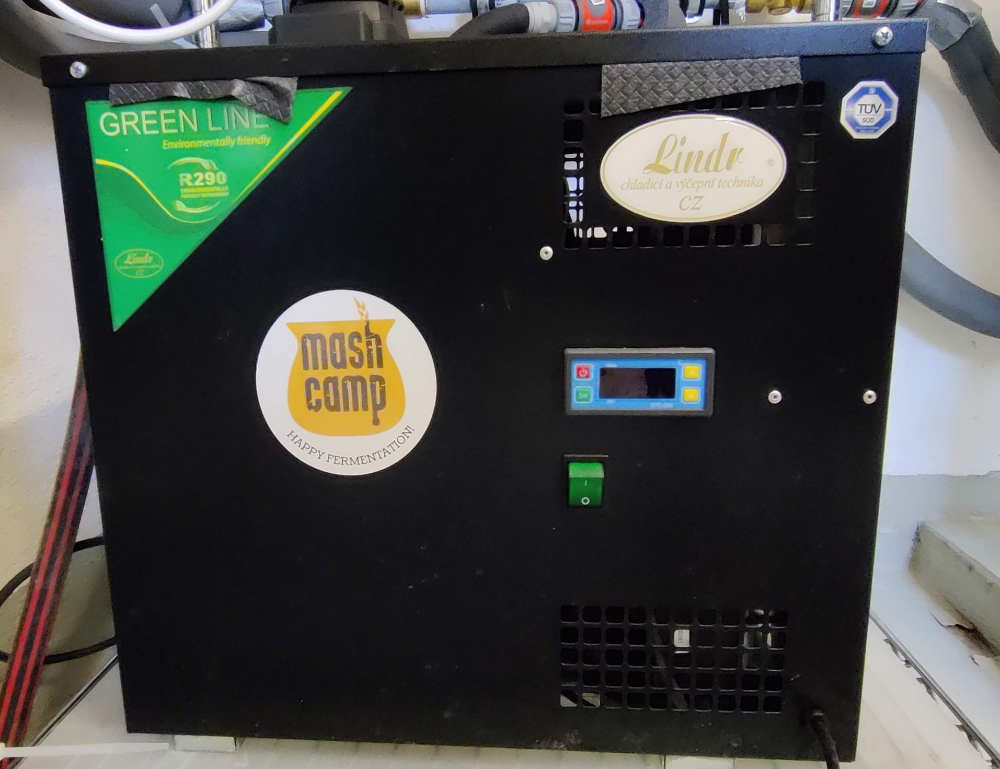
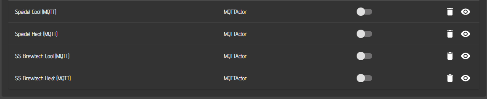
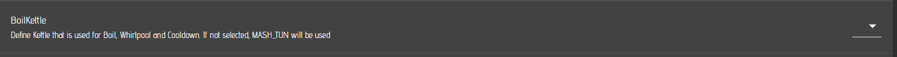
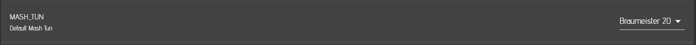
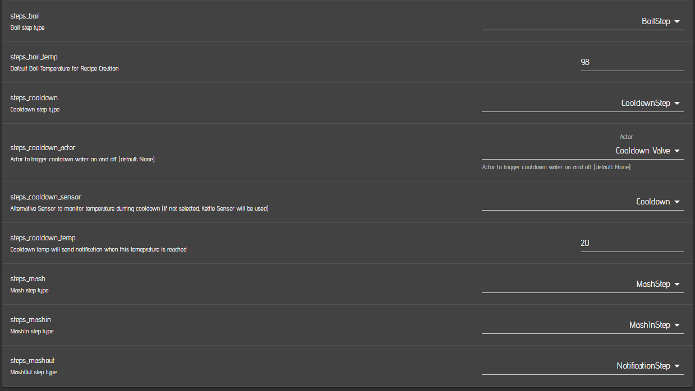

# Example System: MQTTDevice V4 based Fermentation system

- This setup is based on the MQTTDevice V4 which is using an ESP8266 as central unit. The ESP has to be flashed with Innuendos [firmware](https://innuendopi.github.io/MQTTDevice4/). With this setup, you can read the sensors hooked up to the MQTTdevice via the mqtt sensor included in cbpi and you can control the heater / cooler for eacxh femrenter via standard cbpi mqtt actors.

## Hardware requirements 

-  It is recommended to use the PCB described in the aforementioned link. 
- You will also need to connect DS18B20 Onewire sensors (one per fermenter) for temperature measurement to the device.
- 2 Relais (5 Volt) per Fermenter are required (one for cooling, one for heating per fermenter)
- One 5 Volt supply unit for the ESP8266 is required.
- Plug connectors (in my case 230 Volt) are required.
- Connectors for the Sensors are recommended.
- A drip water safe case.
- Magnetic valves to open and close the cooling loop for the fermenter
- Heating pad or cable (25 Watts for 20-30 Liter Fermenter is sufficient). This may vary for your fermenters.
- One Chiller (in my example it is a Lindr AS-40 Glycol which has the advantage that you won't need a bypass valve in case the cooling valves are all closed) 
- Thats about it for the hardware part.

The image below shows the drip water safe case from the outside and the inside equipped with the ESP8266, the power supply and the relais.

The next image shows the Lindr AS-40 Glycol Chiller which is hooked up to the cooling loop for two fermenters.

Here you can see the two magnetic valves I am using to supply my two fermenters independently with glycol. Each of them is connected to one of the 230 Volt Relais from the MQTTDevice setup.

I am using one SS Brewtech BME 7 gal and one Speidel 30 Liter Fermenter. Each femrenter is connected to one of the two cooling lines.

## CraftbeerPi 4 software requirements
- You need to activate mqtt as described [here](../craftbeerpi-4-server/mqtt-connectivity.md)
- I do recommend to install and use also the [**Pushover Plugin**](https://github.com/PiBrewing/cbpi4-PushOver) to recieve push notifications when a step is finished or a target temp is reached and you need to pitch the yeast. Therefore, you need to buy the [**PushOver APP**](https://pushover.net/) for Android or IOS
- I also recommend to install the [**Kettle Sensor Plugin**](https://github.com/PiBrewing/cbpi4-KettleSensor) if you want to monitor some more information about your fermenter such as target temp and cooling or heating status.

## Setup your Fermenter hardware in CraftbeerPi 4


Details on how to setup your software are not shown here, as this is already described in the other chapters.


## Setup your Fermenter hardware in the mqttdevice
- Flashing of the device is not described here as it is documented on Innuendos [page](https://innuendopi.github.io/MQTTDevice4/)
- If you have installed the mqtt broker on your pi, enter the IP adress of your pi in the corresponding setup window of the mqttdevice.

You need to add a sensor or multiple sensors to your mqttdevice depending on the amount of fermenters you want to control. The topic you enter here must match the topic you enter later in your cbpi mqtt sensor settings. The other fields don't need to be changed or filled.

You also need to add actors for your fermenter. In this example you basically need to add two actors per femrneter. One for Cooling and one for heating your fermenter. The example below shows one of the actors. You need to enter again one topic and you must specify one of the output pins. In this example it is 'd0'. 

Once you have saved all your sensors and actors, your overview of the mqtt device web inerface should look like this:

If you are running only one fermenter, you need to specify only one sensor and two actors.

## Setup your Fermenter hardware in Craftbeerpi 4
You need to setup mqtt sensorr, actors and assign them to your fermenter logic.

### Actors
First you should define your actors for the Fermenter. You need one for the heating element and one for the cooling valve.

As actor type, MQTTActor must be selected and you need to enter a specific name for your Actor e.g. `Speidel Cool (MQTT)`. The topic must match the topic you have entered in the mqtt device for this actor, e.g. `mqttdevice/d0`

### Sensors
You also need to configure mqtt actors in your Craftbeerpi4 hardware section. Add a sensor and select MQTTSensor as type. Also here you need to define a specific name for your sensor, e.g. `Speidel (MQTT)`.. The topic must match the topic on your mqtt device and you must enter `Sensor.Value` into the payload field. Timeout can be 0 to disable this function. In the example it is set to 300 and the sensor will raise an alert / notification if the sensor does not receive values for 300 seconds (5 minutes).

### MQTT Explorer

To get more insight into the mqtt topics/payloads and for troubleshooting, you can download and run the [MQTT Explorer](http://mqtt-explorer.com/)

Once started and logged into your mqtt broker, you can see all mqtt topics / payloads in the broker. Below is an example for the mqttdevice, configured as described above. The examples shows temepratures for two configured temperature sensors and the status for four defined actors. One of the actors is switched on, while the other three are off.

In the image below you can see the payload for one of the actors of the mqttdevice.

### Fermenter logic configuration

Finally, you need to defineset up a Fermenter with the required logic. For Femrentation, CraftbeerPi 4 comes with the Fermenter Hysteresis logic which should be sufficient for almost all use cases. However, users can write their own plugins for fermenter logic.

### Global CraftbeerPi4 server settings

Finally, you need to controll / adapt some settings on the server settings page.

You need to set the 'Add Mashin Step' setting to yes for automated recipe creation from Kleiner Brauhelfer, MuMM or Brewfather. In this case, the system will add a first step with a target temp of the mash step and holds the system once the target temp is reached anbd stops the pump and heating. It'll will notify you to add the malt pip/malt and hit next

You should also enable the automode to start and stop the logic automatically after each step.

You don'T need to select a kettle for the boilkettle as your Braumeister is a one Kettle system. But it would not hurt, if you would select the Braumeister as Boilkettle.

For the Mash_Tun you need to select your Braumeister Kettle.

In the steps settings, you need to select the correspondign steps you want to run for your device (You could also create your own steps via a plugin). 

- Boil should be clear.
- The boil temp can be defined and is filled in for the boilstep during the automated recipe creation.
- If you are using a cooldown sensor, select your sensr here. Otherwise the default kettle sensor will be used if no sensor is selected.
- If you are using a colldown valve, you need to select the corresponding actor that will be used for this step.
- The mash step should be also clear as well as the nashin step.


Details for all steps are also described in the corresponding section of this documentation
