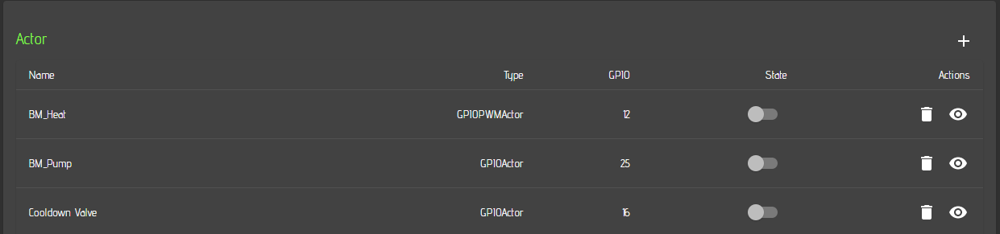
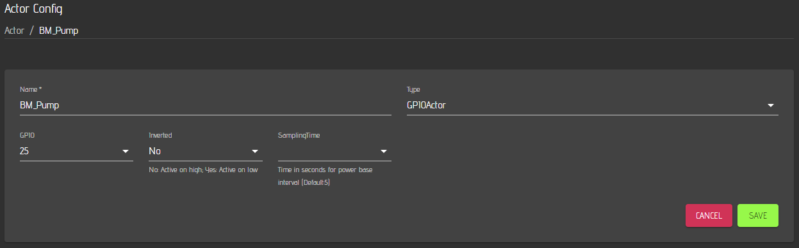
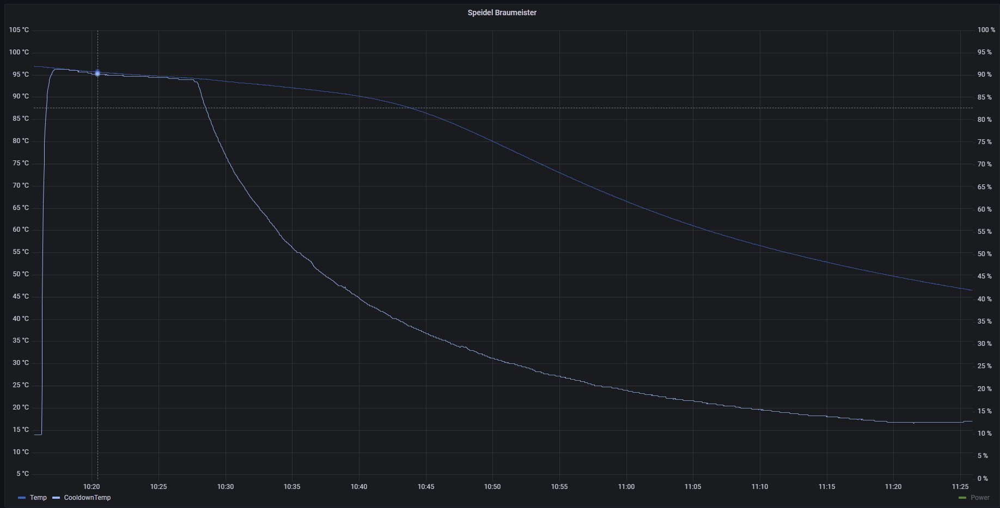
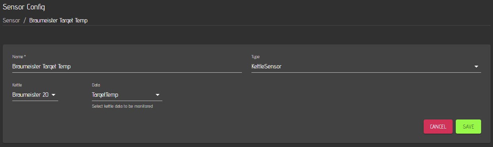
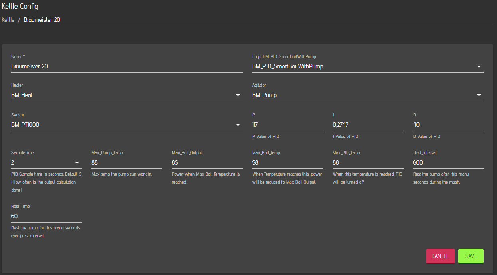
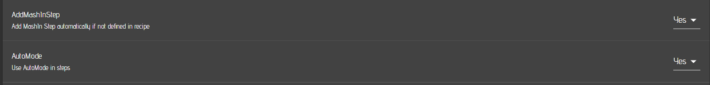

# Example System: MQTTDevice V4 based Fermentation system

- This setup is based on the MQTTDevice V4 which is using an ESP8266 as central unit. The ESP has to be flashed with Innuendos [firmware](https://innuendopi.github.io/MQTTDevice4/). With this setup, you can read the sensors hooked up to the MQTTdevice via the mqtt sensor included in cbpi and you can control the heater / cooler for eacxh femrenter via standard cbpi mqtt actors.

## Hardware requirements 

-  It is recommended to use the PCB described in the aforementioned link. 
- You will also need to connect DS18B20 Onewire sensors (one per fermenter) for temperature measurement to the device.
- 2 Relais (5 Volt) per Fermenter are required (one for cooling, one for heating per fermenter)
- One 5 Volt supply unit for the ESP8266 is required.
- Plug connectors (in my case 230 Volt) are required.
- Connectors for the Sensors are recommended.
- A drip water safe case.
- Magnetic valves to open and close the cooling loop for the fermenter
- Heating pad or cable (25 Watts for 20-30 Liter Fermenter is sufficient). This may vary for your fermenters.
- One Chiller (in my example it is a Lindr AS-40 Glycol which has the advantage that you won't need a bypass valve in case the cooling valves are all closed) 
- Thats about it for the hardware part.

The image below shows the drip water safe case from the outside and the inside equipped with the ESP8266, the power supply and the relais.

The next image shows the Lindr AS-40 Glycol Chiller which is hooked up to the cooling loop for two fermenters.

Here you can see the two magnetic valves I am using to supply my two fermenters independently with glycol. Each of them is connected to one of the 230 Volt Relais from the MQTTDevice setup.

I am using one SS Brewtech BME 7 gal and one Speidel 30 Liter Fermenter. Each femrenter is connected to one of the two cooling lines.

## CraftbeerPi 4 software requirements
- You need to activate mqtt as described [here](../craftbeerpi-4-server/mqtt-connectivity.md)
- I do recommend to install and use also the [**Pushover Plugin**](https://github.com/PiBrewing/cbpi4-PushOver) to recieve push notifications when a step is finished or a target temp is reached and you need to pitch the yeast. Therefore, you need to buy the [**PushOver APP**](https://pushover.net/) for Android or IOS
- I also recommend to install the [**Kettle Sensor Plugin**](https://github.com/PiBrewing/cbpi4-KettleSensor) if you want to monitor some more information about your fermenter such as target temp and cooling or heating status.

## Setup your Fermenter hardware in CraftbeerPi 4


Details on how to setup your software are not shown here, as this is already described in the other chapters.


## Setup your Fermenter hardware in the mqttdevice

- Flashing of the device is not described here as it is documented on Innuendos [page](https://innuendopi.github.io/MQTTDevice4/)
- If you have installed the mqtt broker on your pi, enter the IP adress of your pi in the corresponding setup window of the mqttdevice.

You need to add a sensor or multiple sensors to your mqttdevice depending on the amount of fermenters you want to control. The topic you enter here must match the topic you enter later in your cbpi mqtt sensor settings. The other fields don't need to be changed or filled.

You also need to add actors for your fermenter. In this example you basically need to add two actors per femrneter. One for Cooling and one for heating your fermenter. The example below shows one of the actors. You need to enter again one topic and you must specify one of the output pins. In this example it is 'd0'. 

Once you have saved all your sensors and actors, your overview of the mqtt device web inerface lshould look like this:

If you are running only one fermenter, you need to specify only one sensor and two actors.

### Actors
First you should define two your actors for the Braumeister. You need one for the heating element and one for the pump. In casde you want to run a magnetic valve for the automated cooldown, You need to add another actor for the magnetic valve.

For the heating element you can use a PWM type actor. As frequency, you can choose something between 0.1 and 0.5 Hz. Higher frequencies are not recommended and can cause also issues in your house (e.g. flickering lights). To be on the safe side, choos 0.1 Hz.

For the pump select a regular GPIOActor as it will be only switched on or off once in a while. You can leave the sampling time empty as it is not relevant for this actor.

In case you are using a cooldown valve, you can configure it in the same way as the pump.

### Sensors
Now you need to define your sensors. As mentioned, the Braumeister comes with a 2 wire PT1000. As mentioned above, you need to have a corresponding board connected to your Pi and you need to install the required plugin as mentoined above.

Configure your sensor and coose 1000 as resistivity value and 4300 as resistivity for your reference sensor (You need to buy the correct max board for the PT1000 and not one for a PT100). Choose 2 or 4 wires in the sensor settings. The other parameters are described in detail on the plugin page.

If you want to use an additional one wire sensor for cooldown, you need to set up this sensor as well. Below is an example:

The advantage is that you measure a more realistic temeprature of your wort during cooldown as the PT1000 sensor is covered and 'isolated' with trub. Below you can see the difference for the PT1000 and the Cooldown sensor.

Optionally, you can also install the KettleSensor plugin and add two additional virtual sensors for your Braumeister: Target Temperature and Power. These sensors can be used to display both parameters.

In case you are using influxdb and Grafana integration, you can display the relevant parameters for your brewing session including the target temperatures, the heating power and the measured temepratures.

### Kettle configuration

Finally, you need to define a Kettle with the required logic plugin mentioned above. Select the installed BM_PID_SmartBilWithPump plugin as logic and define a Name for your Kettle. Select the Actor you have defined as Hater for your Kettle Heater and the Pump actor as Agitator. As sensor, select the PT1000 sensor you have defined. The PID parameters need to be derived via the PID Autotune Plugin. Details on how to run the tunig are described [here](https://github.com/PiBrewing/cbpi4-PID_AutoTune).

The max Pump temperature defines, when the pump will be switched off to prevent pump failure. 88C is recommended and alinged with the original Braumeister controller settings. The may bvoil output defines the power that is used for boiling. For my Braumeister 20 L , 85% is suffucuent, but you can adat this to your needs for a good boil. Max Boil Temp is the temeprature, when the max boil output will be used. Max PID temp is the temperature, until the PID settings are used. Above this temeperature, the max output is used. The rest intervall is the intervall when the pump is paused. Default is 600 (= 10 Minutes like in te braumeister controller). The Rest time is the time in seconds for how long the pump is resting. The standard Braumeister setting is 1 Minute.

### Global CraftbeerPi4 server settings

Finally, you need to controll / adapt some settings on the server settings page.

You need to set the 'Add Mashin Step' setting to yes for automated recipe creation from Kleiner Brauhelfer, MuMM or Brewfather. In this case, the system will add a first step with a target temp of the mash step and holds the system once the target temp is reached anbd stops the pump and heating. It'll will notify you to add the malt pip/malt and hit next

You should also enable the automode to start and stop the logic automatically after each step.

You don'T need to select a kettle for the boilkettle as your Braumeister is a one Kettle system. But it would not hurt, if you would select the Braumeister as Boilkettle.

For the Mash_Tun you need to select your Braumeister Kettle.

In the steps settings, you need to select the correspondign steps you want to run for your device (You could also create your own steps via a plugin). 

- Boil should be clear.
- The boil temp can be defined and is filled in for the boilstep during the automated recipe creation.
- If you are using a cooldown sensor, select your sensr here. Otherwise the default kettle sensor will be used if no sensor is selected.
- If you are using a colldown valve, you need to select the corresponding actor that will be used for this step.
- The mash step should be also clear as well as the nashin step.


Details for all steps are also described in the corresponding section of this documentation
