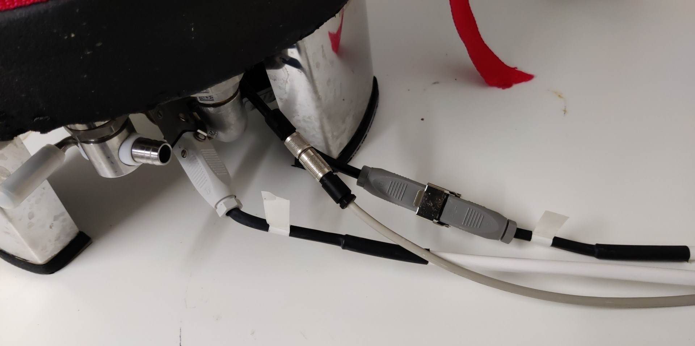
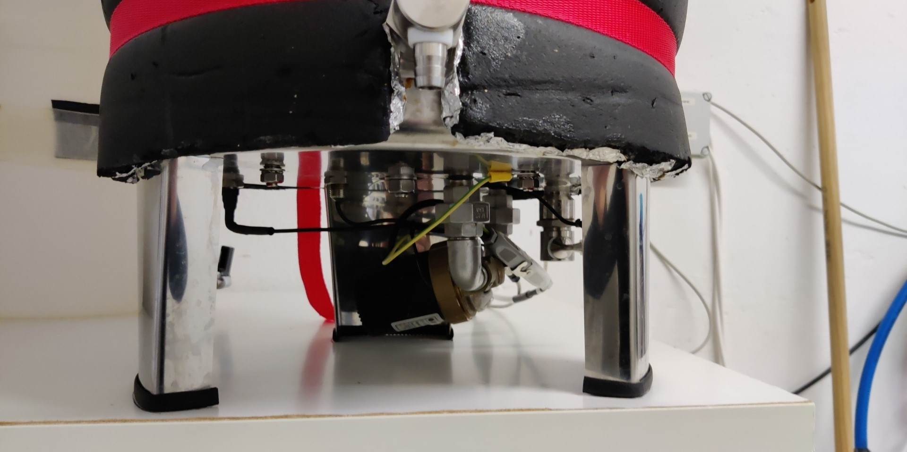

# Example System: Speidel Braumeister 20

- This setup is working with a  a Speidel Braumeister 20 Plus (2015). It should also work with the 10  and 50 Liter models. 
- However, for the 50 Liter model you need to figure out on how to manage the two pumps and heaters. I recommend the GroupedActor Plugin to combine two actors into one.

## Hardware requirements 

- I recommend to use the original temp sensor from the Braumeister which is a 2 wire PT1000. In this case you don't need to deal with thermowells that may not fit into the existing hole of the Braumeister.
-  Therefore you need to add a [max31865 board](https://learn.adafruit.com/adafruit-max31865-rtd-pt100-amplifier/) (incl. a 4300 ohm resistor for PT1000) to your craftbeerpi hardware setup. 
- To connect to the probe, you need a [Binder coupling connector](https://www.conrad.de/de/p/binder-99-0406-00-03-rundstecker-kupplung-gerade-serie-rundsteckverbinder-712-gesamtpolzahl-3-1-st-738917.html)
- You just need to unplug the probe from the Braumeister controller and plug your cable with the aforementioned connector to your craftbeerpi setup
- To connect the pump and the heater, you will need hirschmann connectors. I am using the following connectors
- [Hirschmann STAK 2](https://www.conrad.de/de/p/hirschmann-stak-2-netz-steckverbinder-stak-serie-netzsteckverbinder-stak-buchse-gerade-gesamtpolzahl-2-pe-16-a-gra-1177484.html) for the pump 
- [Hirschmann STAK 200](https://www.conrad.de/de/p/hirschmann-stak-200-netz-steckverbinder-stak-serie-netzsteckverbinder-stak-buchse-gerade-gesamtpolzahl-2-pe-16-a-g-730025.html) for the heating element 
- You will need 2 [Hirschmann safety Clips](https://www.conrad.de/de/p/sicherungsbuegel-hirschmann-730980.html)
- Just unplug pump and heater and connect it to your Relais outputs. I am using SSR for both, heater and pump. They can handle 20A @ 240V AC
- Thats about it for the hardware part.

The image below shows how you connect your Braumeister to the aforementioned plugs:

I have removed the original controller completely from the Braumeister:


Only the pump plug has a ground connection on the Braumeister side. I strongly recommend to add a ground connection from the heater plug (Braumeister side) to the Braumeister Kettle (Yellow/Green Cable in the image above)! You will also need to ensure ground connection from your controller side!


### Optional Hardware requirement
- You can add a magnetic valve to the inlet of your colling jacket as this can be triggered during the cooldown step. It'll open, if you configure a corresponding actor as cooldown valve and set it up in your settings. When the cooldown steps starts, the valve opens and your cooling water starts to flow until your pre-configured temprature is reached. Then the valve is closing. An example picture is shwon below:

- In particular the older Braumeister models have some issues with the accurate temperature readings when cooling down your wort. Theerefore, I recommend to add another temp sensor (e.g. OneWire) to your braumeister during cooldown. The second sensor for cooldown  can be configured in the CraftbeerPi 4 settings. You just need a thermowell and some parts to fix your thermowell and sensor to the middle column of your Braumeister prior ro the cooldown step. 

An example for the parts is shown here:

The placement of the Thermowell with Sensor after cooldown is shown here:

## CraftbeerPi 4 software requirements
- You need an installation of Craftbeerpi4 with some additional plugins.
- You will need the [cbpi4-pt100X plugin](https://github.com/avollkopf/cbpi4-pt100x) to read the temeprature values from the PT1000 and configure it to PT1000.
- You will also need a [logic plugin](https://github.com/avollkopf/cbpi4-BM_PID_SmartBoilWithPump) that covers pump pause, pump stop @ 88°C, PID temperature control and much more 
- The PID settings have to be optimized for your kettle with the [PIDAutotune](https://github.com/avollkopf/cbpi4-PID_AutoTune) plugin.
- PID control switches off at 88°C and boiling will be done with reduced heater power which can be defined in the logic settings (mine is running at 85% power during boil)
- I do recommend to install and use also the [Pushover Plugin](https://github.com/avollkopf/cbpi4-PushOver) to recieve push notifications when you need to add or remove the malt pipe or add hops. Therefore, you need to buy the [PushOver APP](https://pushover.net/) for Android or IOS
- I also recommend to install the [Kettle Sensor Plugin](https://github.com/avollkopf/cbpi4-KettleSensor) if you want to monitor some more information.
- If you have a buzzer connected to your system or if you are using an extension board with a buzzer, you should install and configure the [Buzzer plugin](https://github.com/avollkopf/cbpi4-buzzer) accordingly

