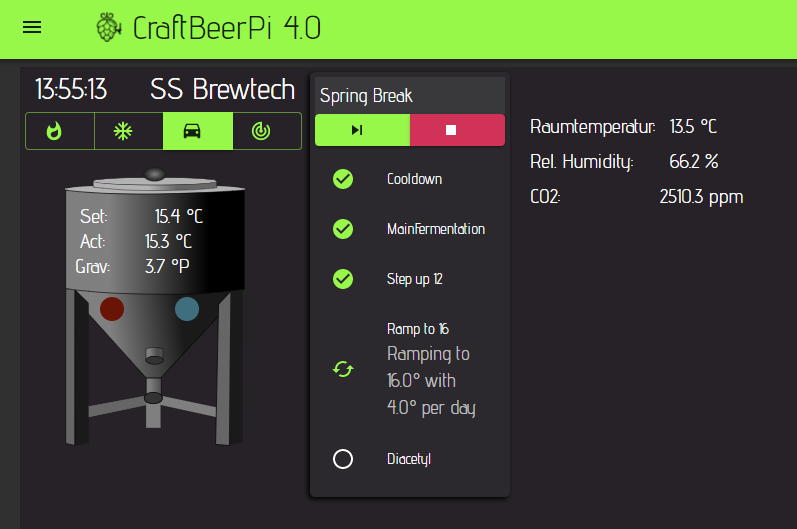

# Operating your system

## Use the system for brewing

If you have set up your [dashboard for brewing](craftbeerpi-4-server/dashboard.md#creating-a-simple-single-kettle-brew-dashboard), and configured your system correctly, you can start brewing. This part will explain you how to run a simple single kettle system. You should start to create a recipe on your system with the [Mash Profile ](craftbeerpi-4-server/mash-profile.md#write-your-first-simple-recipe)editor or you can just create a recipe automatically with the [recipe upload ](craftbeerpi-4-server/recipe-upload.md#overview)functionality. Once the recipe has been created, your brewing dashboard should look similar to the one below.

On top of the kettle, you can see the kettle control bar. This bar contains 3 or 4 different buttons.


In most cases you will see 4 buttons as you have defined a heater and agitator for your kettle. If you have only defined a heater but no agitator, the control bar will contain only 3 buttons.


The example below shows the bar with all 4 buttons. Whenever a button is active, the color scheme is changes and the background will turn green, while the symbol itself will be black

The left button is also the button for the heating element. You can switch it on or off if you are not running the system in auto mode. The next button is for the agitator which can be for instance a pump. With this button, you can switch the agitator on or off.&#x20;


If you switch on the heater with the heater button, the system does not control the temperature and leaves to heater on until you switch it off.&#x20;

The same is true for the agitator button. The button won't take care if you are running for instance a pump that should not be switched on above a certain temperature.

It is always recommended to operate your system in AutoMode where the Kettle logic is taking over control&#x20;


The button on the right side will open a window where you can set the target temperature for your kettle manually. From the target temp dialog you can select temperatures from -5°C to 100°C.&#x20;


If you have set the server to F, the scale is converted to F


.png>)

Once you have selected your target temperature and have clicked on the set button, the target temperature will be also updated on your dashboard.

If you click on the 'car' symbol, the auto mode will be activated and you can see the active status of the actors as the background is now green and the symbol black. The system would now heat up to 80°C and holds that temperature until you stop the auto mode by clicking again on the car symbol.

Theoretically, you could also operate the system with the auto mode and set the target temperatures manually. However, this is not recommended for brewing. You could do this for instance, to run your kettle at 60°C for a cleaning cycle.

To use the system for brewing it is recommended to use the functions provided with the mash step item which is located on the left side of the kettle in this example. To start brewing in a comfortable automatic mode, you need to press the start button in the mash steps item below the recipe name. This will start the first step and the [auto mode if you created your steps accordingly ](craftbeerpi-4-server/mash-profile.md)or configured the [settings for automated recipe creation](craftbeerpi-4-server/recipe-upload.md#define-your-default-recipe-creation-settings) to use this feature. If you have chosen not to use the auto mode setting, you need to activate your kettle control by clicking on the car symbol by yourself. Whenever you want to pause the process in between , you will also need to stop the auto mode manually

In this example, the first step is a MashIn step that heats up your kettle to the target MashIn temperature and raises a notification once the target temperature is reached. The system stops and you can add for instance your malt. To move to the next step, you need to press the next button on the dialog window.

The next step is a regular mash step. When the step is starting, it shows typically 'Waiting for target temp' in the status. When the target mash temp is reached, the timer will start and is shown in the step status. A notification will also be raised with the estimated step end time.

You can see the step properties and also possible step actions if you click on the active step. Properties can't be changed here, but if step actions are available, you can run them from the dialog window. The mash step has two actions included. You can start the timer manually if it is not already running, or you can add time (5 minutes per click) if you want to extend the step when the timer is already running.

The user has also the possibility to pause the current step and move directly to the next step. The 'Forward' button under the recipe name will stop the current step and start the next step in the recipe. The red 'Stop' button will pause the active step.

When the active step is paused, you see a pause symbol in front of the step and three buttons under the recipe name. Now you can resume the step with the left button, jump to the next step with the button in the middle or reset the mash steps and stop the recipe

When all the mash steps including the MashOut steps are completed, a lautering step (based on a notification step) is included in this recipe. This step will also require your confirmation before the system will start the boil step. This allows you to complete the lautering process depending on your system (e.g. removing the malt bag, the malt pipe or transfer the wort to a boil kettle).

The boil step has more properties than the mash steps and the same step actions. You can start the timer before the boil temperature is reached and you can add time to the timer. The step will send out notifications for the following events:

* First Wort Hop: If the flag is set, a notification will be raised to add Fist Wort hops once the boil step has been started.
* Lid Alert: This will raise a notification at 95°C / 203 F to remove the lid of the boil kettle if the flag is set to yes.
* Hop Alarms 1-6: Each hop alarm will raise a notification to add hops / misc.


If you have a buzzer in your system and the buzzer plugin installed, the buzzer will be triggered with each notification.

If you have installed the pushover plugin, notifications will be forwarded to the pushover push message service and you can receive the notification and push message on your smartphone. (Raspberry needs to have an active internet connection and you need to install the pushover app on your smartphone)


When the boil step is completed, a wait step is added as Whirlpool step. The final step is a Cool down step which should be used for active cooling prior to the transfer to your fermenter. The cool down step is monitoring your temperature in the boil kettle (you could also specify a different temperature sensor for this step in the automatic recipe creation settings) and is calculating the estimated completion time when the target temperature is reached (there is still room for improvement). The step sends out an information about the current temperature and the estimated completion time. The cool down step could also trigger a magnetic valve to switch the cool down water on and off.

When the step is completed, the system will raise a notification that the brewing is completed and you can transfer the wort into the fermenter.

## Use the system for fermentation

CraftbeerPi4 supports also fermentation with the Fermenter hardware, a corresponding fermenter logic and fermenter steps. A simple fermentation hysteresis logic is included with the server, but users can also write their own fermenter logic and install them as a plugin. A couple of simple fermentation steps are included and also here, users can create / add steps via plugins.

The integrated logic has some special settings for fermentation and you need to adapt just a few settings for each batch. Details on the other parameters have been already described [here](craftbeerpi-4-server/hardware.md#setting-up-the-hardware-for-fermentation).

* If you want to start the fermenter automatically during reboot, you need to set AutoStart to 'Yes'. In this case, the fermenter will start with the last step and the remaining time. If you are not fermenting in your fermenter, the setting should be switched back to 'No' or you should clear the fermenter profile for this fermenter that no steps are in the profile that could be started.
* The BrewName does not need to be set here as it will  be be set in the recipe and will be shown in the [modded LCDisplay Plugin ](https://github.com/PiBrewing/cbpi4-LCDisplay)during fermentation but also on top of the fermenter step widget.
* The additional sensor property in the logic is only relevant, if you use the modded LCDisplay Plugin. Here you can select for instance an iSpindle Sensor and your Gravity is shown on the LCDisplay

You need to save your settings and go back to your [dashboard, where you did setup your fermenters.](craftbeerpi-4-server/dashboard.md#creating-a-simple-fermenter-dashboard)

In the dashboard example above you can see a dashboard with one fermenters and the fermenter step widget where a recipe has been loaded. If you have multiple fermenters, you can add them to the same dashboard or use one dashboard per fermenter. You just need to pay attention that you assign the widgets such as control or steps to the correct fermenter you want to control.

If you have not yet created or loaded a recipe for this fermenter, you need to create / load a recipe from the [fermenter profile / recipe book](craftbeerpi-4-server/fermenter-profile.md).


There is no need to set the TargetTemp as this is done by the recipe. However, you could set the target temp and click on the auto symbol to run the fermenter logic w/o any steps. The logic will ramp the temp to the desired target temp and keeps it until you stop the logic. However, this is not the recommended scenario to operate your fermenter.


To start the fermenter process, you just need to clock on the play button like it is already described for brewing and the steps for the specified fermenter will start and the steps will set parameters such as target temp automatically. If you enabled also Auto mode in the fermenter steps, the logic will also start automatically.

As soon, as the Auto mode is started, the logic will switch on the actor for cooling or heating to get to the desired target temp. If you restart the system and have enabled Fermenter Autostart in the logic, the Auto mode will be started with the last step and the remaining step time.

Some steps have also step actions and you can access them or the step properties by clicking on the step itself. You can also pause, resume or move directly to the next step via the step widget in the same way as it has been described for the brewing.

