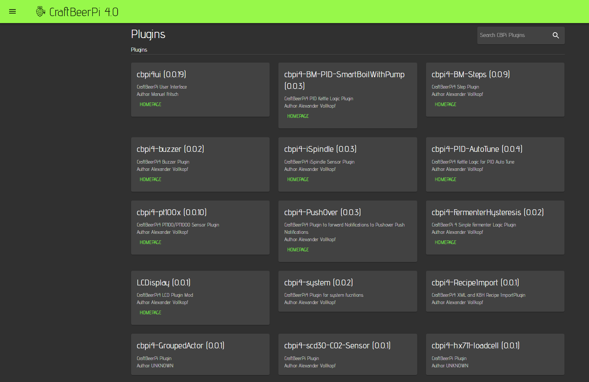

# Plugin installation

## Plugin installation process

Craftbeerpi4 comes with very basic functionality but has the possibility to use plugins provided by the community. Therefore, it has a huge flexibility as Sensors, Actors Controllers, Recipe creation plugins but also Push Messages and Displays can be added to each users need (The user just needs to write his plugin or needs to find someone who is providing it).


There is currently no possibility to install plugins automatically via the integrated plugin page. All plugins need to be installed via the path described below. The plugin page does only show the installed plugins.


CraftbeerPi4 comes for instance with a Onewire temperature sensor, but some users prefer a PT100/PT1000 sensor. Therefore, a variety of plugins is already available and below is an example on how to install a PT100/PT1000 sensor plugin.

Some plugins have been made available via pypi.org and can be installed directly from there. Other plugins need to be installed directly from GitHub. The cbpi4-pt100X plugin is available on both platforms. Typically, the latest version is available on GitHub and will be released a bit later via pypi.org as package

Installation from pypi.org is quite simple. Just type the following command to activate the virtual environment:

```
source ~/.local/pipx/venvs/cbpi4/bin/activate
```

And install the plugin with:

```
python -m pip install cbpi4-pt100x
```

The plugin and it's dependent packages will be installed on your system and cbpi will detect it automatically.

The other way to install the plugin is directly from GitHub:

```
python -m pip install https://github.com/PiBrewing/cbpi4-pt100x/archive/main.zip
```

Also here, the plugin and the dependent packages will be installed automatically.

Once this is completed, you need to leave the virtual environment with:

```
deactivate
``` 

And restart cbpi or reboot your server.


To get some detailed information about the plugin configuration and how to connect/install your sensor, you should have always a look at the plugin page on GitHub or pypi.org. I always try to add the most important information in the corresponding README.

For the cbpi4-pt100x plugin, you can find the information [here](https://github.com/PiBrewing/cbpi4-pt100x) on GitHub or you search for cbpi4-pt100x on the pypi.org site.



Please always remember, that plugins can also add global settings during the installation that need to be set in the [settings page](craftbeerpi-4-server/settings.md). One example is for instance the [cbpi4-pushover ](https://github.com/PiBrewing/cbpi4-Pushover)Plugin which adds the parameters pushover\__user and pushover\__key to the global settings..


## How to update a plugin?

If there is a new version of a plugin you can simply re-install the plugin or run an upgrade. Below is the example for the cbpi-pt100x plugin:

#### Re-Installation (always inside the virtual environment as descried above):

```
python -m pip install --force-reinstall https://github.com/PiBrewing/cbpi4-pt100x/archive/main.zip
```

#### Upgrade (always inside the virtual environment as descried above):

```
python -m pip install --upgrade https://github.com/PiBrewing/cbpi4-pt100x/archive/main.zip
```

The update/upgrade or re-installation can be also done cia pypi.org if the plugin has been published there via the plugin name as shown above.

## How to remove a plugin?


If you want to remove a plugin you need to be careful. Before you remove the plugin from the server, you need to ensure that the plugin is not in use in any of your Hardware items and the dashboard as this may cause errors and can prevent the server from starting


To remove the plugin from the cbpi server, just type in case of the cbpi4-pt100x plugin:

```
python -m pip uninstall cbpi4-pt100x
```

inside the virtual environment.

## How to show the installed/active plugins?

If you want to see the active plugins, you have two possibilities. The first option is from the command line. Just type:

```
cbpi plugins
```

This will show you a list of the installed plugins incl. the version:

```
---------------------
Welcome to CBPi
---------------------

 List of active plugins

 Name                            Version    Author                             Homepage                                                     Summary
------------------------------  ---------  ---------------------------------  -----------------------------------------------------------  ---------------------------------------------------------------------------
cbpi4-LCDisplay                 0.0.3      Alexander Vollkopf                 https://github.com/PiBrewing/cbpi4-LCDisplay                 CraftBeerPi4 LCD Plugin Mod
cbpi4-PushOver                  0.0.3      Alexander Vollkopf                 https://github.com/PiBrewing/cbpi4-PushOver                  CraftBeerPi4 Plugin to forward Notifications to Pushover Push Notifications
cbpi4-buzzer                    0.0.2      Alexander Vollkopf                 https://github.com/PiBrewing/cbpi4-buzzer                    CraftBeerPi4 Buzzer Plugin
cbpi4ui                         0.2.0a4    Manuel Fritsch                     http://web.craftbeerpi.com                                   CraftBeerPi User Interface
cbpi4-pt100x                    0.1.1      Alexander Vollkopf                 https://github.com/PiBrewing/cbpi4-pt100x                    CraftBeerPi4 PT100/PT1000 Sensor Plugin
cbpi4-BM-PID-SmartBoilWithPump  0.1.1      ['Alexander Vollkopf', 'Guy Lev']  https://github.com/PiBrewing/cbpi4-BM_PID_SmartBoilWithPump  CraftBeerPi4 PID Kettle Logic Plugin
cbpi4-iSpindle                  0.0.7      Alexander Vollkopf                 https://github.com/PiBrewing/cbpi4-iSpindle                  CraftBeerPi4 iSpindle Sensor Plugin
cbpi4-PID-AutoTune              0.0.8      Alexander Vollkopf                 https://github.com/PiBrewing/cbpi4-PIDAutoTune               CraftBeerPi4 Kettle Logic for PID Auto Tune
cbpi4-scd30-CO2-Sensor          0.0.3      Alexander Vollkopf                 https://github.com/PiBrewing/cbpi4-scd30-co2-sensor          CraftBeerPi4 Plugin for SCD30 based CO2 Sensor
cbpi4-KettleSensor              0.0.5      Alexander Vollkopf                 https://github.com/PiBrewing/cbpi4-KettleSensor              CraftBeerPi4 Plugin to add Sensor parameters for your Kettle and Fermenter
cbpi4-BLEHydrom                 0.0.4      Alexander Vollkopf                 https://github.com/PiBrewing/cbpi4-BLEHydrom                 CraftBeerPi4 Plugin for Hydrom and Tilt (BLE connection)
cbpi4-system                    0.0.3      Alexander Vollkopf                 https://github.com/PiBrewing/cbpi4-system                    CraftBeerPi4 Plugin for system functions


```

The second option is directly from the user interface. Just click on the menu button on the top left and select Plugins. This will show this page which is still in development. However, you can see the active plugins and if the developer has added the corresponding information to his plugin, you can go directly to the corresponding webpage of the Plugin.


You can't install, activate or deactivate plugins on this page. It only shows the plugins you have installed and activated via command line.




## Plugin List

The tables below shows the plugins that are currently available by type. At this point of time I cannot guarantee that the list is complete as I can only add the plugins to the list I am aware of.

### Sensors

| Name                   | Description                                    | Link                                                               |
| ---------------------- | ---------------------------------------------- | ------------------------------------------------------------------ |
| cbpi4-pt100x           | PT100/PT1000 Temp Sensor                       | [GitHub Link](https://github.com/PiBrewing/cbpi4-pt100x)           |
| cbpi4-hx711-loadcell   | hx711 based Load cell Sensor                    | [GitHub Link](https://github.com/PiBrewing/cbpi4-hx711-loadcell)   |
| cbpi4-Flowmeter        | Hall Sensor based Flowmeter Sensor             | [GitHub Link](https://github.com/PiBrewing/cbpi4-Flowmeter)        |
| cbpi4-system           | System Sensors: Temp, CPU load, Memory         | [GitHub Link](https://github.com/PiBrewing/cbpi4-system)           |
| cbpi4-scd30-co2-sensor | Temp, Rel. Humidity and CO2 sensor (I2C based) | [GitHub Link](https://github.com/PiBrewing/cbpi4-scd30-co2-sensor) |
| cbpi4-iSpindle         | Sensor that collects data from the iSpindle    | [GitHub Link](https://github.com/PiBrewing/cbpi4-iSpindle)         |
| cbpi4-KettleSensor     | Collects target emp and power/status for kettle / fermenter | [GitHub Link](https://github.com/PiBrewing/cbpi4-KettleSensor)     |
| cbpi4-dht22-temp-hum-sensor | Sensor for relative humidity and temperature | [GITHub Link](https://github.com/DanZee/cbpi4-dht22-temp-hum-sensor) |
| cbpi4\_GroupedSensor | Groups up to 8 Sensors for avg, max or min calculation | [GITHub Link](https://github.com/PiBrewing/cbpi4_GroupedSensor) |
| cbpi4-max6675 | Allows usage of max6675 board to connect k-type sensors and measure temps up to 1000°C (e.g. for gas burner control)| [GitHub Link](https://github.com/dimontau/cbpi4-max6675) |

### Actors

| Name                     | Description                                                        | Link                                                                 |
| ------------------------ | ------------------------------------------------------------------ | -------------------------------------------------------------------- |
| cbpi4-GroupedActor        | Allows to group Actors                                             | [GitHub Link](https://github.com/PiBrewing/cbpi4-GroupedActor)       |
| cbpi4-GroupedPowerActor        | Allows to group Actors and ramp the power linear over the individual actors | [GitHub Link](https://github.com/PiBrewing/cbpi4-GroupedPowerActor)       |
| cpbi4-DependentActor     | Contains two Actor types: <p><strong>Dependent Actor</strong> allows to switch actors dependent on the state of other actors.</p><p><strong>Conditional actor</strong> allows to switch a target actor based on the status of a an actor group (AND / OR logic included). Helpful for triggering a chiller pump based on the status of solenoid valves</p> | [GitHub Link](https://github.com/PiBrewing/cbpi4-DependentActor)     |
| cbpi4-GPIODependentActor | Allows to switch actors dependent on the state GPIO Inputs (alpha) | [GitHub Link](https://github.com/PiBrewing/cbpi4-GPIODependentActor) |
| cbpi4-pca9685            | PCA9685 I2C PWM Actor Plugin for CraftBeerPi4                      | [GitHub Link](https://github.com/jtubb/cbpi4-pca9685)                |
| cbpi4-http-actor         | Generic Craftbeerpi4 HTTP Actor Plugin                             | [GitHub Link](https://github.com/hurra/cbpi4-http-actor)             |
| cbpi4-PCF8574-GPIO       | Extend PI's GPIO Actors by 8 via I2C device                        | [GitHub Link](https://github.com/PiBrewing/cbpi4-PCF8574-GPIO)       |
| cbpi4-TriacHatActor     | Plugin for using Waveshare's 2CH Triac Hat for controlling actors in CraftBeerPi | [GitHub Link](https://github.com/netanelklein/cbpi4-TriacHatActor)

### Kettle Controller

| Name                               | Description                                                                                                                                       | Link                                                                         |
| ---------------------------------- | ------------------------------------------------------------------------------------------------------------------------------------------------- | ---------------------------------------------------------------------------- |
| cbpi4-PIDBoil                      | Kettle controller with PID logic and Boil power parameter                                                                                         | [GitHub Link](https://github.com/PiBrewing/cbpi4-PIDBoil)                    |
| cbpi4-PIDHerms                     | Kettle controller with PID logic, Boil power parameter and HLT temp sensor condition                                                              | [GitHub Link](https://github.com/PiBrewing/cbpi4-PIDHerms)                   |
| cbpi4-BM\__PID\__SmartboilWithPump | Kettle controller with PID logic, Boil power parameter and automated Pump control / protection (can be used for instance for Speidel Braumeister) | [GitHub Link](https://github.com/PiBrewing/cbpi4-BM\_PID\_SmartBoilWithPump) |
| cbpi4-PID\_Autotune                | Kettle controller that can be used to determine the PID parameters for the PID based Kettle controllers                                           | [GitHub Link](https://github.com/PiBrewing/cbpi4-PID\_AutoTune)              |

### Fermenter Controller

|                           | Description                                                | Link                                                                  |
| ------------------------- | ---------------------------------------------------------- | --------------------------------------------------------------------- |
| Example plugin to be created | Hysteresis included in cbpi4 > 4.0.1.0 |  |
|cbpi4_FermenterHysteresisWithChillerDiff | Fermenter Hysteresis with disabled cooling depending on chiller temp | [GitHub Link](https://github.com/mstrinzha/cbpi4_FermenterHysteresisWithChillerDiff) |

### Display

| Name                 | Description                                                                           | Link                                                          |
| -------------------- | ------------------------------------------------------------------------------------- | ------------------------------------------------------------- |
| cbpi4-LCDisplay      | Allows usage of LCD Display (I2C)                                                     | [GitHub Link](https://github.com/JamFfm/cbpi4-LCDisplay)      |
| cbpi4-LCDisplay      | Modded Fork that allows also Display of Fermentation with Fermenter Hysteresis Plugin | [GitHub Link](https://github.com/PiBrewing/cbpi4-LCDisplay)   |
| cbpi4-NEXTIONDisplay | Use Nextion Display on CraftbeerPi4                                                   | [GitHub Link](https://github.com/JamFfm/cbpi4-NEXTIONDisplay) |

### Utilities (Messaging, Custom Recipe Creation / Steps)

| Name               | Description                                              | Link                                                           |
| ------------------ | -------------------------------------------------------- | -------------------------------------------------------------- |
| cbpi4-BM\_Steps    | Example Plugin for custom Mash steps                     | [GitHub Link](https://github.com/PiBrewing/cbpi4-BM\_Steps)    |
| cbpi4\_Fermenterstep | Plugin for Additional Fermenter steps                   | [GitHub Link](https://github.com/PiBrewing/cbpi4\_Fermenterstep)    |
| cbpi4-RecipeImport | Example Plugin to customize automated recipe creation    | [GitHub Link](https://github.com/PiBrewing/cbpi4-RecipeImport) |
| cbpi4-buzzer       | Activates buzzer on cbpi4 messages                       | [GitHub Link](https://github.com/PiBrewing/cbpi4-buzzer)       |
| cbpi4-PushOver     | Forwards cbpi4 messages to Pushover push message service | [GitHub Link](https://github.com/PiBrewing/cbpi4-PushOver)     |
| cbpi4-TelegramPushNotifications     | Telegram Push Notifications for Craftbeerpi 4 | [GitHub Link](https://github.com/pascal1404/cbpi4-TelegramPushNotifications)     |
| cbpi4-alarmClock   | Step plugin which starts heating at a specified time     | [GitHub Link](https://github.com/pascal1404/cbpi4-alarmClock)  |