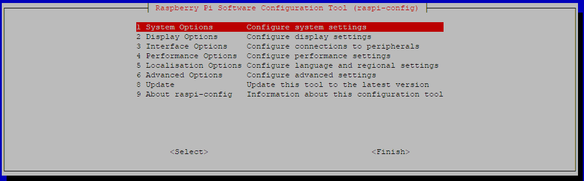

# Server Installation

## How to install Craftbeerpi4 and it's user interface based on a clean raspbian image

There is also the possibility to install the server from a pre-configured image. Details are described [here](server-installation.md#installation-of-craftbeerpi-4-from-a-pre-configured-image-to-your-sd-card).

### Installation of Raspbian and preparation of the system

First you will need to install Raspbian from an image. The installer can be found here: [https://www.raspberrypi.com/software/](https://www.raspberrypi.com/software/)


CraftbeerPi4 requires python 3.9 and it is recommended to install it on bullseye. It has been tested on the 32 bit version but users have reported it is also working on 64 bit bullseye.


You should enable ssh to run commands also via a ssh connection from a remote PC / MAC. Open either a bash window or use a terminal to login via a remote ssh connection to your pi. The default user name is 'pi' and the default password is 'raspberry'. For safety reasons, you should change your password. This can be done with the RaspberryPi imager in the advanced options that can be accessed with CRTL + SHIFT + X.

Once the image has been written to the SD card, you need to place the card in your Pi and start the system. The first boot will take some time as the system will expand the image and needs to boot several times.

Now you should update your OS. Therefore, you need to enter a few commands. These commands need to be run as root. Therefore, you need to place 'sudo' in front of the commands. Open a bash window or connect via ssh to your raspberry.

```
sudo apt-get update
sudo apt-get upgrade
```

CraftbeerPi 4 requires another package that needs to be installed prior to the installation of the cbpi server. To install the package, please run the following command.

```
sudo apt-get install libatlas-base-dev
```

If you want to use hardware that is connected via I2C (e.g. LCD Display), you need to enable I2C in the raspi-config. You can also enable the onewire support in the raspi-config. Therefore, you need to run the command:

```
sudo raspi-config
```

This will open the following window.



Select Interface options to enable I2C, Onewire support or whatever you need.


From the main menu you can also select system options to enable and configure Wifi.

 

If you were using the full image of raspbian, the next steps are not required, as the packages are already included. On the lite image, you need to install a couple of packages, before you can install the server and user interface. Please run the following command to install the python3 package manager:

```
sudo apt-get install python3-pip
```

Now you can start installing the cbpi server.

### Installation of CraftbeerPi 4

The installation of CraftbeerPi4 is done with the package installer for python (pip3). You can install the server directly from pypi.org with the following cxommand:

```
sudo pip3 install cbpi
```

To install craftbeerpi4 from the repo which can be newer once in a while, please run the following command:

```
sudo pip3 install https://github.com/craftbeerpi/craftbeerpi4/archive/master.zip
```

The installation will take some time and it will also install the default user interface. 

To upgrade the user interface separately, you can run:

```
sudo pip3 install cbpi4ui
```

However, this is typically not required.

There could be a newer version of the user interface in the repo and you could install this also directly from the repo.

```
sudo pip3 install https://github.com/craftbeerpi/craftbeerpi4-ui/archive/main.zip
```


There are also development branches of some repos. These branches will be used to test some new features before the code is rolled out to the master or main branch. These branches are typically working, but should not necessarily considered as stable. The installation of these branches will be described in the [development section](development.md#running-a-development-version-of-the-server).


Now you need to setup cbpi to create a config folder:

```
cbpi setup
```

This will show you the following output:

```
Setting up CraftBeerPi 
Folder created 
Config Folder created
```

Then you can try to start cbpi the first time manually:

```
sudo cbpi start
```

You should see the following output in your bash window:

```
START
2021-10-14:22:25:48,300 INFO     [craftbeerpi.py:89] Init CraftBeerPI
2021-10-14:22:25:48,400 INFO     [eventbus.py:56] Topic #
2021-10-14:22:25:48,836 INFO     [craftbeerpi.py:245]
  _____            __ _   ____                 _____ _
 / ____|          / _| | |  _ \               |  __ (_)
| |     _ __ __ _| |_| |_| |_) | ___  ___ _ __| |__) |
| |    | '__/ _` |  _| __|  _ < / _ \/ _ \ '__|  ___/ |
| |____| | | (_| | | | |_| |_) |  __/  __/ |  | |   | |
 \_____|_|  \__,_|_|  \__|____/ \___|\___|_|  |_|   |_|


 _  _    ___   ___   ____   ___
| || |  / _ \ / _ \ |___ \ / _ \
| || |_| | | | | | |  __) | (_) |
|__   _| | | | | | | |__ < \__, |
   | |_| |_| | |_| | ___) |  / /
   |_(_)\___(_)___(_)____/  /_/


2021-10-14:22:25:48,837 INFO     [craftbeerpi.py:246] www.CraftBeerPi.com
2021-10-14:22:25:48,837 INFO     [craftbeerpi.py:247] (c) 2021 Manuel Fritsch
2021-10-14:22:25:48,844 INFO     [plugin_controller.py:30] Trying to load plugin dummyactor
2021-10-14:22:25:48,898 INFO     [plugin_controller.py:30] Trying to load plugin gpioactor
2021-10-14:22:25:48,916 INFO     [plugin_controller.py:30] Trying to load plugin mashstep
2021-10-14:22:25:48,921 INFO     [plugin_controller.py:30] Trying to load plugin onewire
2021-10-14:22:25:48,959 INFO     [plugin_controller.py:30] Trying to load plugin httpsensor
2021-10-14:22:25:48,967 INFO     [plugin_controller.py:30] Trying to load plugin mqtt_sensor
2021-10-14:22:25:48,970 INFO     [plugin_controller.py:30] Trying to load plugin ConfigUpdate
2021-10-14:22:25:48,973 INFO     [plugin_controller.py:30] Trying to load plugin hysteresis
2021-10-14:22:25:48,977 INFO     [plugin_controller.py:30] Trying to load plugin dummysensor
2021-10-14:22:25:48,979 INFO     [plugin_controller.py:52] Try to load plugin:  cbpi4ui
2021-10-14:22:25:48,982 INFO     [plugin_controller.py:56] Plugin cbpi4ui loaded successfully
2021-10-14:22:25:48,982 INFO     [basic_controller2.py:36] SensorController Load
2021-10-14:22:25:48,983 INFO     [step_controller.py:30] INIT STEP Controller
2021-10-14:22:25:48,983 INFO     [basic_controller2.py:36] ActorController Load
2021-10-14:22:25:48,984 INFO     [basic_controller2.py:36] KettleController Load
2021-10-14:22:25:49,430 INFO     [__init__.py:21] Check Config for required changes
2021-10-14:22:25:49,430 INFO     [__init__.py:47] INIT Cooldown Sensor Setting
2021-10-14:22:25:49,432 INFO     [__init__.py:96] INIT Max Dashboard Numbers for multiple dashboards
2021-10-14:22:25:49,439 INFO     [__init__.py:113] INIT Current Dashboard Number
2021-10-14:22:25:49,443 INFO     [__init__.py:144] INIT Brewfather User ID
2021-10-14:22:25:49,448 INFO     [__init__.py:153] INIT Brewfather API Key
2021-10-14:22:25:49,461 INFO     [__init__.py:162] INIT Recipe Creation Path
2021-10-14:22:25:49,465 INFO     [__init__.py:171] INIT BoilKettle
======== Running on http://0.0.0.0:8000 ========
(Press CTRL+C to quit)

```

Now try to access cbpi via the webbrowser on your PI or on external client systems, like other computers or mobile devices.  Therefore, enter in your browser:

> IPADDRESSOFYOURPI:8000 -> e.g. 192.168.10.100:8000

If you see the empty dashboard of Craftbeerpi4, you were successful. Now you can go back to the bash window and press CTRL + C to stop the server.

## Automatically start the server as service

If you want to autostart the server when the pi is booting, you can enable that with the following command:

```
sudo cbpi autostart on
```

The following output should be on the bash screen:

```
Add craftbeerpi.service to systemd
Copied craftbeerpi.service to /etc/systemd/system
Created symlink /etc/systemd/system/multi-user.target.wants/craftbeerpi.service → /etc/systemd/system/craftbeerpi.service.
Enabled craftbeerpi service
Started craftbeerpi.service
```


The craftbeerpi.service file is located in your config directory and configured for the user pi. If you have installled cbpi under a different user or did run the setup in a different folder than /home/pi you need to change the craftbeerpi.service file manually.

`[Service]`

`WokingDirectory=/home/pi`

Just replace `/home/pi` with the path hwere your config folder is located



If you want to remove the autostart during boot, simply run this command:

```
sudo cbpi autostart off
```

It will take some time to stop the server and finally you will see this output:

```
Remove craftbeerpi.service from systemd
Stopped craftbeerpi service
Removed /etc/systemd/system/multi-user.target.wants/craftbeerpi.service.
Removed craftbeerpi.service as service
Deleted craftbeerpi.service from /etc/systemd/system

```

To see the status of cbpi autostart, you can run the following command:

```
sudo cbpi autostart status
```

If you want to stop the server (running as service) for some reason (e.g. debugging), you can stop the server with the following command:

```
sudo systemctl stop craftbeerpi.service
```


You need patience as this will take some time.


Then you can start the server in manual mode to see the logging and you can stop it again with CTRL + C:

```
sudo cbpi start
```

To restart the server as service you can either reboot or just start it as serivce directly:

```
sudo systemctl start craftbeerpi.service
```

## Automatically start chromium in kiosk mode at startup

You can enable chromium kiosk mode via commandline. If this is enabled, chromium will start after boot in kiosk mode with craftbeerpi4.


This has been tested on the full raspbian version where chromium is installed as default. For other setups you may need to install the chromium browser manually.



With Chromium 98 on bullseye (32 and 64 bit), Chromium might start with a white screen and won't load the server on startup. If you experience this issue you need to disable hardware acceleration in Chromium settings.


To enable kiosk mode, you need to run the following command from the bash:

```
sudo cbpi chromium on
```

You will see the following output that the required file has been copied to the autostart folder:

```
Add chromium.desktop to /etc/xdg/autostart/
Copied chromium.desktop to /etc/xdg/autostart/
```

You can also disable the kiosk mode via commandline. Therefore, you need to run the following command:

```
sudo cbpi chromium off
```

You will see the following output that the file has been removed from the autostart folder:

```
Remove chromium.desktop from /etc/xdg/autostart/
Deleted chromium.desktop from /etc/xdg/autostart/
```

You can also see the status for Chromium kiosk mode if you run the following command:

```
sudo cbpi chromium status
```

## Installation of Craftbeerpi 4 from a pre-configured image to your sd-card


There is also the possibility to write an image with a pre-installed CraftbeerPi4 server to your sd-card. This image comes with several installed plugins.

The image can be downloaded from this [link](https://www.slammy.net/homebrewing/2022_02_cbpi4_0_1_16_ui_0_1_2.zip) which is kindly provided by Nicolas Slammy Outrey.


Please read all information BEFORE you boot your card the first time if you want to activate WiFi on a headless system!


Current Version:

```
Server Version: 4.0.1.16
UI Version: 0.1.2
--------------------------------------
List of active plugins
- (0.1.2)       cbpi4ui
- (0.0.2)       cbpi4-buzzer
- (0.1.3)       cbpi4-BM_PID_SmartBoilWithPump
- (0.0.1)       cbpi4-DependentActor
- (0.0.1)       cbpi4-Flowmeter
- (0.0.2)       cbpi4-GroupedActor
- (0.0.2)       cbpi4-hx711-loadcell
- (0.0.8)       cbpi4-iSpindle
- (0.0.5)       cbpi4-KettleSensor
- (0.0.8)       cbpi4-PID_AutoTune
- (0.0.6)       cbpi4-PIDBoil
- (0.1.1)       cbpi4-pt100x
- (0.0.5)       cbpi4-system
- (0.0.3)       cbpi4-PushOver
- (0.0.2)       LCDisplay
- (0.0.2)       cbpi4-PIDHerms
- (0.0.1)       cbpi4-scd30_CO2_Sensor
- (0.0.3)       cbpi4-BLEHydrom
- (0.0.3)       cbpi4-PCF8574-GPIO
- (0.0.3)       cbpi4-GroupedPowerActor
- (0.0.1)       cbpi4-GembirdUSB
--------------------------------------
```

You can install further plugins as described in [this part](plugin-installation.md). But you can and should also deactivate plugins that you don't require.&#x20;

#### The images has the following properties:

* Based on Raspian full 32 bit (bullseye)&#x20;
* Image will expand on first boot to size of sd card (Please be aware, that the system wil start several times until it is up and running)
* Server will autostart after boot.
* Wifi and Bluetooth are working.
* SSH is enabled.
* Onewire support is enabled.
* I2C support is enabled.


User: pi

Password: raspberry


#### Installation:

```
1. Unzip the image. It will inflate to ~7 Gb
2. Write the image to a sd card with min size of 8 Gb.
   Better would be 16 Gb or more
3. If you want to enable Wifi on first start, 
   you need to access the boot partition on the sd card from your PC/Mac
	- Open the file wpa_supplicant.conf.sample
	- Enter your SSID and your credentials at the corresponding positions
	- Save the file and rename it -> remove the .sample at the end.
	- Filename must be: wpa_supplicant.conf
4. Insert the sd card into your raspberry and wait. 
   The device will boot several times
5. Once the server is up and running, you can access it from a browser 
   via IP_OF_YOUR_PI:8000
6. If you are using for instance a screen with your raspberry, 
   you can also activate autostart of chromium with cbpi
	- copy the chromium.desktop file from the ~/config folder 
	   to /etc/xdg/autostart
	-> cd ~/config
	-> sudo cp chromium.desktop /etc/xdg/autostart
	- If the system is asking for a password, enter your password.
	  If you have not changed the default password enter the pasword mentioned above.
	- On the next start, Chromium will be shown on start with the cbpi Dashboard.
```

## Updating your server and UI from the forks

### Updating the Server

If you want to update the server, you just need to run the same command as you did already for the installation of the server but should add the flag `--upgrade`:

```
sudo pip3 install --upgrade cbpi
```

Or from the repo:

```
sudo pip3 install --upgrade https://github.com/craftbeerpi/craftbeerpi4/archive/master.zip
```

If new setting parameters have been added to cbpi, it will handle that in the extension Configupdate. Cbpi4 will add the parameters automatically during start if they are not yet in the config file.

### Updating the UI

To update the user interface, you need to run again the command to install the user interface as done in the initial installation and use the upgrade flag in addition:

```
sudo pip3 install --upgrade cbpi4ui
```

Or from the repo:

```
sudo pip3 install --upgrade https://github.com/craftbeerpi/craftbeerpi4-ui/archive/main.zip
```

## Other Hardware Tips

### Mute your buzzer at startup

If you are using a CraftbeerPi extension board that has a buzzer installed, the buzzer might play an annoying sound during startup. You can stop this by adding one line to the config.txt file in the boot directory. In case of the 4.0 extension board, the buzzer is connected to GPIO5. If your buzzer is connected to a different GPIO, you need to replace the 5 with the corresponding GPIO number. By adding this to the config .txt file, the GPIO will be set to out and low at boot and the signal will stop.

```
gpio=5=op,dl
```

### Display your GPIO numbers with wiringPi

Although, wiringpi is deprecated, it can be useful to get some insights into your pin numbering. CraftbeerPi 4 is using BCM numbers for the GPIOs and wiringpi can list them. Make sure, you have installed the latest (and last) version 2.52

to install wiringPi, open a bash window and run the following commands

```
cd /tmp
wget https://project-downloads.drogon.net/wiringpi-latest.deb
sudo dpkg -i wiringpi-latest.deb
```

You can check the version with

```
gpio -v
```

To see the details for your hardware, just type&#x20;

```
gpio readall
```

This will show the following table

```
pi@raspberrypi:~ $ gpio readall
 +-----+-----+---------+------+---+---Pi 4B--+---+------+---------+-----+-----+
 | BCM | wPi |   Name  | Mode | V | Physical | V | Mode | Name    | wPi | BCM |
 +-----+-----+---------+------+---+----++----+---+------+---------+-----+-----+
 |     |     |    3.3v |      |   |  1 || 2  |   |      | 5v      |     |     |
 |   2 |   8 |   SDA.1 | ALT0 | 1 |  3 || 4  |   |      | 5v      |     |     |
 |   3 |   9 |   SCL.1 | ALT0 | 1 |  5 || 6  |   |      | 0v      |     |     |
 |   4 |   7 | GPIO. 7 |   IN | 1 |  7 || 8  | 1 | IN   | TxD     | 15  | 14  |
 |     |     |      0v |      |   |  9 || 10 | 1 | IN   | RxD     | 16  | 15  |
 |  17 |   0 | GPIO. 0 |  OUT | 1 | 11 || 12 | 0 | IN   | GPIO. 1 | 1   | 18  |
 |  27 |   2 | GPIO. 2 |   IN | 0 | 13 || 14 |   |      | 0v      |     |     |
 |  22 |   3 | GPIO. 3 |   IN | 0 | 15 || 16 | 0 | IN   | GPIO. 4 | 4   | 23  |
 |     |     |    3.3v |      |   | 17 || 18 | 0 | IN   | GPIO. 5 | 5   | 24  |
 |  10 |  12 |    MOSI |  OUT | 0 | 19 || 20 |   |      | 0v      |     |     |
 |   9 |  13 |    MISO |   IN | 1 | 21 || 22 | 0 | OUT  | GPIO. 6 | 6   | 25  |
 |  11 |  14 |    SCLK |  OUT | 0 | 23 || 24 | 0 | IN   | CE0     | 10  | 8   |
 |     |     |      0v |      |   | 25 || 26 | 0 | IN   | CE1     | 11  | 7   |
 |   0 |  30 |   SDA.0 |   IN | 1 | 27 || 28 | 1 | IN   | SCL.0   | 31  | 1   |
 |   5 |  21 | GPIO.21 |  OUT | 0 | 29 || 30 |   |      | 0v      |     |     |
 |   6 |  22 | GPIO.22 |  OUT | 0 | 31 || 32 | 0 | OUT  | GPIO.26 | 26  | 12  |
 |  13 |  23 | GPIO.23 |   IN | 0 | 33 || 34 |   |      | 0v      |     |     |
 |  19 |  24 | GPIO.24 |  OUT | 0 | 35 || 36 | 0 | OUT  | GPIO.27 | 27  | 16  |
 |  26 |  25 | GPIO.25 |   IN | 0 | 37 || 38 | 0 | OUT  | GPIO.28 | 28  | 20  |
 |     |     |      0v |      |   | 39 || 40 | 0 | IN   | GPIO.29 | 29  | 21  |
 +-----+-----+---------+------+---+----++----+---+------+---------+-----+-----+
 | BCM | wPi |   Name  | Mode | V | Physical | V | Mode | Name    | wPi | BCM |
 +-----+-----+---------+------+---+---Pi 4B--+---+------+---------+-----+-----+

```


CraftbeerPi 4 is using the BCM numbering for the GPIOs. Please use the numbers of the corresponding column for your GPIO assignment.&#x20;

The numbering could also vary depending on the Pi you are using.



## Alternative setups

### Docker

While CraftbeerPi is primarily created to be run on a RaspberryPi you can also use a docker image to run it. It can be found in the container registry on GitHub under the name `ghcr.io/craftbeerpi/craftbeerpi4`.

The image is currently only available for `arm64` and `amd64` architectures. If you want to run the image on a RaspberryPi make sure that you have installed a 64bit version of the operating system.

The image is available under several tags:

* `latest` the latest 'stable' release that is built from the master branch.
* `v4.x.x.x` image for a specific version.
* `dev` image for 'unstable' version built from the latest development branch.


Currently the GPIO functionality is not supported in the image. But you can use it with e.g. MQTT sensors and actors.


#### Preparing configuration data

CraftBeerPi requires several configuration files in order to run correctly. Those files should not be located in the containers filesystem, because changes to those files would be lost in case the container is recreated (e.g. when upgrading to a new version).

It is advisable to create the initial configuration outside of the container and use a volume mount to make them available to the container when starting it.

```bash
# create a new config folder and set the correct owner group
mkdir config && chown :1000 config

# run a temporary CraftBeerPi container to write the initial
# configuration files in the new folder
docker run --rm -v "$(pwd)/config:/cbpi/config" ghcr.io/craftbeerpi/craftbeerpi4:latest cbpi setup
```

#### Running the base image

To run the image with the newly created configuration files you can use this command:

```bash
docker run -d -v "$(pwd)/config:/cbpi/config" -p 8000:8000 ghcr.io/craftbeerpi/craftbeerpi4:latest
```

#### Installing plugins

Installing plugins has a similar requirement as the configuration files. They should survive a container recreation. This is why it's not advisable to install them in a running container but create your own `Dockerfile` for it.

This `Dockerfile` can use the _official_ one as base and extends it by installing your own plugins.


```docker
FROM ghcr.io/craftbeerpi/craftbeerpi4:latest

# Install plugins
RUN pip3 install --no-cache-dir cbpi4-pt100x \
    && cbpi add cbpi4-pt100x
```


Then build your own image.

```bash
docker build . -t craftbeerpiwithplugins:latest
```

**docker-compose**

Of course you can use `docker-compose` to setup your environment. You can also use your own image if you created one (see previous section).


```yaml
version: "3.7"
services:
  craftbeerpi:
    image: ghcr.io/craftbeerpi/craftbeerpi4:latest
      volumes:
        - "./config:/cbpi/config"
      ports:
        - 8000:8000
```


And then run it with

```bash
docker-compose up -d
```
